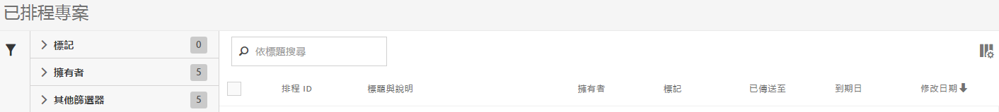

# 已排程專案管理器

管理已排程 Analysis Workspace 專案。

**[!UICONTROL 「分析]** > **[!UICONTROL 元件]** > **[!UICONTROL 計劃的專案」]**。

以下是Analysis Workspace中已排程且可下載專案的影片：

>[!VIDEO](https://video.tv.adobe.com/v/24709/?quality=12)

在「已排程專案管理員」中，您可以編輯和刪除循環的專案交付項目。您可以建立傳送計劃，透過電子郵件將報表傳送至指定地址。您可以設定這些計劃，依特定時間間隔或無限制自動傳送報表，或停止傳送週期性專案。

「排程專案管理員」會顯示特定使用者建立的項目。若應用程式內的使用者帳戶已被停用，所有已安排的傳送將停止。

## 排程專案管理員任務

在 [!UICONTROL 排程專案] UI，您可以：

* 編輯已排程專案。
* 檢視專案的排程 ID (主要用於除錯)。
* 搜尋已排程專案。
* 標記已排程專案。
* 指定/變更已排程專案的擁有者。
* 新增其他篩選條件，例如「核准」、「失敗」、「我的最愛」、「我的」、「全部顯示」和「到期專案」。
* 定義已排程專案的到期日。

