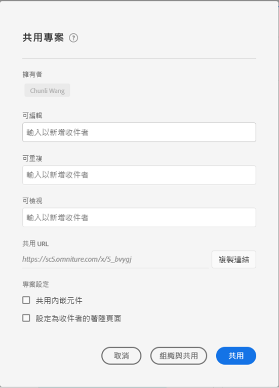

# 共用專案 {#share-projects}

>[!CONTEXTUALHELP]
>id="workspace_shareprojects"
>title="共用專案"
>abstract="您可以與組織中的其他使用者共用這些專案角色中的任一個。"

您可以與以下類型的人員共用 Analysis Workspace 專案：

* 您組織中有 Adobe Analytics 存取權的使用者和群組

  您可以共用「編輯」、「複製」或「檢視」存取權

* 您組織中沒有 Adobe Analytics 存取權的使用者和群組

  收件者擁有唯讀存取權

* 您組織外部的人員

  收件者擁有唯讀存取權

收件者開啟專案時，系統會反映出您在共用之前套用的任何[監管](curate.md)。

>[!BEGINSHADEBOX]

如需示範影片，請參閱 [共用專案](https://video.tv.adobe.com/v/36207?quality=12&learn=on){target="_blank"}。

>[!ENDSHADEBOX]

## 與組織中的使用者及群組共用。 {#Add}

您可以與組織中的現有 Analysis Workspace 使用者或群組共用專案。依照本節所述共用專案時，共用專案的使用者必須已經擁有 Adobe Analytics 存取權。

您可以與使用者或群組共用特定角色，也可以共用連結。

* [共用特定的專案角色](#share-a-specific-project-role)

* [共用專案的連結](#share-a-link-to-a-project)

## 共用特定的專案角色

與組織中的使用者和群組共用特定專案角色時，請考慮以下事項：

* 專案角色 (**[!UICONTROL 編輯原始項目]**、**[!UICONTROL 編輯副本]**&#x200B;和&#x200B;**[!UICONTROL 唯讀]**) 會與使用者和特定專案 ID 相連結。專案角色不受 [Adobe Experience Cloud Admin Console](https://experienceleague.adobe.com/docs/core-services/interface/manage-users-and-products/admin-getting-started.html?lang=zh-hant) 中管理的使用者權限影響。

* 在 Adobe Analytics 中，群組由 [Adobe Experience Cloud Admin Console](https://experienceleague.adobe.com/docs/core-services/interface/manage-users-and-products/admin-getting-started.html?lang=zh-hant) 中的產品設定檔所定義。管理員可將任何群組當作共用對象，包括「全部」。非管理員則可與其所屬的任何群組共用，但「全部」除外。

* 獲得多個角色的使用者一律會有最高體驗。如果同時以個人和群組成員的身分新增使用者，就可能發生此狀況。例如，如果使用者以個人身分獲得&#x200B;**[!UICONTROL 編輯原始項目]**&#x200B;角色，並且以群組成員身分獲得&#x200B;**[!UICONTROL 唯讀]**&#x200B;角色，就會獲得&#x200B;**[!UICONTROL 編輯原始項目]**&#x200B;專案體驗。

* 獲得&#x200B;**[!UICONTROL 編輯副本]**&#x200B;或&#x200B;**[!UICONTROL 唯讀]**&#x200B;角色的管理員，在開啟專案時會獲得這些有限的體驗。管理員可以透過與自己共用專案並授予&#x200B;**編輯**&#x200B;角色，將其角色變更為&#x200B;**[!UICONTROL 編輯原始項目]**，如下列程序中所述。

* 如果選取了多個要共用的專案，收件者將會新增至每個專案的現有收件者清單。

  例如，專案 A 已有收件者 1、2 和 3 共用，而專案 B 已有收件者 4、5 和 6 共用。

  然後，專案 A 以及 B 有收件者 4 和 7 共用。新的專案 A 共用清單現在為 1、2、3、4 和 7，而新的專案 B 共用清單為 4、5、6 和 7。

若要與組織中的使用者或群組共用特定專案角色：

1. 在 AdAdobe Analytics 中，選取「[!UICONTROL **Workspace**]」標籤，然後選取左側邊欄中的「[!UICONTROL **專案**]」。

1. 選取您要共用的一個或多個專案旁邊的勾選方框，然後選取「[!UICONTROL **共用**]」。

   或

   若只要共用單一專案，您可以開啟要共用的專案，然後選取「**[!UICONTROL 共用]** > **[!UICONTROL 與 Workspace 使用者共用]**」。
如果有未儲存的變更，系統會提示您先儲存專案。

   共用專案對話框會顯示。對話框的「[!UICONTROL **透過連結共用**]」和「[!UICONTROL **設定**]」部份只會在共用單一專案時可見到。

   

1. 在提供的其中一個角色欄位中新增收件者或收件者群組：

   **編輯原始項目：**&#x200B;收件者可以&#x200B;**[!UICONTROL 儲存]**&#x200B;對專案的變更，並以共同所有者的身分操作。如果您想要與其他同事共同管理專案，此角色將有其效用；包括編輯、刪除和修改共用專案的收件者清單。 注意：Analysis Workspace 目前不支援即時共同作業，因此我們建議不要有多名使用者同時編輯一個專案。如果同時儲存專案，將會保留最後一個版本。

   **複製副本：**&#x200B;收件者可以&#x200B;**[!UICONTROL 另存新檔]**，且擁有左側邊欄的存取權。此角色的專案互動不受限制。如果您想要與瞭解組織資料，且知道如何使用 Analysis Workspace 的使用者共用專案，但不想讓專案遭到變更，就可以使用此角色。

   **唯讀：**&#x200B;收件者無法&#x200B;**[!UICONTROL 儲存]**&#x200B;或&#x200B;**[!UICONTROL 另存新檔]**，也無法存取左側邊欄。專案互動也有所限制。如果您想要與整體上較不熟悉您的組織資料結構、Analysis Workspace 或 Adobe Analytics 的使用者共用專案，但您仍希望他們能在安全的環境中使用資料和深入分析，就可以使用此角色。深入了解[唯讀專案體驗](/help/analyze/analysis-workspace/curate-share/view-only-projects.md)。

1. (視情況而定) 如果您要共用單一專案，則共用專案時請選擇是否啟用下列選項：

   * **共用嵌入的專案元件：**&#x200B;與所有收件者共用區段、計算量度、日期範圍。共用後，這些元件會出現在收件者 Workspace 的「元件」下拉式清單中。系統不會沿用此設定，此動作僅在單次共用中有效。

   * **設定為收件者的登陸頁面：** 將此頁面設定為收件者的登陸頁面。系統不會沿用此設定，此動作僅在單次共用中有效。

1. 選取「**[!UICONTROL 共用]**」。(如果專案已有人共用，請選取「[!UICONTROL **更新**]」。)

   或

   選取「**[!UICONTROL 監管與共用]**」以自動套用專案監管。(如果專案已共用，選取「**[!UICONTROL 監管與更新]**」)。了解更多有關[專案監管](/help/analyze/analysis-workspace/curate-share/curate.md)。

## 共用專案的連結

按本節所述共用連結時，請考慮以下事項：

* 使用該連結的收件者須先登入 Adobe Analytics，然後才能存取該專案。

* 收件者若未被指派任何角色，且收到專案的[分享連結](/help/analyze/analysis-workspace/curate-share/shareable-links.md)，將會獲得預設角色。 管理員會獲得&#x200B;**[!UICONTROL 編輯原始項目]**，非管理員則會獲得&#x200B;**[!UICONTROL 編輯副本]**。

若要與組織中的使用者共用專案連結：

1. 儲存專案。如果有未儲存的變更，系統會提示您在共用連結之前儲存專案。

1. 選取「**[!UICONTROL 共用]** > **[!UICONTROL 與 Workspace 使用者共用]**」，然後選取「**[!UICONTROL 複製]**」(在「**[!UICONTROL 透過連結共用]**」欄位旁邊)。

   

1. 與組織中的使用者共用連結。例如，您可以將其貼上到電子郵件、內部網站等。

## 與任何人共用專案 (無需登入) {#share-public-link}

>[!CONTEXTUALHELP]
>id="workspace_share_with_anyone_require_aec_authentication"
>title="需要 Experience Cloud 驗證"
>abstract="您的組織要求使用者必須登入 Experience Cloud 才能使用此連結。"

您可以對沒有 Adobe Analytics 存取權的人員授予 Analysis Workspace 專案的[唯讀存取權](/help/analyze/analysis-workspace/curate-share/view-only-projects.md)。這些人員可以包括：

* 您組織外部的人員

* 您組織內沒有 Adobe Analytics 存取權的人員

>[!NOTE]
>
>與沒有 Adobe Analytics 存取權的人員共用 Analysis Workspace 專案時，請考慮以下事項：
>
>* Analytics 管理員可以停用以這種方式共用專案的功能，如[偏好設定](/help/analyze/analysis-workspace/user-preferences.md)中所述。如果您無法按照本節所述共用專案，就代表您的 Analytics 管理員已停用此功能。
>
>* 包含超過 50 個展開之視覺效果的專案，無法與沒有 Adobe Analytics 存取權的人員共用。
>
>* 您與之共用專案的使用者，可以檢視在[監管](curate.md)期間套用至專案的任何篩選器。
> 
>* 您與之共用的使用者可以變更專案日期範圍。預設會顯示您為專案設定的日期範圍。
>
>* 如果有多位使用者同時嘗試存取所提供的連結，專案可能會變得無法存取。根據預設，每 5 分鐘可以有超過 190 人存取單一連結。如果您的組織達到此限制，請等待 5 分鐘，然後再次嘗試存取該連結。

>[!BEGINSHADEBOX]

觀看 [與任何人共用連結](https://video.tv.adobe.com/v/3452476?quality=12&learn=on&captions=chi_hant){target="_blank"}以取得示範影片。

>[!ENDSHADEBOX]

若要與沒有 Adobe Analytics 存取權的人員共用 Analysis Workspace 專案：

1. 開啟您要共用的 Analysis Workspace 專案。

1. 按一下「**[!UICONTROL 共用]** > **[!UICONTROL 與任何人共用]**」。

   如果有未儲存的變更，系統會提示您儲存專案。

   <!-- Add screen shot of new modal -->

1. 如果尚未啟用「**[!UICONTROL 連結使用中]**」選項，請加以啟用。

   選取此選項後，會建立一個可以與任何人共用的專案連結。您可以隨時透過停用此選項來停用對專案的存取權。

   該專案的所有者也是該連結的所有者。只有在專案所有權轉移時，連結所有權才能轉移給其他使用者，如 Analytics 管理員指南中的[轉移使用者資產或設定帳戶期限](/help/admin/tools/user-management/users-assets.md)中所述。

1. 選擇是否啟用以下安全選項 (此選項可由您的 Analytics 管理員控制)：

   * **[!UICONTROL 需要 Experience Cloud 驗證]：**

     啟用此選項後，唯一可以存取專案的使用者，就是可以登入建立您共用之專案所在的 Adobe Experience Cloud 組織的使用者。但是，您與之共用的使用者不需要擁有 Adobe Analytics 的存取權。

     Analytics 管理員可以為公司設定此偏好設定，如[偏好設定](/help/analyze/analysis-workspace/user-preferences.md)中所述。視管理員設定此選項的方式而定，您可能會遇到以下情況：

      * 如果此選項未顯示，就代表您的 Analytics 管理員未啟用此功能。

      * 如果此選項已啟用並顯示為灰色，就代表您的 Analytics 管理員需要對存取 Analysis Workspace 專案的所有人進行 Experience Cloud 驗證。

1. 在「**[!UICONTROL 與任何人共用 (無需登入)]**」欄位旁邊，按一下「**複製連結**」圖示 ，將連結複製到系統剪貼簿。

1. 與您希望有該專案存取權的人員共用連結。例如，您可以將連結貼上到電子郵件中。

   您與之共用連結的任何人都可以檢視 Analysis Workspace 專案。

1. (選用) 您可以按一下「**產生新連結**」圖示 ，將先前收到專案連結之使用者的存取權移除。此時會產生一個新連結；您可以與您希望存取該專案的使用者共用該連結。

1. 選取「**[!UICONTROL 關閉]**」以關閉共用對話框。您的變更會自動儲存。

## 查看與您共用的專案

當有人透過[共用特定的專案角色](#share-a-specific-project-role)與您共用專案時，您可以從 [ Analytics 登陸頁面上的專案標籤](/help/analyze/landing.md#navigate-the-projects-tab)存取共用專案。

當有人透過共用連結 (從[共用專案標籤](#share-a-link-to-a-project)或使用[與任何人共用](#share-a-project-with-anyone-no-login-required)連結) 讓您共用專案時，您必須使用讓您共用的連結才能存取該專案。例如，該連結可能已在電子郵件、內部網站等中提供。

## 共用嵌入元件

您可以共用專案所屬的嵌入元件。

>[!BEGINSHADEBOX]

如需示範影片，請參閱 [共用內嵌元件](https://video.tv.adobe.com/v/24713?quality=12&learn=on){target="_blank"}。

>[!ENDSHADEBOX]

## 常見問題 {#FAQs}

| 問題 | 回答 |
| --- | --- |
| 如果兩個編輯者同時儲存專案，會發生什麼情況？ | 不會合併變更，而會保留最後儲存的專案版本。Analysis Workspace 目前不支援即時共同作業。 |
| 如果某個收件者以個人身分設定於某個角色，又以群組成員身分設定於另一個角色，會發生什麼情況？ | 如果收件者獲得多個角色，將一律會有較高的體驗。例如，如果收件者以個人身分獲得&#x200B;**[!UICONTROL 編輯原始項目]**&#x200B;角色，並且以群組成員身分獲得&#x200B;**[!UICONTROL 唯讀]**&#x200B;角色，就會獲得&#x200B;**[!UICONTROL 編輯原始項目]**&#x200B;專案體驗。 |
| 如果收件者開啟了專案連結，將有何體驗？ | 收件者會獲得您在分享模式中為其設定的角色。如果收件者未獲指派角色，並收到專案連結 (「**[!UICONTROL 共用]** > **[!UICONTROL 與 Workspace 使用者共用]**」，然後選取「**[!UICONTROL 複製]**」(在「**[!UICONTROL 透過連結共用]**」欄位旁邊))，則依照預設，它們會放入某個角色中。管理員會獲得&#x200B;**[!UICONTROL 編輯原始項目]**，非管理員則會獲得&#x200B;**[!UICONTROL 編輯副本]**。 |
