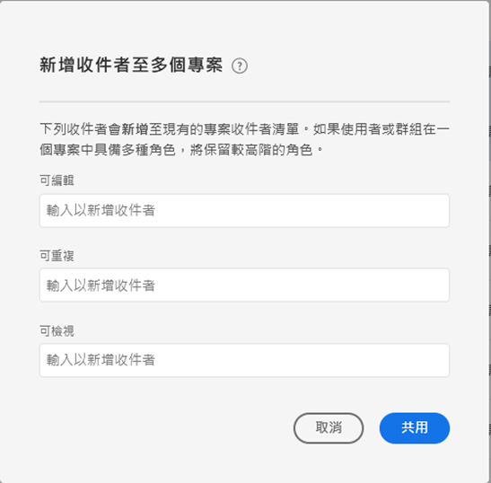

# 共用專案

共用可讓您組織中的其他 Analysis Workspace 使用者也能使用相同專案。收件者開啟專案時，將會顯示您已套用的任何[組織](curate.md)。

## 專案角色 {#Roles}

您可以將收件者新增至三個專案角色的其中之一。專案角色會繫結至使用者和特定專案 ID。專案角色不受 [Adobe Experience Cloud Admin Console](https://docs.adobe.com/content/help/zh-Hant/core-services/interface/manage-users-and-products/admin-getting-started.html) 中管理的使用者權限影響。

| 角色 | 專案控制 |
|---|---|
| 可編輯 | 收件者可&#x200B;**[!UICONTROL 儲存]**&#x200B;對專案的變更，並以共同擁有者的身分操作。如果您想要與其他同事共同管理專案，此角色將有其效用；包括編輯、刪除和修改共用專案的收件者清單。 注意：Analysis Workspace 目前不支援即時共同作業，因此我們建議不要有多名使用者同時編輯一個專案。如果同時儲存專案，將會保留最後一個版本。 |
| 可複製 | 收件者可以&#x200B;**[!UICONTROL 另存新檔]**，且具有左側邊欄的存取權。此角色的專案互動不受限制。如果您想要與瞭解組織資料，且知道如何使用 Analysis Workspace 的使用者共用專案，但不想讓專案遭到變更，就可以使用此角色。 |
| 可檢視 | 收件者無法另存新檔及存取左側邊欄。專案互動也有所限制。如果您想要與整體上較不熟悉您的組織資料結構、Analysis Workspace 或 Adobe Analytics 的使用者共用專案，但您仍希望他們能在安全的環境中使用資料和深入分析，就可以使用此角色。。 深入瞭解[可檢視專案體驗](/help/analyze/analysis-workspace/curate-share/view-only-projects.md)。 |

>[!IMPORTANT]
> 在 2020 年 6 月 18 日之前新增的專案收件者，已移轉至專案角色。管理員使用者已移轉至&#x200B;**[!UICONTROL 可編輯]**&#x200B;角色，非管理員使用者已移轉至&#x200B;**[!UICONTROL 可複製]**&#x200B;角色。這些角色提供的專案體驗與先前相同。此外，所有群組 (包括「全部」) 皆已移轉至&#x200B;**[!UICONTROL 可複製]**&#x200B;角色。

### 未指派任何角色 (專案連結收件者)

收件者若未被指派任何角色，且收到專案的[連結](https://docs.adobe.com/content/help/zh-Hant/analytics/analyze/analysis-workspace/curate-share/shareable-links.html) (**[!UICONTROL 「共用] > [!UICONTROL 取得專案連結」]**)，將會獲得預設角色。管理員會獲得&#x200B;**[!UICONTROL 可編輯]**&#x200B;角色，非管理員會獲得&#x200B;**[!UICONTROL 可複製]**&#x200B;角色。

### 已指派多個角色

如果收件者獲得多個角色，將一律會有最高體驗。如果同時以個人和群組的身分新增收件者，就可能發生此狀況。例如，如果收件者以個人身分獲得&#x200B;**[!UICONTROL 可編輯]**&#x200B;角色，並且以群組成員身分獲得&#x200B;**[!UICONTROL 可檢視]**&#x200B;角色，則將獲得&#x200B;**[!UICONTROL 可編輯]**&#x200B;專案體驗。

### 管理員和角色

設為&#x200B;**[!UICONTROL 可複製]**&#x200B;或&#x200B;**[!UICONTROL 可檢視]**&#x200B;角色的管理員，在開啟專案時將獲得這些有限的體驗。如有需要，管理員可隨時透過&#x200B;**[!UICONTROL 元件] > [!UICONTROL 專案]**&#x200B;將其角色增加到&#x200B;**[!UICONTROL 可編輯]**&#x200B;中。

## 將收件者新增至共用專案 {#Add}

若要將收件者新增至您的共用專案：

1. 按一下&#x200B;**[!UICONTROL 共用]** > **[!UICONTROL 共用專案]**。
如果有未儲存的變更，系統會提示您先儲存專案。
1. 新增收件者或收件者群組。
請參考上方的說明圖示，取得每個角色的說明。
1. (可選) 與所有收件者共用內嵌的專案元件 (區段、計算量度、日期範圍)。
共用後，這些元件會出現在收件者工作區的「元件」下拉式清單中。請注意，系統不會沿用此設定，此為共用時的單次動作。
1. (可選) 將此頁面設為收件者的登陸頁面。系統不會沿用此設定，此為共用時的單次動作。
1. 按一下「共用」。您也可以按一下&#x200B;**[!UICONTROL 組織與共用]**&#x200B;自動套用專案組織。如果專案已共用，這些按鈕將會顯示&#x200B;**[!UICONTROL 更新]**&#x200B;和&#x200B;**[!UICONTROL 組織與更新]**。深入瞭解[專案組織](https://docs.adobe.com/content/help/zh-Hant/analytics/analyze/analysis-workspace/curate-share/curate.html)。

## 與收件者群組共用 {#Groups}

所有使用者都可與群組共用專案；群組是收件者的集合。在 Adobe Analytics 中，群組由 [Adobe Experience Cloud Admin Console](https://docs.adobe.com/content/help/en/core-services/interface/manage-users-and-products/admin-getting-started.html) 中的產品設定檔所定義。

* 管理員可將任何群組當作共用對象，包括「全部」。
* 非管理員則可與其所屬的群組共用，但「全部」除外。

## 共用專案連結 {#Links}

您可以在&#x200B;**[!UICONTROL 共用] > [!UICONTROL 取得專案連結]**&#x200B;下取得專案連結。點選後，收件者必須先登入，才能登入專案。如果收件者未設置於角色中，則將獲得預設角色。管理員會獲得&#x200B;**[!UICONTROL 可編輯]**&#x200B;角色，非管理員會獲得&#x200B;**[!UICONTROL 可複製]**&#x200B;角色。[深入了解](https://docs.adobe.com/content/help/en/analytics/analyze/analysis-workspace/curate-share/shareable-links.html)如何建立工作區專案分享連結。

## 在專案管理員中共用專案 {#Manager}

您也可以從&#x200B;**[!UICONTROL 元件] > [!UICONTROL 專案]**&#x200B;來共用專案。依照上述步驟操作，可共用單一專案。如果選取了多個要共用的專案，收件者將會新增至每個專案的現有收件者清單。

例如：

* 專案 A 會與收件者 1、2、3 共用
* 專案 B 會與收件者 4、5、6 共用

在選取專案 A 和 B 後，收件者 4 和 7 會新增至共用清單。此時，每個專案新的共用清單分別為：

* 專案 A：1、2、3、4、7
* 專案 B：4、5、6、7

## 常見問題解答 {#FAQs}

| 問題 | 回答 |
|---|---|
| 如果兩個編輯者同時儲存專案，會發生什麼情況？ | 不會合併變更，而會保留最後儲存的專案版本。Analysis Workspace 目前不支援即時共同作業。 |
| 身為管理員，我會有何種專案體驗？ | 設為&#x200B;**[!UICONTROL 可複製]**&#x200B;或&#x200B;**[!UICONTROL 可檢視]**&#x200B;角色的管理員，在開啟專案時將獲得這些有限的體驗。如有需要，管理員可隨時透過&#x200B;**[!UICONTROL 元件] > [!UICONTROL 專案]**&#x200B;將其角色增加到&#x200B;**[!UICONTROL 可編輯]**&#x200B;中。 |
| 如果某個收件者以個人身分設置於某個角色，又以群組成員身分設置於另一個角色，會發生什麼情況？ | 如果收件者獲得多個角色，將一律會有較高的體驗。例如，如果收件者以個人身分獲得&#x200B;**[!UICONTROL 可編輯]**&#x200B;角色，並且以群組成員身分獲得&#x200B;**[!UICONTROL 可檢視]**&#x200B;角色，則將獲得&#x200B;**[!UICONTROL 可編輯]**&#x200B;專案體驗。 |
| 如果收件者開啟了專案連結，將有何體驗？ | 收件者會獲得您在分享模式中為其設置的角色。收件者若未被指派任何角色，且收到專案的連結 (**[!UICONTROL 共用] > [!UICONTROL 取得專案連結]**)，將會獲得預設角色。管理員會獲得&#x200B;**[!UICONTROL 可編輯]**&#x200B;角色，非管理員會獲得&#x200B;**[!UICONTROL 可複製]**&#x200B;角色。 |
