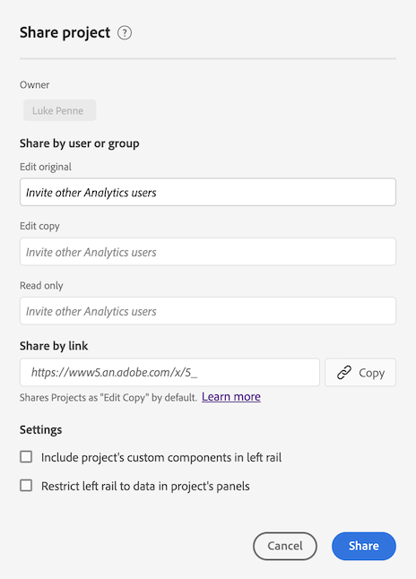

# 共用專案

您可以與下列人員型別共用Analysis Workspace專案：

* 您組織中有權存取Adobe Analytics的使用者和群組

   您可以共用編輯、複製或檢視存取權

* 您組織中無權存取Adobe Analytics的使用者和群組

   收件者具有唯讀存取權

* 組織外部的人員

   收件者具有唯讀存取權

任何 [組織](curate.md) 收件者開啟專案時，會反映您在共用前套用的內容。

以下是專案共用的影片概觀：

>[!VIDEO](https://video.tv.adobe.com/v/36207/?quality=12)

## 與您組織中的Analysis Workspace使用者和群組共用 {#Add}

您可以和組織中的現有Analysis Workspace使用者或群組共用專案。 如本節所述，當您共用專案時，您共用的使用者必須已擁有Adobe Analytics的存取權。

您可以與使用者或群組共用特定角色，也可以共用連結。

* [共用特定的專案角色](#share-a-specific-project-role)

* [共用專案的連結](#share-a-link-to-a-project)

## 共用特定的專案角色

與組織中的使用者和群組共用特定專案角色時，請考慮以下事項：

* 專案角色 (**[!UICONTROL 可編輯]**，**[!UICONTROL 可複製]**，和&#x200B;**[!UICONTROL 可檢視]**) 會繫結至使用者和特定專案 ID。專案角色不受 [Adobe Experience Cloud Admin Console](https://experienceleague.adobe.com/docs/core-services/interface/manage-users-and-products/admin-getting-started.html?lang=zh-Hant) 中管理的使用者權限影響。

* 在 Adobe Analytics 中，群組由 [Adobe Experience Cloud Admin Console](https://experienceleague.adobe.com/docs/core-services/interface/manage-users-and-products/admin-getting-started.html?lang=zh-Hant) 中的產品設定檔所定義。管理員可將任何群組當作共用對象，包括「全部」。非管理員則可與其所屬的任何群組共用，但「全部」除外。

* 獲得多個角色的使用者一律會有最高體驗。如果同時以個人和群組成員的身分新增使用者，就可能發生此狀況。例如，如果使用者以個人身分獲得&#x200B;**[!UICONTROL 可編輯]**&#x200B;角色，並且以群組成員身分獲得&#x200B;**[!UICONTROL 可檢視]**&#x200B;角色，則其將獲得&#x200B;**[!UICONTROL 可編輯]**&#x200B;專案體驗。

* 獲得&#x200B;**[!UICONTROL 可複製]**&#x200B;或&#x200B;**[!UICONTROL 可檢視]**&#x200B;角色的管理員，在開啟專案時會獲得這些有限的體驗。如有需要，管理員可隨時透過&#x200B;**[!UICONTROL 元件] > [!UICONTROL 專案]**&#x200B;將其角色增加到&#x200B;**[!UICONTROL 可編輯]**&#x200B;中。

若要與組織中的使用者或群組共用特定專案角色：

1. 前往您要共用的專案，然後按一下 **[!UICONTROL 共用]** > **[!UICONTROL 與工作區使用者共用]**.
如果有未儲存的變更，系統會提示您先儲存專案。

   

   有關如何同時共用多個專案的資訊，請參閱[在專案管理員中共用專案](#share-projects-in-the-project-manager)。

1. 在提供的其中一個角色欄位中新增收件者或收件者群組：

   **可編輯：**&#x200B;收件者可&#x200B;**[!UICONTROL 儲存]**&#x200B;對專案的變更，並以共同擁有者的身分操作。如果您想要與其他同事共同管理專案，此角色將有其效用；包括編輯、刪除和修改共用專案的收件者清單。 注意：Analysis Workspace 目前不支援即時共同作業，因此我們建議不要有多名使用者同時編輯一個專案。如果同時儲存專案，將會保留最後一個版本。

   **可複製：**&#x200B;收件者可以&#x200B;**[!UICONTROL 另存新檔]**，且具有左側邊欄的存取權。此角色的專案互動不受限制。如果您想要與瞭解組織資料，且知道如何使用 Analysis Workspace 的使用者共用專案，但不想讓專案遭到變更，就可以使用此角色。

   **可檢視：**&#x200B;收件者無法&#x200B;**[!UICONTROL 儲存]**&#x200B;或&#x200B;**[!UICONTROL 另存新檔]**，也無法存取左側邊欄。專案互動也有所限制。如果您想要與整體上較不熟悉您的組織資料結構、Analysis Workspace 或 Adobe Analytics 的使用者共用專案，但您仍希望他們能在安全的環境中使用資料和深入分析，就可以使用此角色。深入瞭解[可檢視專案體驗](/help/analyze/analysis-workspace/curate-share/view-only-projects.md)。

1. 選擇共用專案時是否啟用以下選項：

   * **共用內嵌的專案元件：**&#x200B;與所有收件者共用區段、計算量度、日期範圍。共用後，這些元件會出現在收件者 Workspace 的「元件」下拉式清單中。系統不會沿用此設定，此動作僅在單次共用中有效。

   * **設定為收件者的登陸頁面：** 將此頁面設定為收件者的登陸頁面。系統不會沿用此設定，此動作僅在單次共用中有效。

1. 按一下「**[!UICONTROL 共用]**」。(如果專案已共用，請按一下 [!UICONTROL **更新**].)

   或

   按一下 **[!UICONTROL 組織與共用]** 以自動套用專案組織。 (如果專案已共用，請按一下 **[!UICONTROL 監管與更新]**.) 深入瞭解[專案組織](https://experienceleague.adobe.com/docs/analytics/analyze/analysis-workspace/curate-share/curate.html?lang=zh-Hant)。

## 共用專案的連結

按本節所述共用連結時，請考慮以下事項：

* 使用該連結的收件者須先登入 Adobe Analytics，然後才能存取該專案。

* 收件者若未被指派任何角色，則會收到 [連結](https://experienceleague.adobe.com/docs/analytics/analyze/analysis-workspace/curate-share/shareable-links.html?lang=zh-Hant) 對於專案，預設會為他們指定角色。 管理員接收 **[!UICONTROL 可以編輯]** 和非管理員會收到 **[!UICONTROL 可以複製]**.

若要與組織中的使用者共用專案連結：

1. 儲存專案。如果有未儲存的變更，系統會提示您先儲存專案，然後再共用連結。

1. 選取 **[!UICONTROL 共用]** > **[!UICONTROL 與工作區使用者共用]**，然後選取 **[!UICONTROL 複製]** 旁邊 **[!UICONTROL 透過連結共用]** 欄位。

   

1. 與組織中的使用者共用連結。例如，您可以將其貼到電子郵件中、內部網站中，等等。

## 與任何人共用專案（不需要登入） {#share-public-link}

{{release-limited-testing-section}}

您可以授予 [唯讀存取](/help/analyze/analysis-workspace/curate-share/view-only-projects.md) Analysis Workspace專案給無法存取Adobe Analytics的使用者。 這可能包括：

* 組織外部的人員

* 您組織內無權存取Adobe Analytics的人員

>[!NOTE]
>
>與無法存取Analysis Workspace的人共用Adobe Analytics專案時，請考量下列事項：
>
>* Analytics管理員可以停用以這種方式共用專案的功能，如所述 [偏好設定](/help/analyze/analysis-workspace/user-preferences.md). 如果您無法依照本節所述共用專案，您的Analytics管理員已停用此功能。
>
>* 超過50個展開視覺效果的專案無法與無法存取Adobe Analytics的人共用。
>
>* 您共用專案的使用者可以檢視期間套用至專案的任何篩選器 [組織](curate.md).
> 
>* 您共用的使用者可以變更專案日期範圍。 預設會顯示您為專案設定的日期範圍。
>
>* 如果許多使用者同時嘗試存取指定的連結，專案可能會變成無法存取。 根據預設，每5分鐘可以存取單一連結的人數超過190人。 如果您的組織達到此限制，請等待5分鐘，然後再次嘗試存取連結。

若要與無法存取Analysis Workspace的人共用Adobe Analytics專案：

1. 開啟您要共用的Analysis Workspace專案。

1. 按一下 **[!UICONTROL 共用]** > **[!UICONTROL 與任何人共用]**.

   如果有未儲存的變更，系統會提示您儲存專案。

   <!-- Add screen shot of new modal -->

1. 啟用 **[!UICONTROL 連結作用中]** 選項（如果尚未啟用）。

   選取此選項會建立專案的連結，可供任何人共用。 您可以隨時停用此選項來停用對專案的存取。

   專案的所有者也是此連結的所有者。 只有在專案所有權轉移時，才能將連結所有權轉移給其他使用者，如中所述 [轉移使用者資產或設定帳戶有效期](/help/admin/admin/user-management2/users-assets.md) （在Analytics管理指南中）。

1. 選擇是否啟用下列安全性選項（此選項可由您的Analytics管理員控制）：

   * **[!UICONTROL 需要 Experience Cloud 驗證]:**

      啟用此選項後，只有可登入您共用專案所在的Adobe Experience Cloud組織的使用者才能存取該專案。

      Analytics管理員可為公司設定此偏好設定，如所述 [偏好設定](/help/analyze/analysis-workspace/user-preferences.md). 您可能會遇到以下情況，具體取決於管理員如何設定此選項：

      * 如果未顯示此選項，您的Analytics管理員未啟用此功能。

      * 如果已啟用此選項且變暗，您的Analytics管理員需要對存取Analysis Workspace專案的任何人進行Experience Cloud驗證。

1. 旁邊 **[!UICONTROL 與任何人共用（不需要登入）]** 欄位，按一下 **複製連結** 圖示  以將連結複製到您的系統剪貼簿。

1. 與您要存取專案的人共用連結。 例如，您可以貼上電子郵件中的連結。

   您共用連結的任何人都可以檢視Analysis Workspace專案。

1. （可選）您可以按一下 **產生新連結** 圖示  移除先前收到專案連結之使用者的存取權。 系統會產生新連結，您可將其與您要存取專案的使用者共用。

1. 選取 **[!UICONTROL 關閉]** 關閉「共用」對話方塊。 您的變更會自動儲存。

## 在 Project Manager 中共用專案 {#Manager}

您也可以從&#x200B;**[!UICONTROL 元件] > [!UICONTROL 專案]**&#x200B;來共用專案。依照上述步驟操作，可共用單一專案。如果選取了多個要共用的專案，收件者將會新增至每個專案的現有收件者清單。

例如：

* 專案 A 會與收件者 1、2、3 共用
* 專案 B 會與收件者 4、5、6 共用

在選取專案 A 和 B 後，收件者 4 和 7 會新增至共用清單。此時，每個專案新的共用清單分別為：

* 專案 A：1、2、3、4、7
* 專案 B：4、5、6、7

## 共用內嵌元件

以下是有關該主題的影片：

>[!VIDEO](https://video.tv.adobe.com/v/24713/?quality=12)

## 常見問題 {#FAQs}

| 問題 | 回答 |
| --- | --- |
| 如果兩個編輯者同時儲存專案，會發生什麼情況？ | 不會合併變更，而會保留最後儲存的專案版本。Analysis Workspace 目前不支援即時共同作業。 |
| 身為管理員，我會有何種專案體驗？ | 設為&#x200B;**[!UICONTROL 可複製]**&#x200B;或&#x200B;**[!UICONTROL 可檢視]**&#x200B;角色的管理員，在開啟專案時將獲得這些有限的體驗。如有需要，管理員可隨時透過&#x200B;**[!UICONTROL 元件] > [!UICONTROL 專案]**&#x200B;將其角色增加到&#x200B;**[!UICONTROL 可編輯]**&#x200B;中。 |
| 如果某個收件者以個人身分設定於某個角色，又以群組成員身分設定於另一個角色，會發生什麼情況？ | 如果收件者獲得多個角色，將一律會有較高的體驗。例如，如果收件者以個人身分獲得&#x200B;**[!UICONTROL 可編輯]**&#x200B;角色，並且以群組成員身分獲得&#x200B;**[!UICONTROL 可檢視]**&#x200B;角色，則將獲得&#x200B;**[!UICONTROL 可編輯]**&#x200B;專案體驗。 |
| 如果收件者開啟了專案連結，將有何體驗？ | 收件者會獲得您在分享模式中為其設定的角色。收件者若未被指派任何角色，且收到專案的連結(**[!UICONTROL 共用]** > **[!UICONTROL 與工作區使用者共用]**，然後選取 **[!UICONTROL 複製]** 旁邊 **[!UICONTROL 透過連結共用]** 欄位)，則預設會將其置於角色中。 管理員會獲得&#x200B;**[!UICONTROL 可編輯]**&#x200B;角色，非管理員會獲得&#x200B;**[!UICONTROL 可複製]**&#x200B;角色。 |
