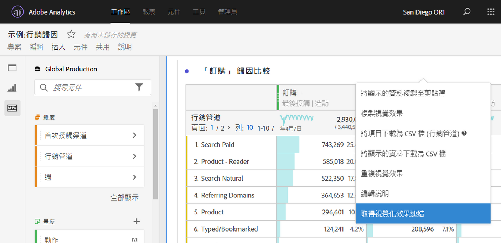

# 建立分享連結

Analysis Workspace 提供許多與用戶共用專案的方式，包括取得專案連結或專案特定部分的功能。部分連結類型會要求收件者在存取專案之前登入 Adobe Analytics，其他連結類型則不會要求。

## 取得專案連結，與其他 Workspace 使用者共用 {#project-link}

若要共用專案連結，請前往要共用的專案，然後選取前往「[!UICONTROL **共用**] > [!UICONTROL **與 Workspace 使用者共用**] > [!UICONTROL **透過連結共用**]」。您與之共用連結的使用者必須登入。

如果連結的收件者未獲指派[專案角色](https://experienceleague.adobe.com/docs/analytics/analyze/analysis-workspace/curate-share/share-projects.html?lang=zh-Hant)，管理員會獲得「**[!UICONTROL 編輯原始項目]**」體驗，非管理員則會獲得「**[!UICONTROL 編輯副本]**」體驗。

## 取得唯讀連結，與任何人共用

您可以與沒有 Adobe Analytics 存取權的人員共用 Analysis Workspace 專案的唯讀連結。您與之共用連結的使用者不需要登入。

如需更多資訊，請參閱[共用專案](/help/analyze/analysis-workspace/curate-share/share-projects.md)文章中的「與任何人共用專案 (無需登入)」。

## 取得面板或視覺效果連結 {#panel-link}

您也可以分享專案特定部分的連結，例如面板或個別視覺效果，有時也稱為內部連結。此功能有助於讓使用者專注於專案中重要的深入分析。

* 在面板的任一標題上按一下右鍵，並選取&#x200B;**[!UICONTROL 「取得面板連結」]**
* 在任一表格或視覺效果的標題上按一下右鍵，並選取&#x200B;**[!UICONTROL 「取得視覺效果連結」]**

[觀看影片](https://experienceleague.adobe.com/docs/analytics-learn/tutorials/analysis-workspace/visualizations/intra-linking-in-analysis-workspace.html?lang=zh-Hant)以了解如何建立連結，並使用連結引導收件者前往專案的特定部分。

