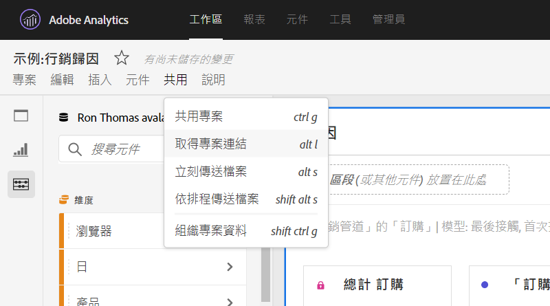

# 建立分享連結

Analysis Workspace 提供許多與使用者共用專案的方式，包括取得專案連結或專案特定部分的功能。使用者收到連結後須先登入 Adobe Analytics，才能進入專案。

## 取得專案連結 {#project-link}

若要分享完整專案的連結，請前往 **[!UICONTROL 「共用 > 取得專案連結」]**。如果連結收件者仍未獲指派[專案角色](https://experienceleague.adobe.com/docs/analytics/analyze/analysis-workspace/curate-share/share-projects.html?lang=zh-Hant)，管理員與非管理員使用者會分別收到&#x200B;**[!UICONTROL 「可編輯」]**&#x200B;和&#x200B;**[!UICONTROL 「可複製」]**&#x200B;的體驗。

## 取得面板或視覺效果連結 {#panel-link}

您也可以分享專案特定部分的連結，例如面板或個別視覺效果，有時也稱為內部連結。此功能有助於讓使用者專注於專案中重要的深入分析。

* 在面板的任一標題上按一下右鍵，並選取&#x200B;**[!UICONTROL 「取得面板連結」]**
* 在任一表格或視覺效果的標題上按一下右鍵，並選取&#x200B;**[!UICONTROL 「取得視覺效果連結」]**

[觀看影片](https://experienceleague.adobe.com/docs/analytics-learn/tutorials/analysis-workspace/visualizations/intra-linking-in-analysis-workspace.html?lang=zh-Hant)以了解如何建立連結，並使用連結引導收件者前往專案的特定部分。

## 在目錄中使用連結 {#TOC}

運用各種連結選項的秘訣之一，就是一律在 Analysis Workspace 專案的頂端加入目錄。您可以透過目錄連結至其他相關專案、特定面板，以及特定的視覺效果。如此有助於專案的收件者輕鬆導覽。

[觀看影片](https://experienceleague.adobe.com/docs/analytics-learn/tutorials/analysis-workspace/navigating-workspace-projects/create-a-toc-in-analysis-workspace.html?lang=zh-Hant)以了解如何使用連結和 Analysis Workspace 功能齊全的文字編輯器，輕鬆建立目錄。

