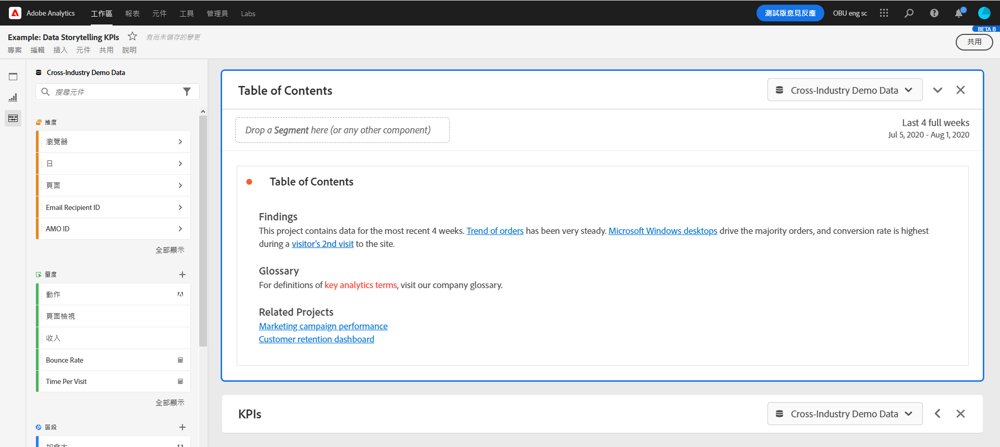

# 建立分享連結

Analysis Workspace 提供許多與用戶共用專案的方式，包括取得專案連結或專案特定部分的功能。部分連結類型會要求收件者在存取專案之前登入 Adobe Analytics，其他連結類型則不會要求。

## 取得專案連結，與其他 Workspace 使用者共用 {#project-link}

若要共用專案的連結，請移至您要共用的專案，然後選取移至&#x200B;**[!UICONTROL 共用]** > **[!UICONTROL 取得專案連結]** (或&#x200B;**[!UICONTROL 共用]** > **[!UICONTROL 與Workspace使用者共用]** > **[!UICONTROL 透過連結共用]**)。 您與之共用連結的使用者必須登入。

如果連結收件者尚未獲指派[專案角色](/help/analyze/analysis-workspace/curate-share/share-projects.md)，管理員會收到&#x200B;**[!UICONTROL 編輯原始專案]**，非管理員會收到&#x200B;**[!UICONTROL 編輯復本]**&#x200B;體驗。

## 取得唯讀連結，與任何人共用

您可以與無法存取Analysis Workspace的人共用指向Adobe Analytics專案的唯讀連結。

如需詳細資訊，請參閱[與任何人共用](/help/analyze/analysis-workspace/curate-share/share-projects.md#share-a-project-with-anyone-no-login-required)。

## 取得面板或視覺效果連結 {#panel-link}

您也可以分享專案特定部分的連結，例如面板或個別視覺效果，有時也稱為內部連結。此功能有助於讓使用者專注於專案中重要的深入分析。

* 從面板標題的內容功能表中，選取&#x200B;**[!UICONTROL 取得面板連結]**
* 從視覺效果標題的內容功能表中，選取&#x200B;**[!UICONTROL 取得視覺效果連結]**

[觀看影片](https://experienceleague.adobe.com/docs/analytics-learn/tutorials/analysis-workspace/visualizations/intra-linking-in-analysis-workspace.html?lang=zh-Hant)以了解如何建立連結，並使用連結引導收件者前往專案的特定部分。

## 在目錄中使用連結 {#TOC}

運用各種連結選項的秘訣之一，就是一律在 Analysis Workspace 專案的頂端加入目錄。您可以透過目錄連結至其他相關專案、特定面板，以及特定的視覺效果。如此有助於專案的收件者輕鬆導覽。

[觀看影片](https://experienceleague.adobe.com/docs/analytics-learn/tutorials/analysis-workspace/navigating-workspace-projects/create-a-toc-in-analysis-workspace.html?lang=zh-Hant)以了解如何使用連結和工作區功能齊全的文字編輯器，輕鬆建立目錄。

<!--
# Create shareable links

Analysis Workspace offers many ways to share a project to your users, including the ability to get a link to a project or a specific part of a project. Some link types require the recipient to log in to Adobe Analytics before accessing the project, while others do not. 

## Get a project link to share with other Workspace users {#project-link} 

To share a link to a project, go to the project you want to share, then select go to [!UICONTROL **Share**] > [!UICONTROL **Share with Workspace users**] > [!UICONTROL **Share by link**]. Users you share the link with are required to log in. 

If the recipient of the link has not been assigned a [project role](https://experienceleague.adobe.com/docs/analytics/analyze/analysis-workspace/curate-share/share-projects.html?lang=zh-Hant), admins receive **[!UICONTROL Edit original]** and non-admins receive **[!UICONTROL Edit copy]** experiences.

## Get a read-only link to share with anyone

You can share a read-only link to Analysis Workspace projects with people who don't have access to Adobe Analytics. Users you share the link with are not required to log in. 

For more information, see "Share a project with anyone (no login required)" in the article [Share projects](/help/analyze/analysis-workspace/curate-share/share-projects.md).

## Get panel or visualization link {#panel-link} 

You can also share a link to a specific part of a project, such as a panel or individual visualization. This is sometimes referred to as intra-linking. This can be useful to draw your users' attention to key insights within the project.  

* From any panel header, right-click **[!UICONTROL Get panel link]** 
* From any table or visualization header, right-click **[!UICONTROL Get visualization link]** 

[Watch the video](https://experienceleague.adobe.com/docs/analytics-learn/tutorials/analysis-workspace/visualizations/intra-linking-in-analysis-workspace.html?lang=zh-Hant) on how to create links and use them to drive recipients to specific parts of your project. 

-->