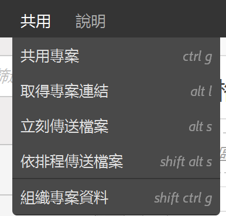
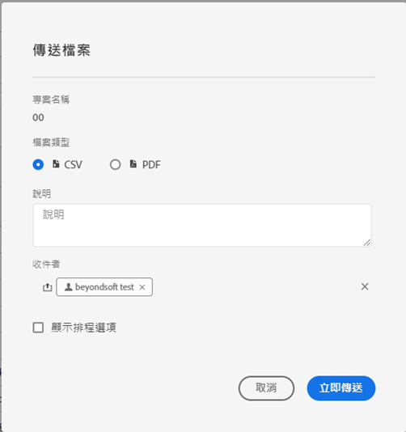
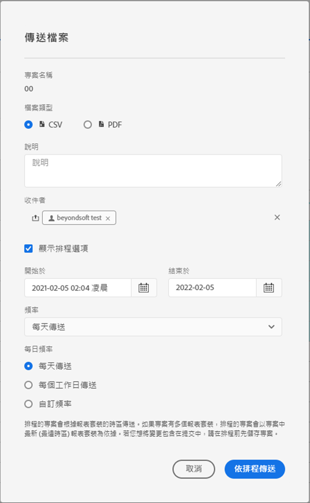

# 傳送和排程

您可以透過電子郵件將Adobe Analytics專案以檔案形式傳送給所選使用者。 您可以臨時發送檔案，也可以設定按排程發送檔案。能以 CSV 或 PDF 格式傳送檔案。

任何套用於專案的索引標籤都會自動套用於匯出檔案。

也可使用其他匯出Adobe Analytics資料的方法，如[匯出概觀](/help/export/home.md)中所述。

## 傳送檔案

若要透過電子郵件將臨時檔案傳送給收件者：

1. 選取&#x200B;**[!UICONTROL 共用] > [!UICONTROL 傳送檔案]**。
1. 指定檔案類型：
   * [!UICONTROL **CSV**]：如果您需要純文字資料，請選擇此選項。
   * [!UICONTROL **PDF**]：如果您希望下載的檔案包含專案中所有顯示 (可見) 的表格和視覺效果，請選擇此選項。
1. （選用）使用&#x200B;**[!UICONTROL 說明]**&#x200B;新增要包含在電子郵件中的說明。
1. 新增收件者或群組。您也可以輸入電子郵件地址。
1. （選擇性）選取&#x200B;**[!UICONTROL 顯示排程選項]**&#x200B;至[排程檔案匯出](#schedule-file-export)。
1. 按一下&#x200B;**[!UICONTROL 立即傳送]**。 選取「**[!UICONTROL 取消]**」即可取消。

## 排程檔案匯出 {#schedule}

若要透過電子郵件依排程傳送檔案給收件者

1. 選取&#x200B;**[!UICONTROL 共用] > [!UICONTROL 排程檔案匯出]**。
1. 指定檔案類型：
   * [!UICONTROL **CSV**]：如果您需要純文字資料，請選擇此選項。
   * [!UICONTROL **PDF**]：如果您希望下載的檔案包含專案中所有顯示 (可見) 的表格和視覺效果，請選擇此選項。
1. （選用）使用&#x200B;**[!UICONTROL 說明]**&#x200B;新增要包含在電子郵件中的說明。
1. 新增收件者或群組。您也可以輸入電子郵件地址。
1. （僅適用於Healthcare Shield客戶）提供[密碼保護排程報告](#password-protect-a-new-scheduled-project)的密碼。
1. 請確定已選取&#x200B;**[!UICONTROL 顯示排程選項]**。
1. 選取&#x200B;**[!UICONTROL 頻率]**。 您可以選取：

   | 頻率 | 選項 |
   |---|---|
   | **[!UICONTROL 每小時傳送]** | 輸入&#x200B;**[!UICONTROL 每小時傳送一次的值]**。 |
   | **[!UICONTROL 每日傳送]** | 選取&#x200B;**[!UICONTROL 每日頻率]**： **[!UICONTROL 每天傳送]**、**[!UICONTROL 每個工作日傳送]**&#x200B;或&#x200B;**[!UICONTROL 自訂頻率]**。 如果您選取&#x200B;**[!UICONTROL 自訂頻率]**，請輸入&#x200B;**[!UICONTROL 每隔]**&#x200B;天傳送的值。 |
   | **[!UICONTROL 每週傳送]** | 輸入&#x200B;**[!UICONTROL 每週]**&#x200B;傳送的值。 並選取一週的&#x200B;**[!UICONTROL 天]**。 |
   | **[!UICONTROL 按一週的某天每月傳送]** | 選取&#x200B;**[!UICONTROL 星期]**&#x200B;和&#x200B;**[!UICONTROL 星期]**。 |
   | **[!UICONTROL 每月依月份日期傳送]** | 從&#x200B;**[!UICONTROL 於本月]**&#x200B;的當天傳送中選取一個值。 |
   | **[!UICONTROL 每年依月份日期]**&#x200B;傳送 | 選取&#x200B;**[!UICONTROL 一週中的某天]**，選取一個月中的&#x200B;**[!UICONTROL 周]**，然後選取一年中的&#x200B;**[!UICONTROL 每月]**。 |
   | **[!UICONTROL 依特定日期每年傳送]** | 選取&#x200B;**[!UICONTROL 月份]**，並從&#x200B;**[!UICONTROL 於當月的這個日期傳送]**&#x200B;中選取值。 |

1. 輸入從&#x200B;]**開始的**[!UICONTROL &#x200B;開始日期。 或者，選取以從行事曆中挑選開始日期。

1. 在&#x200B;**[!UICONTROL 結束日期]**&#x200B;中輸入結束日期。 或者，選取以從行事曆中挑選結束日期。
1. 選取&#x200B;**[!UICONTROL 依排程傳送]**。 選取「**[!UICONTROL 取消]**」即可取消。

## 已排程的專案管理員 {#manager}

已排程的Analysis Workspace專案可從主介面使用&#x200B;**[!UICONTROL 元件]** > **[!UICONTROL 已排程的專案]**&#x200B;來管理。 如需更多資訊，請參閱「[已排程專案](/help/components/scheduled-projects-manager.md)」。

<!--
# Schedule projects

From the Workspace **Share menu**, you can send Analysis Workspace projects using email to selected recipients. Files can be sent in CSV or PDF format. After you share scheduled projects, you can edit the schedule settings to modify the frequency, receipient list, or file type using the Scheduled Projects manager.

## Send file now

To send a file immediately to recipients via email:

1. Click **[!UICONTROL Share] > [!UICONTROL Export file]**.
1. Specify the file type:
   * [!UICONTROL **CSV**]: Choose this option if you want plain-text data.
   * [!UICONTROL **PDF**]: Choose this option if you want the downloaded file to contain all the displayed (visible) tables and visualizations in the project.
1. (Optional) Add a description to include in the email to explain the file being received. 
1. Add recipients or groups. Email addresses can also be entered. 
1. Click **[!UICONTROL Send Now]**.
1. (Optional) Click **[!UICONTROL Show scheduling options]** to specify a delivery schedule.

## Send file on schedule

To send a file on a recurring schedule to recipients via email:

1. Click **[!UICONTROL Share] > [!UICONTROL Schedule file export]**.
1. Specify the file type (CSV or PDF).
1. (Optional) Add a description that will be included in the email to explain the file being received. 
1. Add recipients or groups. Email addresses can also be entered. 
1. Specify the range the schedule should be delivered over by modifying Starting on and Ending on inputs. The end date must be within a year from the day the schedule is created or modified.
1. Specify the delivery frequency. Each frequency allows for different customizations. 
1. Click **[!UICONTROL Send on schedule]**.

## Manage scheduled projects

When you manage scheduled projects, you can edit and delete recurring project schedules:

*  Change the file type (.csv or PDF)
*  Update the project description
*  Add or remove recipients
*  Change the frequency

Scheduled Analysis Workspace projects can be managed under **Analytics > Components > Scheduled Projects**.

For more information, see [Scheduled projects](/help/components/scheduled-projects-manager.md)
-->
