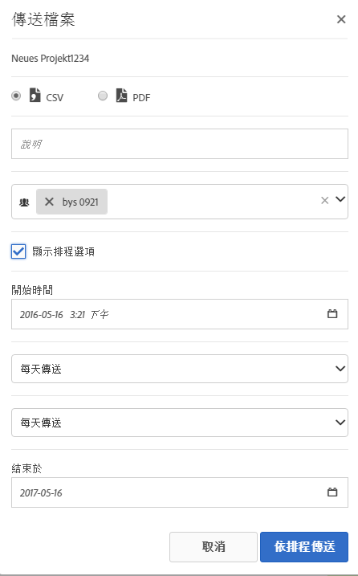

# 傳送檔案 - 排程專案進行傳送

透過電子郵件傳送 Analysis Workspace 專案，或排程進行傳送。

1. [ 建立 Analysis Workspace 專案](https://marketing.adobe.com/resources/help/en_US/analytics/analysis-workspace/t_freeform_project.html)並儲存。
1. 按一下&#x200B;**[!UICONTROL 「共用]** &gt; **[!UICONTROL 依排程傳送檔案」]**。

   

1. 在「[!UICONTROL 傳送檔案]」頁面中指定檔案類型 (CSV 或 PDF)。

   

1. 新增收件者電子郵件地址或名稱，然後按一下&#x200B;**[!UICONTROL 「立即傳送」]**。
1. (選用) 按一下&#x200B;**[!UICONTROL 「顯示排程選項」]**，指定傳送排程，然後按一下&#x200B;**[!UICONTROL 「依排程傳送」]**。
1. 在&#x200B;**[!UICONTROL 「元件]** &gt; [已排程專案」](/help/analyze/analysis-workspace/curate-share/schedule-projects.md)中管理已排程專案。
