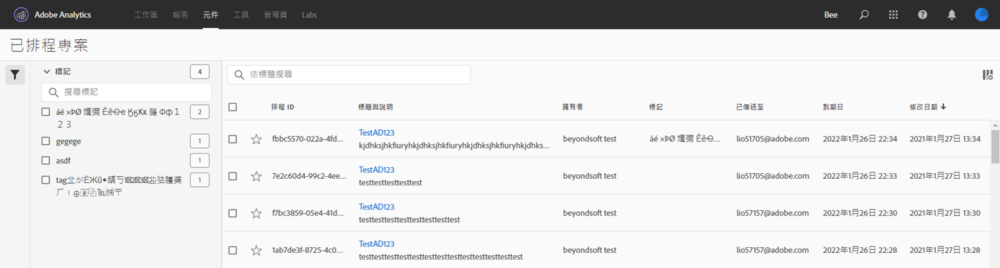

# 排程專案

您可以從工作區的&#x200B;**「共用」功能表**，透過電子郵件將 Analysis Workspace 專案傳送給選取的收件者。能以 CSV 或 PDF 格式傳送檔案。

## 立即傳送檔案

若要透過電子郵件立即傳送檔案給收件者：

1. 按一下&#x200B;**「共用 > 立即傳送檔案」**。
1. 指定檔案類型 (CSV 或 PDF)。
1. (選用) 新增要加入電子郵件中的說明，以說明傳送的檔案。
1. 新增收件者或群組。您也可以輸入電子郵件地址。
1. 按一下&#x200B;**立即傳送**。
1. (選用) 按一下&#x200B;**「顯示排程選項」**，以指定傳送排程。

## 依排程傳送檔案

若要透過電子郵件定期傳送檔案給收件者：

1. 按一下&#x200B;**「共用 > 依排程傳送檔案」**。
1. 指定檔案類型 (CSV 或 PDF)。
1. (選用) 新增要加入電子郵件中的說明，以說明傳送的檔案。
1. 新增收件者或群組。您也可以輸入電子郵件地址。
1. 修改「開始時間」和「結束時間」輸入內容，指定應傳送排程的時間範圍。結束日期必須在建立或修改排程當日起一年內。
1. 指定傳送頻率。每個頻率都允許不同的自訂內容。
1. 按一下&#x200B;**「依排程傳送」**。

## 排程專案管理員

可在&#x200B;**「Analytics > 元件 > 已排程專案」**&#x200B;中管理已排程 Analysis Workspace 專案。

在「排程專案管理員」中，您可以編輯和刪除周期性專案排程。在搜尋列中或使用左側邊欄中的篩選選項來搜尋排程。您可以依標籤、核准的排程、擁有者等篩選。

下列是「排程專案管理員」中的常見動作：

| 動作 | 說明 |
|---|---|
| **編輯排程** | 按一下排程的標題以更新傳送設定。 |
| **刪除排程** | 選取清單中排程的專案，然後在功能表按一下「刪除」。這會刪除專案選取的排程，不會刪除專案本身。 |
| **新增標籤** | 選取清單中排程的專案，然後選擇「標籤」或「核准」來組織排程，更能輕鬆搜尋。 |
| **檢視失敗的排程** | 導覽至左側邊欄 >「其他篩選器 > 失敗」，查看失敗的排程。 |
| **檢視過期的排程** | 導覽至左側邊欄 >「其他篩選器 > 過期」，查看過期的排程。按一下排程的標題，設定新的傳送排程。 |
| **檢視排程 ID** | 導覽至右上角的欄選項，然後將「排程 ID」欄新增至表格。排程的 ID 對除錯而言通常很實用。 |

「排程專案管理員」會顯示特定使用者建立的項目。若應用程式內的使用者帳戶已被停用，所有已安排的傳送將停止。可以在&#x200B;**「管理員 > Analytics 使用者和資產 > 轉移資產」**&#x200B;中，將排程的專案所有權&#x200B;**轉移**&#x200B;給新使用者。
