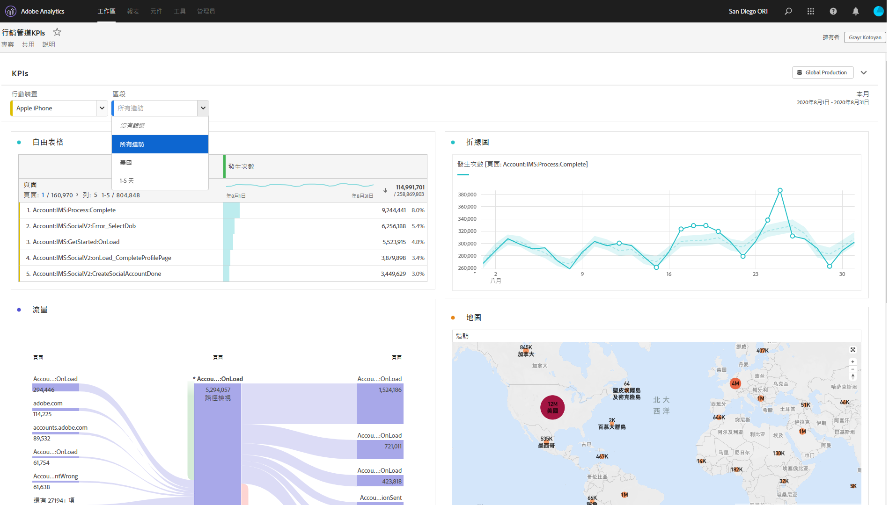

# 僅供檢視的專案

您可以透過[專案共用工作流程](/help/analyze/analysis-workspace/curate-share/share-projects.md)，將專案以「僅限檢視」的形式與收件者共用。設定於「可檢視」角色的收件者，將獲得更為限定的專案體驗。如果您想要與整體上較不熟悉您的組織資料結構、Analysis Workspace 或 Adobe Analytics 的使用者共用專案，但仍希望他們能在安全的環境中使用資料和深入解析，就可以採取此做法。

請注意，即使在僅供檢視的專案中，您也可以編輯面板行事曆日期範圍。

以下是僅限檢視專案的影片概觀：

>[!VIDEO](https://video.tv.adobe.com/v/36206/?quality=12)

## 停用的互動功能

在僅限檢視專案中停用的互動功能包括：

* 隱藏左側邊欄
* 報表套裝
* 自由格式篩選
* 可見列的自由格式編號
* 自由格式列、欄或視覺效果設定
* 面板區段
* 編輯、插入和元件選單
* Workspace 提示

## 啟用的互動功能

在僅限檢視專案中啟用的互動功能之中，更值得注意的功能包括：

| 區域 | 啟用的互動功能 |
| --- | --- |
| 自由表格 | <ul><li>分頁與排序</li><li>暫留</li><li>可更新連結視覺效果的儲存格選項</li><li>按一下滑鼠右鍵 > 取得視覺效果連結</li><li>按一下滑鼠右鍵 > 複製到剪貼簿</li></ul> |
| 視覺效果 | <ul><li>按一下以開啟/關閉圖例</li><li>暫留</li><li>按一下滑鼠右鍵 > 取得視覺效果連結</li><li>摺疊/展開</li><li>流量 - 展開流量節點</li><li>地圖 - 縮放</li></ul> |
| 面板 | <ul><li>互動式下拉式篩選器</li><li>按一下滑鼠右鍵 > 取得面板連結</li><li>摺疊/展開</li></ul> |
| 專案 | <ul><li>檢查所有資訊圖示</li><li>專案選單 - 新增、開啟、設定為登陸頁面、重新整理、下載 CSV/PDF、有限的專案資訊和設定</li><li>共用選單 - 取得專案連結，立即傳送檔案</li><li>說明選單 - 提示與除錯工具選項以外的所有動作</li></ul> |
