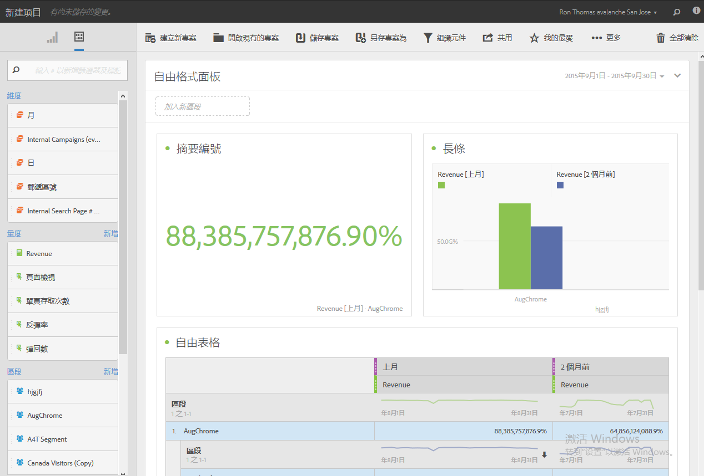
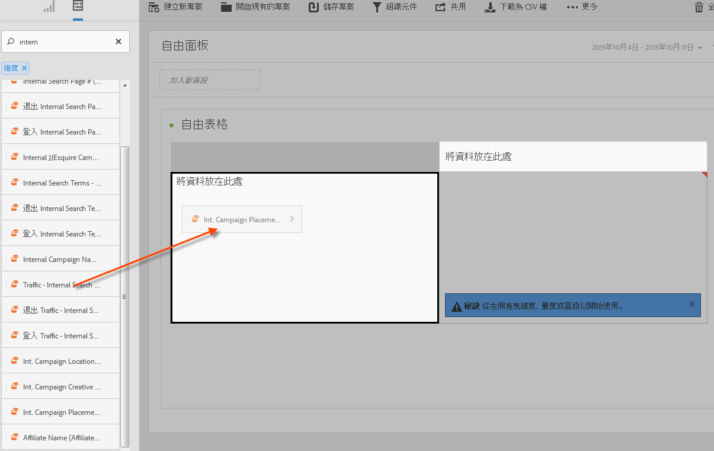
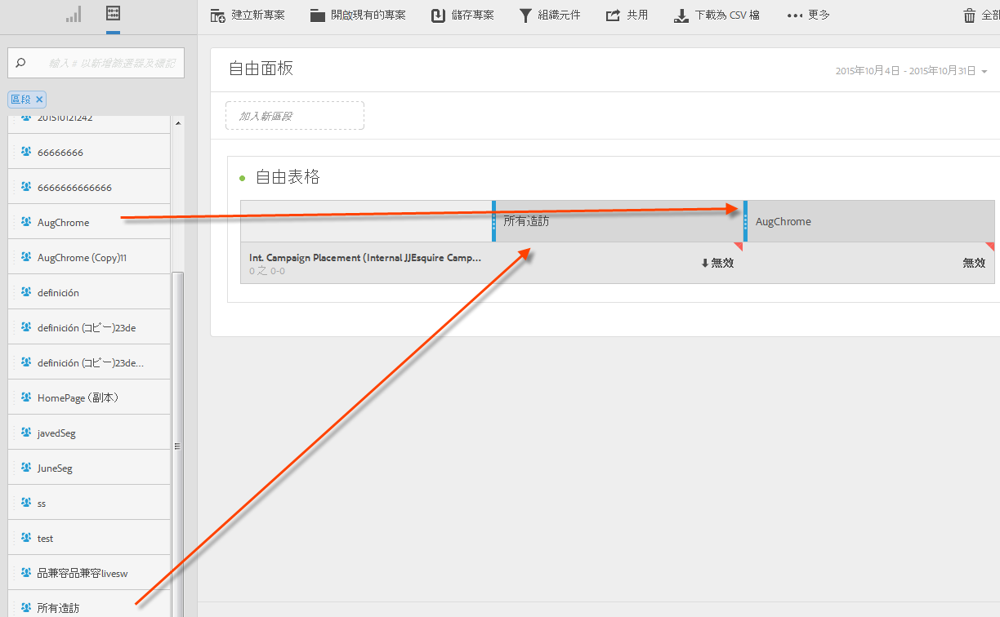
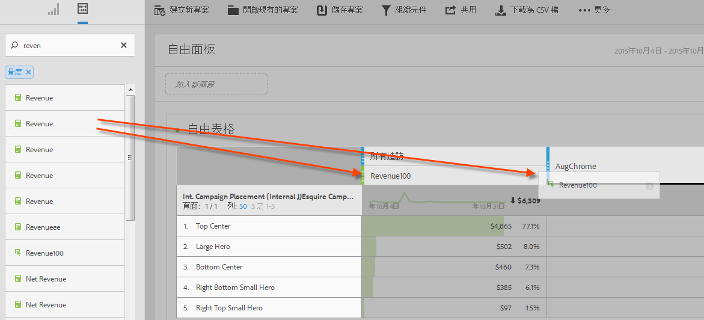
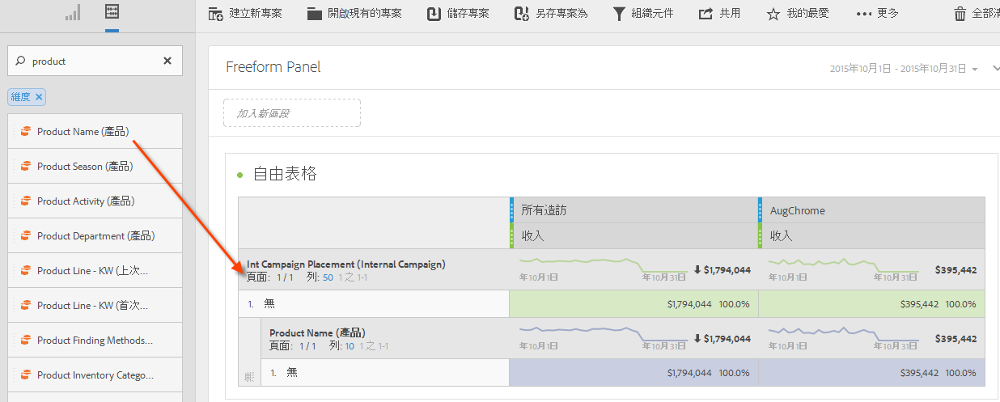
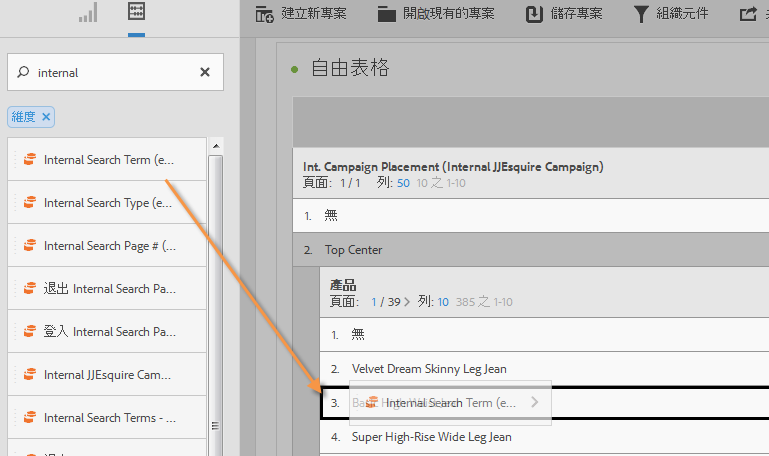
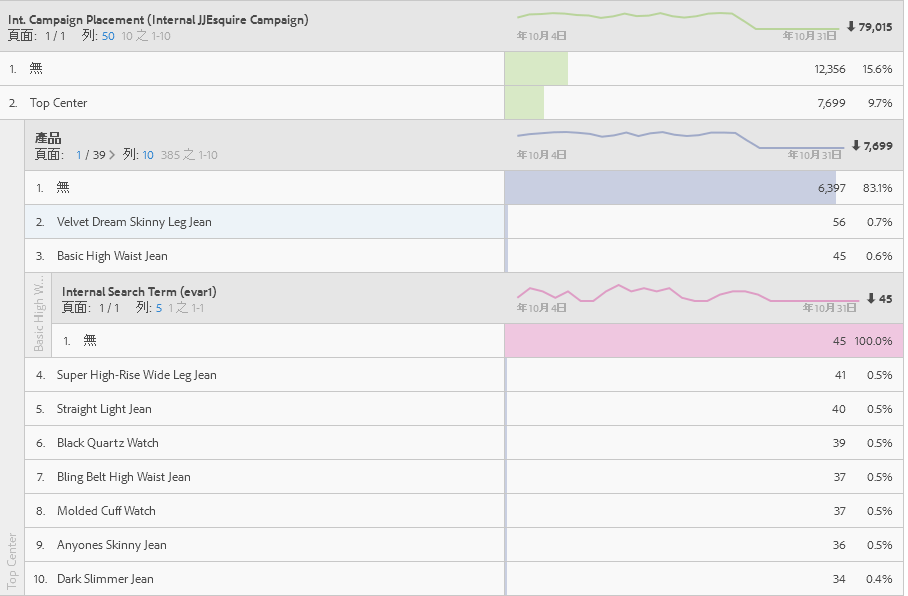

# Analysis Workspace 的使用案例

如何在「Analysis Workspace」中使用資料表格、區段以及使用案例的範例。

您可在各種資料間進行研究，回答具體問題並將客戶的互動和讀者的興趣放在一起描述。在自由格式環境中，您可以針對一個時段套用維度、量度和區段，直接擷取目標資料。製作您自己的分析、針對特定問題加以自訂，接著以豐富的報表和視覺化發佈資訊以供共用，即使是時間最有限的前線企業使用者也能輕鬆理解。

**範例**

* 身為一家媒體公司，您想比較新訪客、回頭訪客和最忠誠的訪客，了解不同區段隨時間的內容使用變化情形。
* 比較品牌關鍵字和非品牌關鍵字的轉換率。
* 依內部搜尋、外部搜尋、著陸頁面等項目劃分頁面檢視，了解品牌和非品牌搜尋詞的執行差異。
* 逐日進行欄或行比較，在多重量度間分析成長情形。
* 執行簡易查詢，例如每個維度的彈回數。

## 零售範例 {#section_9EFDEF038CAD4954BCFB118A8F33A96F}

假設您是一家戶外用品零售商的市場分析人員，您的任務是檢視最近的感恩節促銷活動的成效，並對現場促銷活動提出建議。此範例說明如何比較不同區段的促銷活動收入資料，並新增劃分以更深入鑽研促銷活動。

1. 選擇正確的報表套裝。
1. 舉例來說，您可以搜尋「內部促銷活動位置」維度，將其拖曳至表格畫布的左側區域 (此資料將組成表格行)。

   

1. 現在按一下左上方的區段圖示，拖曳不同的客戶忠誠度區段至畫布的右側。您即將動態進行區段的互相比較。這些資料將組成表格欄。

   

1. 按一下左上方的「事件 (量度)」圖示，在每個區段下方新增收入量度。注意報表自動產生的方式。您現在可以開始比較這些客戶區段的促銷活動收入了。

   

1. 現在，如果您想查看哪個產品在您網頁上的左側橫幅廣告插槽中最有效果，請依「產品名稱」劃分「左側橫幅廣告」。只需按一下「維度」圖示，然後拖曳產品名稱維度至「左側橫幅廣告」上方即可。

   

1. 您還可以更深入研究。您可能想知道人們透過哪個搜尋詞接觸您最暢銷的產品：Norfolk Highland。您只需將「內部搜尋詞」維度拖曳至產品名稱上方：

   

   就會產生新的劃分結果：

   

   您已透過劃分資料，為您的銷售團隊產生可在其他促銷活動中實施的建議和交叉銷售項目，可為您的公司帶來更多收入。您可以繼續進行劃分，直到獲得您想要的成果為止。

   現在您可以將報表[共用](/help/analyze/analysis-workspace/curate-share/curate.md)給銷售團隊了!

