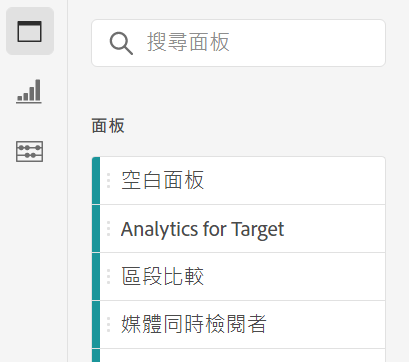
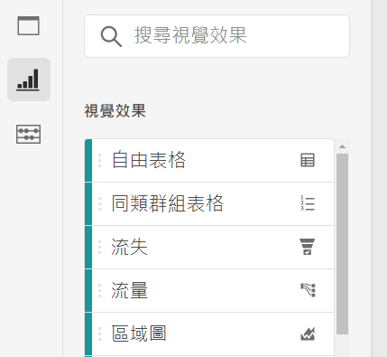
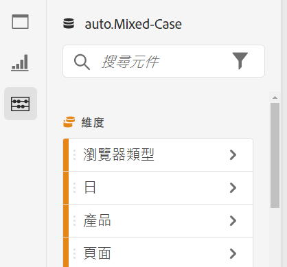
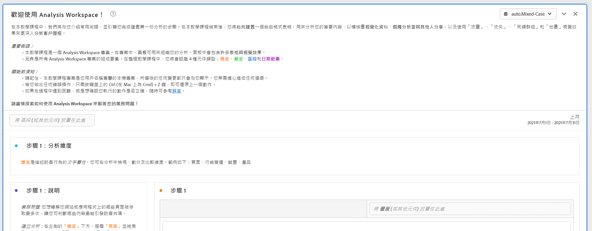

# Analysis Workspace 概觀

Analysis Workspace 可讓您快速建置分析以收集深入見解，然後與其他人分享這些深入見解。透過拖放瀏覽器介面，您可以建立分析、新增視覺效果以生動呈現資料、組織資料集，以及與組織中您選擇的任何人共用和排程專案。

以下影片提供了簡要概觀以及可能的範例。

>[!BEGINSHADEBOX]

請參閱  [Analysis Workspace 概觀](https://video.tv.adobe.com/v/26266/?quality=12&learn=on){target="_blank"}的示範影片。

>[!ENDSHADEBOX]

## Analysis Workspace 的區域

下圖和隨附的表格說明了 Analysis Workspace 中的一些主要區域：

| 影像中的位置 | 名稱與功能 |
|---------|----------|
| A | **最左側邊欄：**&#x200B;包含用於在 Analysis Workspace 新增面板、視覺效果和元件的標籤。也包含用來開啟資料字典的「資料字典」圖示。 |
| B | **左側邊欄：**&#x200B;根據在最左側邊欄選取的標籤，該區域包含個別的面板、視覺效果或元件。 |
| C | **畫布：**&#x200B;這是從左側邊欄拖曳內容以建立專案的主要區域。您新增面板、視覺效果和元件到畫布時，該專案就會動態更新。 |
| D | **報告套裝下拉式選單：**&#x200B;對於 Analysis Workspace 中的每個面板，報告套裝下拉式選單可讓您選擇要使用做為資料來源的報告套裝。 |

## Analysis Workspace 的功能 {#analysis}

以下是 Analysis Workspace 提供的一些主要功能：

### 面板

**面板**&#x200B;是用來在專案中整理可能包含許多表格和視覺效果的分析。Analysis Workspace 中提供的許多面板皆可根據使用者輸入的少量內容，產生完整的分析集。在左側邊欄中，選取頂部的「**[!UICONTROL 面板]**」圖示可檢視完整的可用面板清單。

若要深入了解面板，請參閱[面板概觀](https://experienceleague.adobe.com/docs/analytics/analyze/analysis-workspace/panels/panels.html)。

### 視覺效果

**視覺效果**&#x200B;可用來生動地呈現資料，例如長條圖或折線圖。在左側邊欄中，選取中間的「**[!UICONTROL 視覺效果]**」圖示可檢視完整的可用視覺效果清單。

若要深入了解視覺效果，請參閱[視覺效果概觀](https://experienceleague.adobe.com/docs/analytics/analyze/analysis-workspace/visualizations/freeform-analysis-visualizations.html)。

### 元件

Analysis Workspace 中的元件包含以下內容：

* 維度

* 量度

* 區段

* 日期範圍

若要深入了解各種元件類型，請參閱[元件概觀](/help/analyze/analysis-workspace/components/analysis-workspace-components.md)。

這些每個元件類型都可以新增到視覺效果 (例如自由形式表格) ，以開始回答您的業務問題。

了解元件術語之後，您可以將元件拖曳進入視覺效果 (包括自由形式表格) 以[建立分析](/help/analyze/analysis-workspace/build-workspace-project/freeform-overview.md)。

### 資料字典

Analysis Workspace 中的資料字典可幫助使用者和管理員追蹤和深入了解其 Analytics 環境中的元件。

若要深入了解資料字典，請參閱[資料字典概觀](/help/analyze/analysis-workspace/components/data-dictionary/data-dictionary-overview.md)。

### 資料來源

同步視覺效果可讓您控制哪些資料表或資料來源會對應至視覺效果。以下是有關如何[管理資料來源](/help/analyze/analysis-workspace/visualizations/t-sync-visualization.md)的更多資訊。

## 開始使用 Analysis Workspace

### 登入 Adobe Analytics {#login}

若要開始使用 Analysis Workspace，請前往 [experience.adobe.com/analytics](https://experience.adobe.com/analytics) 登入 Adobe Analytics。預設會顯示 Analysis Workspace 的「專案」頁面。如果系統已選取特定專案，專案就會以預設顯示。

### 建立專案 {#new-project}

Analysis Workspace 中的分析稱為[專案](/help/analyze/analysis-workspace/build-workspace-project/freeform-overview.md)。

您可以按照[建立專案](/help/analyze/analysis-workspace/build-workspace-project/create-projects.md)所述，在 Analysis Workspace 中建立專案。

如 [Analysis Workspace 中的資料夾](/help/analyze/analysis-workspace/build-workspace-project/workspace-folders/about-folders.md)所述，專案可以整理至資料夾和子資料夾中。

### 儲存和共用專案

您在 Analysis Workspace 中建立分析時，您的工作會[自動儲存](/help/analyze/analysis-workspace/build-workspace-project/save-projects.md)。

完成專案建置並開始收集可操作分析時，該專案就可供其他人使用。您可以與組織中的使用者和群組 (或甚至組織外部的人員) 共用該專案。如需有關共用專案的資訊，請參閱[共用專案](/help/analyze/analysis-workspace/curate-share/share-projects.md)。

## 其他資源 {#resources}

* Adobe 提供數百項 [Analytics 影片培訓教學課程](https://experienceleague.adobe.com/docs/analytics-learn/tutorials/overview.html?lang=zh-Hant)。
* 如需有關新功能的更新，請參閱 [Adobe Experience Cloud 發行說明](https://experienceleague.adobe.com/docs/release-notes/experience-cloud/current.html#analytics)。
* 熟悉 Analysis Workspace 的絕佳方法是透過 Analysis Workspace 培訓教學課程範本。此範本會逐步引導您了解常用術語，以及在 Workspace 中初次建立分析的步驟。若要開始進行教學課程：
   1. 在 Adobe Analytics 的「[!UICONTROL **Workspace**]」標籤上，選取左側的「**[!UICONTROL 學習]**」。
   1. 選取「**[!UICONTROL 開啟教學課程]**」。
      

