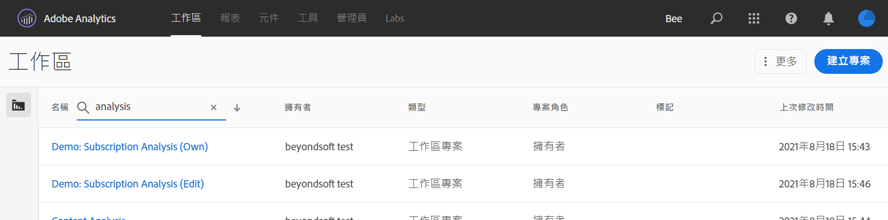
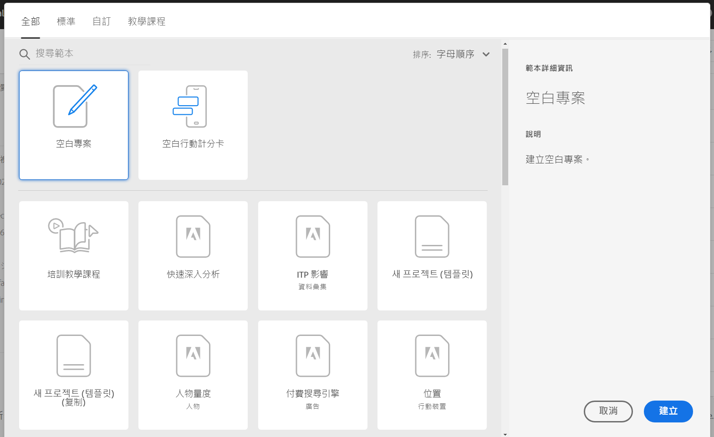

# Analysis Workspace 概述

Analysis Workspace 是彈性的瀏覽器工具，可協助您快速建立分析及分享見解。您可以使用拖放式操作介面建立分析、新增視覺效果以生動呈現資料、組織資料集、與組織中的任何人共用及排程專案。

如果您只有幾分鐘的時間，請觀看此簡短概述，以了解各項功能。

>[!VIDEO](https://video.tv.adobe.com/v/26266/?quality=12)

## 登入 Adobe Analytics {#login}

若要開始使用 Analysis Workspace，請前往 [experience.adobe.com/analytics](http://experience.adobe.com/analytics) 登入 Adobe Analytics。如果先前未選取特定專案，您的登陸頁面就會是 Analysis Workspace 專案清單首頁。

## 使用培訓教學課程 {#training-tutorial}

登入後，系統會先提供 Analysis Workspace 培訓教學課程，逐步引導您了解常用術語，並為您說明首次在 Analysis Workspace 建立分析的步驟。若要開始瀏覽教學課程，請按一下&#x200B;**[!UICONTROL 「建立新專案」]**，接著在新專案模式中選取&#x200B;**「培訓教學課程」**。

## 建立新專案 {#new-project}

結束教學課程後，您就能開始建立第一個專案。開始建立分析時，**新專案模式**&#x200B;會提供各種選項。您可以思考是要透過瀏覽器或 Adobe Analytics 儀表板行動應用程式共用分析，據以選擇開啟空白專案或[空白行動記分卡](https://docs.adobe.com/content/help/zh-Hant/analytics/analyze/mobapp/curator.translate.html)。

此外，預先建立的&#x200B;**範本** (包括 Adobe 提供的標準範本或貴組織建立的自訂範本) 也是您開始建立分析的理想選擇。您可以依據分析類型或其用途，從多種範本中挑選合適的範本使用。[深入了解](https://docs.adobe.com/content/help/zh-Hant/analytics/analyze/analysis-workspace/build-workspace-project/starter-projects.html)不同的範本選項。

## 建立分析 {#analysis}

進入 Analysis Workspace 專案後，您可以從左側邊欄存取&#x200B;**面板、表格、視覺效果和元件**。這些都是專案的組成要素。

### 元件

**元件**&#x200B;包括維度、量度、區段或日期範圍，您可以在&#x200B;**[!UICONTROL 自由表格]**&#x200B;中結合這些元件，開始回應客戶對業務的相關問題。請務必熟悉各種[元件類型](/help/analyze/analysis-workspace/components/analysis-workspace-components.md)，再開始建立分析。熟悉元件術語後，即可開始在&#x200B;**[!UICONTROL 自由表格]**&#x200B;中以拖放方式[建立分析](https://docs.adobe.com/content/help/zh-Hant/analytics/analyze/analysis-workspace/build-workspace-project/t-freeform-project.html)。

### 視覺效果

接著可以在資料上增加&#x200B;**視覺效果** (例如長條圖或折線圖)，以視覺化方式生動呈現資料。在左側邊欄中，選取中間的&#x200B;**[!UICONTROL 「視覺效果」]**&#x200B;圖示，即可檢視完整的可用[視覺效果](https://docs.adobe.com/content/help/zh-Hant/analytics/analyze/analysis-workspace/visualizations/freeform-analysis-visualizations.html)清單。

### 面板

**面板**&#x200B;可供在專案中組織可能包含許多表格和視覺效果的分析。Analysis Workspace 中提供的許多面板皆可根據使用者輸入的少量內容，產生完整的分析集。在左側邊欄中，選取頂端的&#x200B;**[!UICONTROL 「面板」]**&#x200B;圖示，即可檢視完整的可用[面板](https://docs.adobe.com/content/help/zh-Hant/analytics/analyze/analysis-workspace/panels/panels.html)清單。

## 其他資源 {#resources}

* Adobe 提供數百項 [Analytics 影片培訓教學課程](https://docs.adobe.com/content/help/zh-Hant/analytics-learn/tutorials/overview.html)。
* 請參閱「[Analysis Workspace 新增功能](/help/analyze/analysis-workspace/new-features-in-analysis-workspace.md)」，以取得新功能的更新資訊。
