# Analysis Workspace 的新增功能

## 2020 年 3 月

2020年3月12日發行的新功能。

| 功能 | 說明 |
|--- |--- |
| 支援工作區中的多個報表套裝 | 您現在可以將多個報表套裝的資料匯入單一專案，以並排檢視。 [更多詳情...](https://docs.adobe.com/content/help/en/analytics/analyze/analysis-workspace/build-workspace-project/multiple-report-suites.html) |
| 訓練教學課程範本 | 此新標準範本會逐步帶您瞭解在工作區中建立第一個分析的常用術語和步驟。 若新使用者的清單中沒有其他專案，這會顯示為「新增專案」模組中的標準範本，取代目前現有的範例專案。[更多詳情...](/help/analyze/analysis-workspace/build-workspace-project/starter-projects.md) |

## 2020 年 2 月

2020年2月20日發行的新功能。

| 功能 | 說明 |
|--- |--- |
| 使用跨裝置分析的組織適用的新工作區範本 | 此範本顯示CDA如何有效地將造訪連結在一起，並教育您瞭解CDA專屬的維度和量度。 需使用 CDA 的報表套裝。如需詳細資訊，請參閱[設定跨裝置分析](https://docs.adobe.com/content/help/en/analytics/components/cda/cda-setup.html)。 |
| 工作區中的新快速鍵 | <ul><li>摺疊/展開所有面板：`alt + m`</li><li>摺疊/展開作用中的面板：`alt + ctrl + m`</li><li>搜尋左側欄：`ctrl + /`</li><li>移至下一個面板：`alt + Right Key`</li><li>移至上一個面板：`alt + Left Key`</li></ul>[更多詳情...](https://docs.adobe.com/content/help/en/analytics/analyze/analysis-workspace/build-workspace-project/fa-shortcut-keys.html) |
| 其他工作區增強功能 | <ul><li>當面板或視覺化放入「工作區」時，左側導軌現在會自動切換至元件，讓工作流程更順暢。</li><li>範本元件現在可以依據（例如標籤、收藏、核准）進行設定。</li><li>篩選的量度和區段清單會提供+按鈕，讓您在找不到所需項目時新增元件。</li></ul> |
| 工作區除錯程式 | 「說明」功能表新增 Workspace 偵錯程式，供您以更順暢的方式啟用，以偵錯 Workspace 請求。[更多詳情...](https://www.adobe.io/apis/experiencecloud/analytics/docs.html#!AdobeDocs/analytics-2.0-apis/master/reporting-tricks.md) |

## 2020 年 1 月

2020 年 1 月 16 日發行的新功能.

| 功能 | 說明 |
|--- |--- |
| [自由表格產生器](https://docs.adobe.com/content/help/en/analytics/analyze/analysis-workspace/visualizations/freeform-table.html) | 啟用「表格產生器」後，許多維度、劃分、量度和區段都可直接拖放使用，方便建立可回答更複雜商業問題的表格。資料不會立即更新，Instead, updates occur after you click **[!UICONTROL Build]**, saving you time once you know what table you want to construct. 此外，這項功能也提供以下輔助功能：<ul><li>**預覽**：演算實際資料前，您可以先預覽表格格式。</li><li>**彈性的表格列與劃分設定**：您可以針對每個維度列設定列與劃分層級。以前，Workspace 的預設內容只有在資料回傳後才能變更。</li><li>**依位置劃分**：您可以設定維度列，一律&#x200B;_依位置劃分_&#x200B;而非&#x200B;_依特定項目_&#x200B;劃分 (預設)。</li><li>**手動靜態列排序**：您可以手動排序靜態列，讓表格列能依您的需求顯示。以前，靜態列只能依量度欄或字母順序排序。</li></ul> |

## 2019 年 10 月

2019 年 10 月 10 日發行的增強功能。

| 增強功能 | 說明 |
|--- |--- |
| 更新為自由表格總計 | 自由表格現在包含兩個總計， **[!UICONTROL Table total]** a和a **[!UICONTROL Grand total]**。 表格總計列計入套用的[報表篩選器](https://docs.adobe.com/content/help/en/analytics/analyze/analysis-workspace/build-workspace-project/pagination-filtering-sorting.html)。以前只有區段會影響總計。[更](https://docs.adobe.com/content/help/en/analytics/analyze/analysis-workspace/build-workspace-project/workspace-totals.html) 多資訊此外， **[!UICONTROL Show Totals]** 還 **[!UICONTROL Show Grand Total]** 新增了選項至 **[!UICONTROL Column Settings]**。 對自由格式總計的這項變更，會更新相依的視覺化(例如連結的視覺 **[!UICONTROL Summary Number]** 化)，以及匯出的CSV和PDF資料。 |
| 移除「未指定/無」的選項 | 可輕鬆移除「未指定 (無)」的功能已新增為報表篩選器的選項。 |
| 取代紫色粒度元件 | 紫色粒度時間元件 (分鐘、小時、日、周、月、季、年) 已遭取代。紫色時間元件的行為一向會與其橘色維度元件完全相同，因此這項變更可簡化體驗。如果您先前已使用其中一個紫色時間元件，則&#x200B;**不需要採取任何動作**。 透過這項變更，紫色 **[!UICONTROL Time]** 區段也已重新命名為 **[!UICONTROL Date Ranges]**。 |

## 2019 年 8 月

2019 年 8 月 8 日發行的增強功能。

| 增強功能 | 說明 |
|--- |--- |
| 將下拉式篩選器的項目上限從 50 個提升至 200 個 | 我們將下拉式篩選器中可放置的項目上限從 50 個提升至 200 個。此增強功能適合多種使用案例，例如將所有國家 (195) 新增至篩選器，或新增所有美國州和省 (52)。 |

## 2019 年 7 月

2019 年 7 月 18 日發行的增強功能。

| 增強功能 | 說明 |
|--- |--- |
| Cohort Analysis 增強功能 | 已新增全新的[同類群組分析設定](https://docs.adobe.com/content/help/en/analytics/analyze/analysis-workspace/visualizations/cohort-table/t-cohort.html)： <ul><li>僅顯示百分比</li><li>將百分比四捨五入到最接近的整數</li><li>顯示平均百分比列</li></ul> |
| 顯示最近 18 個月的項目 | 在左側滑軌中，使用者現在可以選擇&#x200B;_顯示過去 18 個月的項目_。之前，回顧期間的上限為 6 個月。這能讓您更加輕鬆地與去年或最多 18 個月前的頁面或行銷活動進行比較。 |
| 全新 Analysis Workspace 範本 | 我們對 Analysis Workspace 新增了名為[「Magento：行銷和商務」](https://docs.adobe.com/content/help/en/analytics/analyze/analysis-workspace/build-workspace-project/starter-projects.html)的全新範本。此範本是專為 Magento 電子商務客戶所設計，但所有零售商均可使用此範本來取得有關其商務活動的獨特分析。 |

## 2019 年 6 月

2019 年 6 月 13 日發行的增強功能。

| 增強功能 | 說明 |
|--- |--- |
| 新的立即可用濾鏡 | 新增立即可用的篩選器至左側欄搜尋。除了您今天看到的項目 (維度、量度、已批准等)，新增了新的篩選器，包括計算量度、客戶屬性、eVar、Prop、視訊等，讓您能夠輕鬆找到您需要的元件。 |

## 2019 年 5 月

2019 年 5 月 9 日發行的增強功能。

| 增強功能 | 說明 |
|--- |--- |
| 「流量」視覺效果新增設定：「包含重複例項」。 | [流量設定](/help/analyze/analysis-workspace/visualizations/c-flow/flow-settings.md) |

## 2019 年 4 月

2019 年 4 月 11 日發行的增強功能。

| 增強功能 | 說明 |
|--- |--- |
| 最佳化最佳實務的增強功能 | [效能最佳化](/help/analyze/analysis-workspace/new-features-in-analysis-workspace.md) |

## 2019 年 1 月

2019 年 1 月 17 日發行的新功能與增強功能。

| 功能 | 說明 |
|--- |--- |
| [同類群組分析](/help/analyze/analysis-workspace/visualizations/cohort-table/cohort-analysis.md) | 同類群組分析的重大改善可讓您：<ul><li>分別套用區段包含和回訪量度。 </li><li>顯示流失率而非保留率。</li><li>顯示延時表格 (包含事件前後經過的時間)。</li><li>自訂同類群組維度 (根據 eVar 將訪客分組，而非僅根據時間)。</li><li>執行滾動式同類群組計算：根據先前時段 (而非原始同類群組) 計算保留率/流失率。 </li><li>在包含與回訪欄位中新增多個量度，並套用區段。(不支援計算量度)</li></ul> |
| [檢視密度](/help/analyze/analysis-workspace/build-workspace-project/view-density.md) | 此新設定可減少左側欄、自由表格和同類群組表格的垂直邊框間距，讓您在單一畫面上查看更多資料。您可透過「專案 > 專案資訊與設定」，存取此設定。 |
| [支援歸因 IQ 中的多值變數](attribution-iq.md) | Analytics 的部分維度可包含單一點擊的多個數值，例如 listVar、產品變數、清單 prop 或銷售 eVar。Analysis Workspace 可讓您將歸因 IQ 套用至這些點擊層級變數。 |
| 改善效能 | 提升劃分視覺效果的速度，具有大量劃分的專案會更快載入。 |

## 2018 年 11 月

2018 年 11 月 1 日發行的新功能與增強功能。

| 功能 | 說明 |
|--- |--- |
| [VRS 與專案組織 - 增強功能](/help/analyze/analysis-workspace/curate-share/curate-projects-vrs.md) | 這些變更實際上已於 2018 年 10 月推出。管理員與非管理員可在已組織的 Workspace 專案和虛擬報表套裝 (VRS) 中查看的元件有所變動。 過去，只要按一下「顯示所有元件」，任何人都能查看未組織的元件。更新的組織體驗能讓您對可查看的元件執行更細微的控制。  |

## 2018 年 10 月

2018 年 10 月 11 日發行的新功能與增強功能。

<table id="table_3DDC812B2F66416F868004416D248BF3"> 
 <thead> 
  <tr> 
   <th colname="col1" class="entry"> 功能 </th> 
   <th colname="col2" class="entry"> 說明 </th> 
  </tr> 
 </thead>
 <tbody> 
  <tr> 
   <td colname="col1"> 
<b>面板下拉式清單管理</b> 
 </td> 
   <td colname="col2"> 
我們變更了 9 月 MR 推出的面板下拉式清單管理方式。現在用滑鼠右鍵按下拉式清單時，可以進行下列操作： 
 
    <ul id="ul_4BDEC66EEB2243628FE32B43E377E5BD"> 
     <li id="li_EF8277BE972540D3B2604D82BC7C0918">刪除下拉式清單 (一律顯示此選項。) </li> 
     <li id="li_6A991208F2744274817DBE1E9D1B443F">刪除標籤 (如果有標籤。) </li> 
     <li id="li_5C1CFC465C2E41D2B35E8841EFDC82AA">新增標籤 (如果沒有標籤。) </li> 
    </ul> </td> 
  </tr> 
  <tr> 
   <td colname="col1"> 
<b>面板的連結和視覺效果工具提示</b> 
 </td> 
   <td colname="col2"> 
我們將相關影片和文件連結新增至面板，並新增視覺效果工具提示。 
 </td> 
  </tr> 
 </tbody> 
</table>

## 2018 年 9 月

2018 年 9 月 13 日發行的新功能與增強功能。

<table id="table_137719BFA03C44A78FDE872DF8B228A4"> 
 <thead> 
  <tr> 
   <th colname="col1" class="entry"> 功能 </th> 
   <th colname="col2" class="entry"> 說明 </th> 
  </tr> 
 </thead>
 <tbody> 
  <tr> 
   <td colname="col1"> 
<b>面板下拉式清單</b> 
 </td> 
   <td colname="col2"> 
面板拖放區域現在具有下拉式清單功能。下拉式清單可讓使用者以有限方式與專案中資料互動。舉例來說，假設您的專案有多種版本，提供特定國家/地區報表。您現在可以將這些專案匯集成單一專案，並將其加入國家/地區下拉式清單中。 
 </td> 
  </tr> 
  <tr> 
   <td colname="col1"> 
<b>調色盤</b> 
 </td> 
   <td colname="col2"> 
您現在可以從其他的調色盤中選擇，或者自訂調色盤，變更用於 Workspace 的色彩配置。此功能會影響 Workspace 許多項目，包括大部分的視覺效果。「摘要變更」、自由表格中的條件式格式以及地圖視覺效果<b>不</b>受影響。 
 
注意：Internet Explorer 11 並不支援調色盤。 
 </td> 
  </tr> 
  <tr> 
   <td colname="col1"> 
<b>全新範本：音效消耗</b> 
 </td> 
   <td colname="col2"> 
請參閱 <a href="https://marketing.adobe.com/resources/help/en_US/sc/appmeasurement/hbvideo/media-workspace-templates.html"  >Audio Analytics</a>。 
 </td> 
  </tr> 
 </tbody> 
</table>
## 2018 年 8 月

2018 年 8 月 9 日發行的新功能與增強功能。

<table id="table_DD77C02344414DCD9AC0A6A22E648B72"> 
 <thead> 
  <tr> 
   <th colname="col1" class="entry"> 功能 </th> 
   <th colname="col2" class="entry"> 說明 </th> 
  </tr> 
 </thead>
 <tbody> 
  <tr> 
   <td colname="col1"> 
<b>拖放區域參考線</b> 
 </td> 
   <td colname="col2"> 
這些參考線能讓您更容易了解每個拖放操作的作用。例如，當您將游標停留在欄上時，會顯示如「新增」、「取代」、「篩選依據」以及「劃分」等。 
 
我們也新增了黃/紅參考線，系統會在您採取不建議或禁止使用的操作時提醒您，例如將兩個量度堆疊在一起 (這會導致資料無效)。 
 </td> 
  </tr> 
  <tr> 
   <td colname="col1"> 
<b>新增空白面板選項</b> 
 </td> 
   <td colname="col2"> 
我們在開始面板下方新增了 + 號，讓您可以更輕鬆地新增其他面板。 
 </td> 
  </tr> 
 </tbody> 
</table>

## 2018 年 7 月

2018 年 7 月 19 日發行的新功能與增強功能。

<table id="table_336E121310204DC492EA004F40830B0F"> 
 <thead> 
  <tr> 
   <th colname="col1" class="entry"> 功能 </th> 
   <th colname="col2" class="entry"> 說明 </th> 
  </tr> 
 </thead>
 <tbody> 
  <tr> 
   <td colname="col1"> 
<b> <a href="attribution-iq.md"  > 歸因 IQ </a> </b> 
 </td> 
   <td colname="col2"> 
歸因 IQ 可讓您針對行銷績效執行更精細的智慧化分析作業。全新的歸因模式適用於 Analysis Workspace (任何表格或任何劃分) 與計算量度中的量度。全新的歸因面板可提供更理想的視覺化效果和比較功能。 
 </td> 
  </tr> 
  <tr> 
   <td colname="col1"> 
<b> 改善左側欄 </b> 
 </td> 
   <td colname="col2"> 
對左側欄加以改善，使其更為直覺且易於使用： 
 
    <ul id="ul_087BEDF4338946DA857CD82CB69F98C2"> 
     <li id="li_C751AACAC60442DC93118F0819F8EEA7"> 將各元件 (量度、區段、日期) 的建立 (+) 功能內嵌在標頭中。 </li> 
     <li id="li_DE2EB184A02D4CE58C23F518DB85EFDD"> 在每個區段清單的最下方新增「+ 查看全部」，以明確表明有超過 5 個選項。 </li> 
     <li id="li_5208F3C6026647B09F4A85131B175175">選取元件時浮現附有圖示的動作 (例如標記、標為最愛)。 </li> 
     <li id="li_11E601488A844515928231E09889BC54">改善使用者介面的視覺外觀。 </li> 
    </ul> </td> 
  </tr> 
  <tr> 
   <td colname="col1"> 
<b>計算量度的總計 </b> 
 </td> 
   <td colname="col2"> 
現在，我們會盡可能顯示計算量度的總計，包括百分比 
 </td> 
  </tr> 
  <tr> 
   <td colname="col1"> 
<b>新增<a href="/help/analyze/analysis-workspace/components/calendar-date-ranges/calendar.md"  >日期範圍</a>預設集</b> 
 </td> 
   <td colname="col2"> 
針對 Analysis Workspace 的日期範圍預設集新增「過去 13 週整」。 
 </td> 
  </tr> 
 </tbody> 
</table>

## 2018 年 6 月

2018 年 6 月 14 日發行的新功能與增強功能。

<table id="table_57035A06D99447A6BE6ED825A648ED3F"> 
 <thead> 
  <tr> 
   <th colname="col1" class="entry"> 功能 </th> 
   <th colname="col2" class="entry"> 說明 </th> 
  </tr> 
 </thead>
 <tbody> 
  <tr> 
   <td colname="col1"> 
<b> <a href="/help/analyze/analysis-workspace/components/dimensions/view-dimensions.md"  > 動態維度欄 </a> </b> 
 </td> 
   <td colname="col2"> 
過去，當維度放置於某一欄時，我們會顯示非時間維度的前 5 個值 (而時間維度則是前 15 個值)，並將這些值保持為靜態 (亦意，所選的 5 個值從未改變)。 
 
從現在起，我們會預設顯示動態值而不是靜態值，並可以選擇將這些值轉換為靜態值。其他注意事項： 
 
    <ul id="ul_C802BC32CB084E30B4E58E9E90B9A63D"> 
     <li id="li_452466AB416F4737B532849C604BD4CC">按一下動態維度上的 (i)，您將會看到排名 (5 名中的第 1 名) 與維度類型。 </li> 
     <li id="li_588F6199E38D47869AC855A4C2A4D1B7">隨著資料更新，動態維度欄也會隨之更新以顯示目前的 5/15 維度項目。 </li> 
     <li id="li_19D47638D4D94416B0DAD2B2FB835ABE">已複製或移動的動態維度欄將變為靜態。 </li> 
     <li id="li_B95411689AE04774B7B9BA128F2DB96F">滑鼠游標暫留在靜態維度欄時，您會看到一個鎖定圖示，表示該維度是靜態的。 </li> 
    </ul> </td> 
  </tr> 
  <tr> 
   <td colname="col1"> 
<b>全新 Workspace 功能模式 </b> 
 </td> 
   <td colname="col2"> 
與上個月推出的「每日秘訣」類似，在新版本發行後，此模式會在第一次登入 Workspace 時顯示新的 Workspace 功能。 
 </td> 
  </tr> 
 </tbody> 
</table>

## 2018 年 5 月

2018 年 5 月 10 日發行的新功能與增強功能。

<table id="table_EE4C690A178B4F80BDAF2BB4424D6020"> 
 <thead> 
  <tr> 
   <th colname="col1" class="entry"> 功能 </th> 
   <th colname="col2" class="entry"> 說明 </th> 
  </tr> 
 </thead>
 <tbody> 
  <tr> 
   <td colname="col1"> 
<b>每日祕訣</b> 
 </td> 
   <td colname="col2"> 
介面右下角會提供每日祕訣 (並附上短片)。這麼做的目的，是要協助您儘快熟悉 Analysis Workspace 的眾多功能。您可以選擇關閉這些秘訣，需要時可隨時前往「說明 &gt; 秘訣」查看。 
 
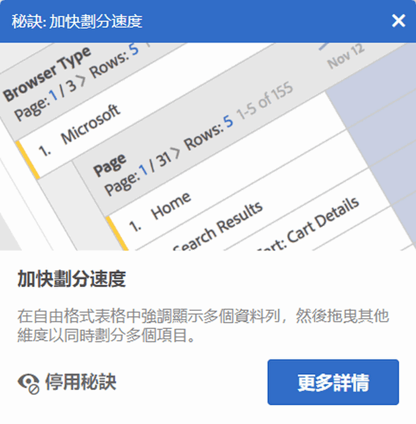 
 </td> 
  </tr> 
  <tr> 
   <td colname="col1"> 
<b><a href="/help/analyze/analysis-workspace/components/t-freeform-project-segment.md"  >區段範本</a>和<a href="/help/analyze/analysis-workspace/components/apply-create-metrics.md"  >計算量度範本</a></b> 
 </td> 
   <td colname="col2"> 
現在起，左側欄會顯示區段範本和計算量度範本。 
 </td> 
  </tr> 
  <tr> 
   <td colname="col1"> 
<b>拖曳元件時可同時捲動</b> 
 </td> 
   <td colname="col2"> 
現在開始，將元件拖曳到新位置時可以同時上下捲動。 
 </td> 
  </tr> 
  <tr> 
   <td colname="col1"> 
<b>檢視異常的<a href="/help/analyze/analysis-workspace/virtual-analyst/c-anomaly-detection/view-anomalies.md"  > 其他資訊 </a></b> 
 </td> 
   <td colname="col2"> 
現在起，將滑鼠游標暫留在折線圖的某個異常上，畫面就會顯示異常的日期和原始值等相關資訊。 
 </td> 
  </tr> 
 </tbody> 
</table>

## 2018 年 4 月

2018 年 4 月 12 日發行的新功能與增強功能。

<table id="table_B9E784CD14A1453EB360FCCDC612250F"> 
 <thead> 
  <tr> 
   <th colname="col1" class="entry"> 功能 </th> 
   <th colname="col2" class="entry"> 說明 </th> 
  </tr> 
 </thead>
 <tbody> 
  <tr> 
   <td colname="col1"> 
 <a href="/help/analyze/analysis-workspace/build-workspace-project/column-row-settings/column-settings.md"  >「繞排標頭文字」預設為啟用</a> 
 </td> 
   <td colname="col2"> 
自由格式表格現已預設啟用「繞排標頭文字」欄設定。 
 </td> 
  </tr> 
  <tr> 
   <td colname="col1"> 
 <a href="/help/analyze/analysis-workspace/build-workspace-project/column-row-settings/table-settings.md"  > 新的列設定 </a> 
 </td> 
   <td colname="col2"> 
新增「按列計算百分比」的列設定，強制自由格式表格計算跨列的儲存格百分比，而非整欄計算。此設定在計算趨勢百分比時特別實用，例如分析一維值是如何隨著時間而在剩餘的部分當中好轉的趨勢。按一下「視覺化」圖示時，此功能就會預設為啟用。 
 </td> 
  </tr> 
  <tr> 
   <td colname="col1"> 
 <a href="/help/analyze/analysis-workspace/visualizations/freeform-analysis-visualizations.md#section_D3BB5042A92245D8BF6BCF072C66624B"  >「100% 堆疊」的視覺效果設定 </a> 
 </td> 
   <td colname="col2"> 
針對堆疊區域圖/堆疊長條圖/堆疊橫條圖的全新視覺效果設定可讓圖表以「100% 堆疊」的視覺效果方式呈現；因此，你可以測量相對比例。 
 
 
 </td> 
  </tr> 
  <tr> 
   <td colname="col1"> 
 現在僅可透過 Analysis Workspace 使用<a href="/help/analyze/analysis-workspace/virtual-analyst/overview.md"  >「異常偵測」和「貢獻分析」</a>。 
 </td> 
   <td colname="col2"> 
「異常偵測」和「貢獻分析」這兩項功能已從 Reports &amp; Analytics 功能集中移除，現在只能透過 Analysis Workspace 使用。 
 
請注意，Adobe Analytics Select 與 Adobe Analytics Foundation 客戶在 Workspace 中只能存取「每日粒度」的異常偵測功能。 
 </td> 
  </tr> 
 </tbody> 
</table>

## 2018 年 3 月

2018 年 3 月 8 日發行的新功能與增強功能。

<table id="table_580CF2C1322E4FB78870BE2B1F497B2F"> 
 <thead> 
  <tr> 
   <th colname="col1" class="entry"> 功能 </th> 
   <th colname="col2" class="entry"> 說明 </th> 
  </tr> 
 </thead>
 <tbody> 
  <tr> 
   <td colname="col1"> 
 <a href="/help/analyze/analysis-workspace/build-workspace-project/column-row-settings/column-settings.md"  > 標頭文字繞排 </a> 
 </td> 
   <td colname="col2"> 
您現在可以在自由表格中繞排標頭文字，讓標頭更容易閱讀，表格也更便於分享。我們已在欄設定中新增「繞排標頭文字」選項。這項設定特別是對 PDF 的轉譯還有較長名稱的量度來說，非常實用。 
 </td> 
  </tr> 
  <tr> 
   <td colname="col1"> 
 <a href="/help/analyze/analysis-workspace/components/apply-create-metrics.md"  > 按一下右鍵以建立量度 </a> 
 </td> 
   <td colname="col2"> 
為了更方便快速建立計算量度，在自由表格中，已將「從選取範圍建立量度」新增至的滑鼠右鍵功能表。只要選取一個或多個標頭欄儲存格，就可以看到這個選項。 
 </td> 
  </tr> 
  <tr> 
   <td colname="col1"> 
 <a href="/help/analyze/analysis-workspace/visualizations/map-visualization.md"  > 地圖視覺效果增強功能 </a> 
 </td> 
   <td colname="col2"> 
為了能夠在地圖視覺效果中顯示期間比較 (例如，逐年比較)，我們新增了下列增強功能： 
 
    <ul id="ul_F570E6AB174C45788620CF50E2742A08"> 
     <li id="li_746E329037764644A9CCF79161C26350">地圖視覺效果現在也支援顯示負數。舉例來說，如果您繪製的是逐年比較量度，則地圖可以在紐約上顯示 -33％。 </li> 
     <li id="li_E05F0380627044E6A4E8A60C98494BF7">對於類型為「百分比」的量度，叢集會一併平均分配百分比。 </li> 
     <li id="li_44C04306EA1B413E91B8256B340D5296">新的色彩配置：正值/負值 (綠色/紅色) </li> 
    </ul> </td> 
  </tr> 
  <tr> 
   <td colname="col1"> 
 <a href="/help/analyze/analysis-workspace/build-workspace-project/starter-projects.md"  > 自訂範本更新 </a> 
 </td> 
   <td colname="col2"> 
在最新發行的自訂範本中，我們已 
 
    <ul id="ul_787F48253F454163B99F6DD50F199FE2"> 
     <li id="li_828DD547DDB54A81B9FFB9FE92790F6C">在專案的上方(標題旁邊)新增範本圖示，以幫助您在使用範本開始一個專案的同時，區分與編輯範本模式。 </li> 
     <li id="li_EEAA4D115CB74A57BABD524B2561E0CC">允許非管理員建立(另存新檔)並編輯 Workspace 專案範本，並假設他們已獲得在 Analysis Workspace 中建立/組織專案的權限。(「管理員 &gt; 使用者管理  &gt; 群組 &gt; 編輯所有報表存取權 &gt; 自訂 Analytics 工具 &gt; 在 Analysis Workspace 中建立/組織專案」)。 </li> 
    </ul> </td> 
  </tr> 
 </tbody> 
</table>

## 2018 年 2 月

2018 年 2 月 8 日發行的新功能與增強功能。

<table id="table_824BBE4A554B4DB092ADA9044383D0FA"> 
 <thead> 
  <tr> 
   <th colname="col1" class="entry"> 功能 </th> 
   <th colname="col2" class="entry"> 說明 </th> 
  </tr> 
 </thead>
 <tbody> 
  <tr> 
   <td colname="col1"> 
 <a href="/help/analyze/analysis-workspace/build-workspace-project/starter-projects.md#create-custom-template"  > 自訂 Workspace 範本 </a> 
 </td> 
   <td colname="col2"> 
您現在可以建立與保存專屬於您的 Workspace 範本，並且供您機構中其他與該範本類似的使用者直接使用您的範本。 
 </td> 
  </tr> 
  <tr> 
   <td colname="col1"> 
 <a href="/help/analyze/analysis-workspace/build-workspace-project/t-freeform-project.md"  > 新專案啟動模式 </a> 
 </td> 
   <td colname="col2"> 
按一下「新專案」以開啟新視窗，您可以在該視窗選擇您想要的開始方式 
 
    <ul id="ul_FE90E6B9AF334A029D66A43901F8FA0B"> 
     <li id="li_F1DFD9AE140C4E5B849D4C522D5968DB">空白專案，或 </li> 
     <li id="li_23BD391D68674C299858A97BFE10598B">標準 (內建) Workspace 範本，或 </li> 
     <li id="li_04D84FE375B84BF88843AA0D43A234BF">自訂 Workspace 範本 (請參閱上述) </li> 
    </ul> </td> 
  </tr> 
  <tr> 
   <td colname="col1"> 
支援按一下滑鼠右鍵來複製 
 </td> 
   <td colname="col2"> 
我們新增了按一下滑鼠右鍵「複製至剪貼簿」選項，讓您能夠不間斷地複製儲存格/表格。 
 </td> 
  </tr> 
  <tr> 
   <td colname="col1"> 
 <a href="/help/analyze/analysis-workspace/build-workspace-project/column-row-settings/column-settings.md"  >欄百分比改善</a> 
 </td> 
   <td colname="col2"> 
即使在某些情況下，列會超過總數的 100% (例如平均值)，欄中顯示的「總數的百分比」上限還是 100%。 
 
為了比例更精確，現在開始我們可以顯示超過 100% 的數值。我們也將上限提高為 1000％，以確保欄位的寬度夠大。 
 </td> 
  </tr> 
  <tr> 
   <td colname="col1"> 
 <a href="/help/analyze/analysis-workspace/build-workspace-project/column-row-settings/column-settings.md#section_3DD847151DA14914888A70FC4FD7BDFB"  > 在「劃分」上啟用條件格式 </a> 
 </td> 
   <td colname="col2"> 
除非選取「自訂」限制，否則現在都能自動在自由表格中套用顏色等條件格式。 
 </td> 
  </tr> 
  <tr> 
   <td colname="col1"> 
預設<a href="/help/analyze/analysis-workspace/components/calendar-date-ranges/calendar.md"  >日曆</a>檢視的變更 
 </td> 
   <td colname="col2"> 
預設狀況下，Workspace 日曆現在將顯示當月與上個月，而不是先前的當月與下個月。 
 </td> 
  </tr> 
  <tr> 
   <td colname="col1"> 
改善在 Workspace 表格中的覆蓋/選擇顏色 
 </td> 
   <td colname="col2"> 
將滑鼠游標暫留在自由表格的儲存格上而不是點選儲存格時，其顏色差異更加明顯。 
 </td> 
  </tr> 
 </tbody> 
</table>

## 2018 年 1 月

2018 年 1 月 18 日發行的新功能與增強功能。

<table id="table_7A2E678577F94BDABB1276C826E6554F"> 
 <thead> 
  <tr> 
   <th colname="col1" class="entry"> 功能 </th> 
   <th colname="col2" class="entry"> 說明 </th> 
  </tr> 
 </thead>
 <tbody> 
  <tr> 
   <td colname="col1"> 
自由表格中多個維度項目的<a href="/help/analyze/analysis-workspace/build-workspace-project/pagination-filtering-sorting.md"  >篩選選項</a> 
 </td> 
   <td colname="col2"> 
已新增多個維度項目的進階篩選選項 (除了現有的「包含」與「不包含」選項以外)： 
 
    <ul id="ul_869B3E943E304C0282D56AD96BB79E18"> 
     <li id="li_81A49BA0CA3041C7AB892FAD2D129E5A">包含所有字詞 </li> 
     <li id="li_2AB564F917844F82839A91949D0B684A">包含任何字詞 </li> 
     <li id="li_16C7938EDC8F422EA006FB63F2881EF1">包含片語 </li> 
     <li id="li_5130EBE9A7A54CCFA313F3C3C268B367">不包含任何字詞 </li> 
     <li id="li_861825154EDC49EBA57514FD0A2AE462">不包含此片語 </li> 
     <li id="li_5364BFB73ECF4B92A6663693ABD4BCF5">等於 </li> 
     <li id="li_1EBF3119B6364842A35D39BAD645F4AF">不等於 </li> 
     <li id="li_487886E0A6EC4245A0E85D2E8B4A20FB">開始於 </li> 
     <li id="li_A73F54DFBAAB44D4A4134342A3124E47">終止於 </li> 
    </ul> </td> 
  </tr> 
  <tr> 
   <td colname="col1"> 
 <a href="/help/analyze/analysis-workspace/visualizations/freeform-analysis-visualizations.md#section_05B7914D4C9E443F97E2BFFDEC70240C"  > 在各面板和專案之間複製並貼上視覺效果/面板</a> 
 </td> 
   <td colname="col2"> 
您現在可按一下滑鼠右鍵複製視覺效果或面板，然後再將複製的元素貼到 (「插入」) 專案內的其他位置或其他專案中。 
 
您可使用這項功能建立「建置組塊」 (預先定義的視覺效果/面板) 並將這些組塊複製到其他專案中，然後藉由您業務專用的資料，更快地展開作業。 
 </td> 
  </tr> 
  <tr> 
   <td colname="col1"> 
 <a href="/help/analyze/analysis-workspace/build-workspace-project/starter-projects.md"  >適用於「傳訊」和「位置」的全新行動範本</a> 
 </td> 
   <td colname="col2"> 
新增兩項全新的專案範本： 
 
    <ul id="ul_2F5976C849474A2B8A6BCDA2559F2855"> 
     <li id="li_51B7830E062A4CFDBDF219C56249A733">適用於「傳訊」的全新行動專案範本，著重於應用程式內及推送訊息效能。 </li> 
     <li id="li_D2FB258EF3AF4EB19CEB258D08F4EBBE">適用於「位置」的全新行動專案範本，內含可顯示位置資料的地圖。 </li> 
    </ul> </td> 
  </tr> 
  <tr> 
   <td colname="col1"> 
欄大小重新調整功能改善 
 </td> 
   <td colname="col2"> 
現在重新調整最左邊欄的大小時，Workspace 可以維持其他欄的寬度百分比 (而非只是調整右側相鄰欄的寬度)。這項變更加快了建立表格以用於分析和共用的速度。 
 </td> 
  </tr> 
  <tr> 
   <td colname="col1"> 
在一個表格中顯示 <a href="/help/analyze/analysis-workspace/visualizations/freeform-table.md"  >400 列</a> 
 </td> 
   <td colname="col2"> 
您現可於一個表格中顯示 400 列 (至少顯示 200 列)，還可顯示 365 天的趨勢。 
 </td> 
  </tr> 
  <tr> 
   <td colname="col1"> 
 <a href="/help/analyze/analysis-workspace/visualizations/map-visualization.md"  > 地圖視覺效果支援 PDF 格式</a> 
 </td> 
   <td colname="col2"> 
2017 年 10 月推出的地圖視覺效果現在可以 PDF 格式呈現。 
 </td> 
  </tr> 
  <tr> 
   <td colname="col1"> 
 <a href="/help/analyze/analysis-workspace/build-workspace-project/t-freeform-project.md"  > 複製/另存為新專案時的</a>相對內部連結 
 </td> 
   <td colname="col2"> 
先前複製專案或使用「另存新檔」功能時，儲存在專案中的所有內部連結會指向原專案，而非複製的專案。 
 
現在您複製/另存新檔後，內部連結可反映其所在專案中的相對位置。 
 </td> 
  </tr> 
  <tr> 
   <td colname="col1"> 
貢獻分析：<a href="https://marketing.adobe.com/resources/help/en_US/analytics/contribution/ca_main.html"  >代號通知 </a> 
 </td> 
   <td colname="col2"> 
如果貴公司的貢獻分析代號數目有限，現在每次只要您使用代號，Analysis Workspace 使用者介面就會顯示通知，讓您知道目前剩餘的代號數目。&amp;nbsp; 
 
(管理員使用者：您可編輯群組權限，限制可使用代號的使用者。)此權限稱為「異常偵測與貢獻度分析」，其位於「Analytics &gt; 管理 &gt; 使用者管理 &gt; 編輯群組 &gt; 編輯所有報表存取權 &gt; 自訂報表套裝工具 &gt; 工具和報表」當中。 
 </td> 
  </tr> 
  <tr> 
   <td colname="col1"> 
含有多位元組字元的 CSV 檔案 
 </td> 
   <td colname="col2"> 現在可在 MS Excel 中開啟內含多位元組字元並以電子郵件傳送的 CSV 檔案。 </td> 
  </tr> 
  <tr> 
   <td colname="col1"> 
event#、eVar# 和 prop# 的變更 
 </td> 
   <td colname="col2"> 
2017 年新增到左側欄中的維度名稱 Event#、eVar# 和 prop# 現在只有在您<b>搜尋</b>元件時才會出現。 
 
(亦適用於虛擬報表套裝產生器。) 
 </td> 
  </tr> 
  <tr> 
   <td colname="col1"> 
「無/未指定」的變更 
 </td> 
   <td colname="col2"> 
變更「無/未指定」在 Analysis Workspace 中的運作方式，使其與 Reports &amp; Analytics、區段產生器，以及 Analysis Workspace 中的維度值功能表一致。 
 
這表示在 Analysis Workspace 的大部分專案中，值將會顯示為「未指定」而非「無」。 
 </td> 
  </tr> 
 </tbody> 
</table>

## 2017 年 11 月

2017 年 11 月 9 日發行的新功能。

<table id="table_C502E81253634E6CBAE7F12C7B62F7B6"> 
 <thead> 
  <tr> 
   <th colname="col1" class="entry"> 功能 </th> 
   <th colname="col2" class="entry"> 說明 </th> 
  </tr> 
 </thead>
 <tbody> 
  <tr> 
   <td colname="col1"> 
不相容的元件清單 
 </td> 
   <td colname="col2"> 
有時候，報表套裝不一定會包含專案中隨附的所有元件。現在載入專案或切換至報表套裝時，顯示的「不相容的報表套裝」訊息會列出不相容的元件。 
 </td> 
  </tr> 
 </tbody> 
</table>

## 2017 年 10 月

2017 年 10 月 26 日發行的新功能。

<table id="table_892279F2B4AF4DB38C64AA9AFC5657A7"> 
 <thead> 
  <tr> 
   <th colname="col1" class="entry"> 功能 </th> 
   <th colname="col2" class="entry"> 說明 </th> 
  </tr> 
 </thead>
 <tbody> 
  <tr> 
   <td colname="col1"> 
 <a href="/help/analyze/analysis-workspace/visualizations/map-visualization.md"  > 地圖視覺效果 </a> 
 </td> 
   <td colname="col2"> 
Analysis Workspace 中全新的「地圖視覺效果」讓您輕鬆地在客戶所在地點的環境中查看其互動。從宏觀 (全球) 檢視到微觀 (城市) 檢視，您都可以輕鬆放大和縮小視覺效果中的各種階層層次，以查看跨區域使用者的叢集。 
 
您可以透過 IP 位址將位置資料 (針對非行動資料集) 加以視覺化，您也可以讓經緯度資料 (適用於使用 Mobile SDK 的客戶) 在 Analysis Workspace 中重現。&amp;nbsp; 
 </td> 
  </tr> 
  <tr> 
   <td colname="col1"> 
 <a href="/help/analyze/analysis-workspace/visualizations/line.md"  >趨勢視覺效果的粒度選取器</a> 
 </td> 
   <td colname="col2"> 
若資料來源的維度是時間維度，現在您可以輕鬆地切換不同的時間粒度。您可以透過視覺效果設定中的下拉式選單切換粒度。 
 </td> 
  </tr> 
  <tr> 
   <td colname="col1"> 
 <a href="/help/analyze/analysis-workspace/components/t-freeform-project-segment.md"  > 區段放置區的完整維度和事件 </a> 
 </td> 
   <td colname="col2"> 
先前，您只能將維度項目、日期範圍或區段放置到區段放置區。您現在可以將完整維度或事件放置到區段放置區。在這兩種情況下，Analysis Workspace 會建立「存在」點擊區段。 
 
例子：「點撃 eVar1 存在的位置」或「點撃 event1 存在的位置」。 
 
注意：您不可將計算量度放入區段區。只有您可以建立區段的維度/量度才可放入區段區域。 
 </td> 
  </tr> 
  <tr> 
   <td colname="col1"> 
 <a href="/help/analyze/analysis-workspace/visualizations/t-sync-visualization.md"  >「資料來源設定」中列出的已連接視覺效果</a> 
 </td> 
   <td colname="col2"> 
若有視覺效果連接到自由格式表格或同類群組表格，則左上角的點 (資料來源設定) 會列出已連接的視覺效果。游標暫留時會反白顯示連結的視覺效果，只要按一下，即可進入該視覺效果。 
 
此外還有一個「顯示/隱藏資料表」核取方塊，讓您顯示或隱藏資料表。 
 </td> 
  </tr> 
  <tr> 
   <td colname="col1"> 
 <a href="/help/analyze/analysis-workspace/build-workspace-project/t-freeform-project.md"  >新增至左側欄事件名稱的 Event#</a> 
 </td> 
   <td colname="col2"> 
在 2017 年 10 月前，我們已將 evar# 和 prop# 附加至維度名稱，您可以搜索這些號碼。現在事件也可使用相同的功能。 
 
範例：「訂閱」現於左側邊欄顯示為「訂閱 (event1)」 
 
請記住： 
 
    <ul id="ul_5DF85C65F7004539949DDC4F23922296"> 
     <li id="li_A685834B4914460D87568583BB39C474">表中不會顯示事件號碼 (以保持標題簡短)。 </li> 
     <li id="li_D742D04470244633900335B7F5A79FD9">為保持一致，prop 及 eVar 也不會再於表中顯示號碼。 </li> 
    </ul> </td> 
  </tr> 
  <tr> 
   <td colname="col1"> 
 <a href="/help/analyze/analysis-workspace/build-workspace-project/t-freeform-project.md"  >依預設現有的維度會按照邏輯順序排序</a> 
 </td> 
   <td colname="col2"> 
對於以下這些情況，部分現有維度的預設排序順序已更新： 
 
    <ul id="ul_B9C0C761F39E43A4977EC028F4D4525C"> 
     <li id="li_FE72ADDCD32A4FF7907462726D6E7758">將維度拖入自由格式表格時。 </li> 
     <li id="li_5D78DD0DCB7347AC85E260F53109010C">在左側邊欄檢視維度時。 </li> 
    </ul> 
例如：若將「小時」放置在表格中，則會從上午 12 時排序至晚上 11 時。您仍可以選擇依照任何量度欄來排序。 
 </td> 
  </tr> 
  <tr> 
   <td colname="col1"> 
 <a href="/help/analyze/analysis-workspace/virtual-analyst/c-anomaly-detection/view-anomalies.md"  >允許重新縮放圖表的信賴區間的選項</a> 
 </td> 
   <td colname="col2"> 
異常偵測信賴區間不會自動縮放視覺效果中的 Y 軸，如此可能會使圖表更清晰。 
 
您現在可以選擇允許信賴區間來縮放圖表。 
 </td> 
  </tr> 
  <tr> 
   <td colname="col1"> 
 <a href="/help/components/c-alerts/alert-manager.md"  >警報：新增<b>「續訂」</b>選項</a> 
 </td> 
   <td colname="col2"> 
在「警報管理器」中，選取一或多個警報後，按一下「續訂」即可續訂警報。 
 
如此一來，無論原始到期日為何，到期日將從按一下「續訂」之日起延長 1 年。 
 </td> 
  </tr> 
  <tr> 
   <td colname="col1"> 
UI 改善項目 
 </td> 
   <td colname="col2"> 
    <ul id="ul_645B43AC6F554353B887DD58F0AA86E8"> 
     <li id="li_05B16A84008E4DA3A5DE91AF3C942D55">空白面板：現在開始會強調顯示所有可以新增至面板的視覺效果，例如地圖、流失、流量、色階分布圖、同類群組和 Venn 圖表。您可以選擇將此面板儲存為預設專案啟動狀態。 </li> 
     <li id="li_9F1ED138DB0E453DA6BD4B4A512492CC">新的左側欄樣式使左側欄上的面板、視覺效果和元件更加清晰可見而實用。 </li> 
     <li id="li_5DF6177F0EFD4D4D9D432768DEA3F37D">自由格式表格：空白的自由格式表格現在會顯示示範 Analysis Workspace 拖放範例的動畫 GIF。 </li> 
    </ul> </td> 
  </tr> 
 </tbody> 
</table>

## 2017 年 9 月

2017 年 9 月 21 日發行的新功能。

<table id="table_DC0DA93B8A3B481080FCB2BA8F985753"> 
 <thead> 
  <tr> 
   <th colname="col1" class="entry"> 功能 </th> 
   <th colname="col2" class="entry"> 說明 </th> 
  </tr> 
 </thead>
 <tbody> 
  <tr> 
   <td colname="col1"> 
 <a href="/help/analyze/analysis-workspace/components/dimensions/time-parting-dimensions.md"  >Analysis Workspace 中的時間分段維度</a> 
 </td> 
   <td colname="col2"> 
以時間戳記為基礎的維度已新增至 Analysis Workspace 且立即可用。維度包含： 
 
    <ul id="ul_9BDBC0B344504E85840040E493873A47"> 
     <li id="li_826A8CBF4FDB4C98AC176C7145C09DB2">小時 (例如，01、12、15、23) </li> 
     <li id="li_FD6AAD4D3F544224A757D8124F973BE5">上午/下午 (例如，上午 下午) </li> 
     <li id="li_5CAE35FB8E3E490A8FCF72DF8AC619CC">星期 (例如，星期一、星期二、星期三等) </li> 
     <li id="li_930DFC6BFCC740A392EC7FA859FF0E73">週末/平常日 (例如，週末、平常日) </li> 
     <li id="li_C09F8BF8C598498392732C183C5BB720">日期 (例如，1、2...30、31) </li> 
     <li id="li_E80A8932C32B4410A9BC703090FB5CFF">月份 (例如，1 月、2 月、3 月) </li> 
     <li id="li_67620F09B58244B2B17317E0DB97067A">一年當中的第幾天 (例如，第 1 天、第 2 天等) </li> 
     <li id="li_A96CD77357064FC19D92EFA8244560D6">季別 (例如，第 1 季、第 2 季等) </li> 
    </ul> </td> 
  </tr> 
  <tr> 
   <td colname="col1"> 
 <a href="/help/analyze/analysis-workspace/build-workspace-project/column-row-settings/column-settings.md"  > 在自由表格中同時管理多個欄 </a> 
 </td> 
   <td colname="col2"> 
您現在可以同時變更多個欄中的設定。只要選取多個欄，然後在任一欄中按一下設定圖示。您所做的任何變更都會套用在所有欄，以及您在其中選定的儲存格。 
 </td> 
  </tr> 
  <tr> 
   <td colname="col1"> 
 <a href="/help/analyze/analysis-workspace/visualizations/c-flow/multi-dimensional-flow.md"  > 流量：維度間標籤 </a> 
 </td> 
   <td colname="col2"> 
在每個「流量」欄頂端新增了量度標籤，如此一來在流量視覺效果中使用多維度時可更符合使用直覺。 
 </td> 
  </tr> 
  <tr> 
   <td colname="col1"> 
 <a href="/help/analyze/analysis-workspace/visualizations/histogram.md#section_09D774C584864D4CA6B5672DC2927477"  > 色階分佈圖點擊計數方法 </a> 
 </td> 
   <td colname="col2"> 
先前在色階分佈圖視覺效果中有兩種計數方法：「造訪」和「訪客」(預設)。 
 
現在您可以使用第三種計數方法「點擊」作為區段容器。「發生次數」在自由表格中會設為 Y 軸的量度。 
 </td> 
  </tr> 
  <tr> 
   <td colname="col1"> 
 「區段比較」和「貢獻分析」設定的「全部清除」按鈕 
 </td> 
   <td colname="col2"> 
現在您可以使用「全部清除」來清除下列 Workspace 區域中的所有元素，而不必手動刪除每個元素： 
 
    <ul id="ul_73E06D64CDCA4E83B9FEC2FD99D41CD3"> 
     <li id="li_A51EF8FADFA04CC19FD79C1675597659"> <a href="/help/analyze/analysis-workspace/virtual-analyst/contribution-analysis/run-contribution-analysis.md#section_F6932F4BF74544B5872164E7B1E0C6FC"  > 貢獻分析的已排除元件 </a> </li> 
     <li id="li_30E612D5A7584484967260931DB9E30E"> <a href="/help/analyze/analysis-workspace/c-panels/c-segment-comparison/segment-comparison.md"> 區段比較的已排除元件 </a> </li> 
    </ul> </td> 
  </tr> 
  <tr> 
   <td colname="col1"> 
 <a href="/help/analyze/analysis-workspace/visualizations/summary-number-change.md"  >更新「摘要變更」的顯示類型名稱</a> 
 </td> 
   <td colname="col2"> 
重新命名目前的兩種「摘要變更選項」以釐清意義： 
 
    <ul id="ul_7301D1C73E72424F911EE8DAAD9247A0"> 
     <li id="li_89D94632E0C94263A84887AF5B360E27">「顯示變更 &gt; 顯示百分比變更」 </li> 
     <li id="li_D48EB4055019449DAF2998CB9A5D23DF">「顯示差異 &gt; 顯示原始差異」 </li> 
    </ul> </td> 
  </tr> 
  <tr> 
   <td colname="col1"> 
 <a href="/help/analyze/analysis-workspace/visualizations/summary-number-change.md"  >延伸縮寫「摘要編號/變更」的小數位數</a> 
 </td> 
   <td colname="col2"> 
先前縮寫的「摘要編號/變更」視覺效果顯示 0 個小數位數。 
 
現在您可以選擇顯示 0 至 3 個小數位數來加強報表。 
 </td> 
  </tr> 
 </tbody> 
</table>

## 2017 年 8 月

2017 年 8 月 17 日發行的新功能。

<table id="table_C29887097C894B1C91AD7086F0DAEC73"> 
 <thead> 
  <tr> 
   <th colname="col1" class="entry"> 功能 </th> 
   <th colname="col2" class="entry"> 說明 </th> 
  </tr> 
 </thead>
 <tbody> 
  <tr> 
   <td colname="col1"> 
 <a href="/help/analyze/analysis-workspace/build-workspace-project/t-freeform-project.md"  > 儲存時標記專案 </a> 
 </td> 
   <td colname="col2"> 
您現在可以在儲存專案時為專案新增標記。 
 </td> 
  </tr> 
  <tr> 
   <td colname="col1"> 
 <a href="/help/analyze/analysis-workspace/build-workspace-project/freeform-overview.md"  >「專案」清單頁面中的「標記」欄</a> 
 </td> 
   <td colname="col2"> 
已將「標記」欄新增至「工作區」專案清單頁面。此欄會顯示各個專案的標記。 
 </td> 
  </tr> 
  <tr> 
   <td colname="col1"> 
 <a href="/help/analyze/analysis-workspace/visualizations/c-flow/flow.md"  > 將「流量」視覺效果匯出為 .CSV 檔案 </a> 
 </td> 
   <td colname="col2"> 
您可以下載 .csv 檔格式的「流量」視覺效果，如此即可在 Microsoft Excel 內分析 (以視覺效果呈現表格) 或其他地方分析「流量」結果。 
 </td> 
  </tr> 
  <tr> 
   <td colname="col1"> 
 <a href="/help/components/c-alerts/intellligent-alerts.md"  > 智慧型警報：其他可信度區間 </a> 
 </td> 
   <td colname="col2"> 
已針對「異常偵測」警報新增兩個新可信度區間等級 (99.75% 和 99.9%)。此外，部分粒度選項的預設值均已變更： 
 
    <ul id="ul_EB1F07A4D2204D57B2DDD9838CE4F5D9"> 
     <li id="li_542AAACE703F4EBFBD91F11F5ABC2929">每小時：現在為 99.75% </li> 
     <li id="li_D01E4598FB33473FAAC5D60441FD081B"> 每日：現在為 99% </li> 
    </ul> </td> 
  </tr> 
 </tbody> 
</table>

## 2017 年 7 月

2017 年 7 月 20 日發行的新功能。

<table id="table_64E3A9960F314E2F9FFC738696EACDF7"> 
 <thead> 
  <tr> 
   <th colname="col1" class="entry"> 功能 </th> 
   <th colname="col2" class="entry"> 說明 </th> 
  </tr> 
 </thead>
 <tbody> 
  <tr> 
   <td colname="col1"> 
<b> <a href="/help/analyze/analysis-workspace/visualizations/text.md"  > RTF 編輯器 </a></b> 
 </td> 
   <td colname="col2"> 
可讓您變更字體設定 (粗體、斜體等) 和文字方塊視覺效果和面板/視覺效果說明內的超連結。 
 </td> 
  </tr> 
  <tr> 
   <td colname="col1"> 
<b> <a href="/help/analyze/analysis-workspace/analysis-workspace-features.md#section_253EA04E067F4A29A8B54CE2B7631086"  > 內部連結 (快速視覺化連結) </a></b> 
 </td> 
   <td colname="col2"> 
<b>內部連結</b>可讓您透過文字方塊向下連結至專案內的特定面板及視覺效果，例如建立專案內容表格。您可以共用專案連結的方式共用這些連結，將使用者導向至專案內的特定視覺效果或面板。已新增「取得面板連結」和「取得視覺效果連結」滑鼠右鍵選項。 
 </td> 
  </tr> 
  <tr> 
   <td colname="col1"> 
<b> <a href="/help/analyze/analysis-workspace/visualizations/freeform-analysis-visualizations.md#section_94F1988CB4B9434BA1D9C6034062C3DE"  > 編輯圖例標籤 </a></b> 
 </td> 
   <td colname="col2"> 
讓您重新命名視覺效果圖例 (「流失」、「區域圖」、「堆疊區域圖」、「長條圖」、「堆疊長條圖」、「環形圖」、「色階分布圖」、「橫條圖」、「堆疊橫條圖」、「折線圖」、「散佈圖」和「Venn 圖表」) 中的數列名稱，有助於讓視覺效果更簡單明瞭。 
 
編輯圖例<b>不</b>適用於：「樹狀圖」、「項目」、「摘要變更或數字」、「文字」、「自由格式」、「色階分布圖」、「同類群組」或「流量」視覺效果。 
 </td> 
  </tr> 
  <tr> 
   <td colname="col1"> 
<b><a href="/help/analyze/analysis-workspace/visualizations/t-sync-visualization.md"  >「管理資料來源」的更新</a></b> 
 </td> 
   <td colname="col2"> 
我們已重新開發資料來源 (強化視覺效果) 的管理方式。當您將資料來源鎖定至某表格後，將不再顯示其他個別隱藏的表格。 
 
我們會繼續將視覺效果繫結至您建立該效果的來源表格。此方式也可解決即時連結表格中，當您變更資料粒度後，載入下個專案時回復至原先資料粒度的錯誤。 
 </td> 
  </tr> 
  <tr> 
   <td colname="col1"> 
<b> <a href="/help/analyze/analysis-workspace/virtual-analyst/contribution-analysis/run-contribution-analysis.md"  > 反白標示特定異常項目的功能 </a></b> 
 </td> 
   <td colname="col2"> 
我們現在可在貢獻分析及與其連結的智慧型警報專案內，使用藍點強調顯示異常項目。如此即可以更清楚的方式指明分析所得的異常項目。 
 </td> 
  </tr> 
  <tr> 
   <td colname="col1"> 
<b>適用於 Experience Cloud 登入的「取得專案連結」</b> 
 </td> 
   <td colname="col2"> 
如果您先前使用 Experience Cloud 憑證登入，並導覽至 Analytics，您可能無法使用「共用 &gt; 取得專案連結」功能。我們已修正此問題。但您仍須先儲存專案，才可點選此選項。 
 </td> 
  </tr> 
  <tr> 
   <td colname="col1"> 
<b><a href="/help/analyze/analysis-workspace/curate-share/schedule-projects.md"  >排程專案管理員中的「到期專案」篩選器</a></b> 
 </td> 
   <td colname="col2"> 
現在您可以在排程專案管理員中篩選到期的專案。接著便可以決定是否重新啟動或刪除這些專案。 
 </td> 
  </tr> 
 </tbody> 
</table>

## 2017 年 6 月

2017 年 6 月 8 日發行的新功能。

<table id="table_5B859A64363A44A98FC55E7AFB3C1D0C"> 
 <thead> 
  <tr> 
   <th colname="col1" class="entry"> 功能 </th> 
   <th colname="col2" class="entry"> 說明 </th> 
  </tr> 
 </thead>
 <tbody> 
  <tr> 
   <td colname="col1"> <b><a href="/help/analyze/analysis-workspace/visualizations/fallout/configuring-fallout.md"  >「流失」</a></b>改良功能 </td> 
   <td colname="col2"> 
    <ul id="ul_8A979BC0BE0F4D008F68B019A2D83A08"> 
     <li id="li_C8093834980B43A094FA9E2A7906E135">無限的比較區段 </li> 
     <li id="li_45D709C9B04F4E6A9BD94FD03E0C80FA">具命名功能且可更輕鬆管理接觸點群組 (新增、移除、移動等)。 </li> 
     <li id="li_BC609CDFD9AA4EB081987922DB318040">按一下滑鼠右鍵 &gt;「顯示接觸點趨勢 %」：顯示總流失百分比趨勢 </li> 
     <li id="li_C72BB725368644DDA3FCE479A918CDB3">按一下滑鼠右鍵 &gt;「顯示所有接觸點趨勢 %」：在同一圖表上顯示流失中所有接觸點的百分比趨勢 (「所有造訪」若包含則除外)。 </li> 
     <li id="li_40D0A8B481B04F21BEC0A4E421C77865">可在路徑內將個別接觸點限制為下一次點擊 (而非最終)。 </li> 
    </ul> </td> 
  </tr> 
  <tr> 
   <td colname="col1"> <a href="/help/analyze/analysis-workspace/visualizations/c-flow/flow-settings.md"  ><b>「流量」</b></a>改良功能 </td> 
   <td colname="col2"> 
    <ul id="ul_54675DB3F59E4B24AF0C8F6E6AB2F3C1"> 
     <li id="li_DEF7D9BF03CD4A2D86A4BDD89FB3731A">新增名為「停用標籤截斷」的視覺效果設定 (預設 = 未勾選)。 </li> 
    </ul> </td> 
  </tr> 
  <tr> 
   <td colname="col1"> <b> <a href="/help/analyze/analysis-workspace/components/calendar-date-ranges/calendar.md"  > 日曆</a></b>變更 </td> 
   <td colname="col2"> 日曆的變更可使其與「Reports &amp; Analytics」日曆的內容一致： 
    <ul id="ul_BD706B07369F4339BF4925F22FEC1C7F"> 
     <li id="li_33A47BAAD3C04C8784D2FC00A6F6782E">按第一下會啟動日期範圍選取。接著往前或往後反白標示範圍，按第二下則可選取結束日期範圍。若 Shift 鍵在點選第一次日期時為按住狀態 (或已使用右鍵)，則會將該日期附加至範圍。 </li> 
     <li id="li_C3BEC56ABCED482C82A41EA0550B3077">延長各種滾動日期片段的回顧期間 (例如，最遠可回顧兩年前的記錄)。 </li> 
    </ul> </td> 
  </tr> 
  <tr> 
   <td colname="col1"> 
<b>改善維度項目搜尋</b> 
 </td> 
   <td colname="col2"> 
    <ul id="ul_E955585818FF4553A869003B94DDB697"> 
     <li id="li_A37D2DB6290842578FE752DD8E712B73">強化速度 </li> 
     <li id="li_BADFD0FF3D574F1C8F19EFB37F95969C">新增「顯示最近 6 個月排名最前的項目」選項以帶入更多資料 (如有必要)。 </li> 
    </ul> </td> 
  </tr> 
  <tr> 
   <td colname="col1"> 
<b><a href="/help/analyze/analysis-workspace/build-workspace-project/column-row-settings/column-settings.md"  >「使用百分比限制」核取方塊</a></b> 
 </td> 
   <td colname="col2"> 
    <ul id="ul_7B6B794EDF874A4D87770AB9BAB42F33"> 
     <li id="li_0B403D892320434FBAD9A7F7B808947C"> 特別為使用百分比的量度新增核取方塊，以表示百分比截點 (也可與非百分比量度搭配使用)。 </li> 
    </ul> </td> 
  </tr> 
  <tr> 
   <td colname="col1"> 
<b>「元件管理員」改良功能</b> 
 </td> 
   <td colname="col2"> 
    <ul id="ul_BB22F84ABFB04685A9752AD4BDE6E60A"> 
     <li id="li_B3D460C15C454911A9D7254F50815355">新增警報及已排程專案的到期日 </li> 
    </ul> </td> 
  </tr> 
  <tr> 
   <td colname="col1"> 
<b><a href="/help/components/c-alerts/alert-manager.md"  >「警報管理器」改良功能</a></b> 
 </td> 
   <td colname="col2"> 
    <ul id="ul_72464DC499744290BA37DB3B1E143F74"> 
     <li id="li_C687F0A3A99F4CC39B482BDA0F7B75DD">新增啟用/停用警報的功能。 </li> 
     <li id="li_F7415EE7DF29417FAF416594E36A38A4">新增「啟用/停用」欄。 </li> 
     <li id="li_61B3A60A2AFB4BD0AA4D83803AB95B1E">新增啟用/停用警示的篩選器。 </li> 
    </ul> </td> 
  </tr> 
  <tr> 
   <td colname="col1"> 
全新 <b> <a href="/help/analyze/analysis-workspace/build-workspace-project/fa-shortcut-keys.md"  > 快捷鍵 </a></b> 
 </td> 
   <td colname="col2"> 
已新增下列快捷鍵： 
 
    <ul id="ul_5AE965D910DA4883BC2067CDFDBBA75A"> 
     <li id="li_6DBD6DFB9CA54F89B9A0627F3B1D5928">alt + shift + 1 = 前往「面板」窗格 </li> 
     <li id="li_1B7E7C1115A84DB8A1BC07EA1C3AB15F">alt + shift + 2 = 前往「視覺效果」窗格 </li> 
     <li id="li_1BDB09DDEEDC4E7DB0D1C08A4E02A613">alt + shift + 3 = 前往「元件」窗格 </li> 
    </ul> </td> 
  </tr> 
 </tbody> 
</table>

## 2017 年 4 月

2017 年 4 月 20 日發行的新功能。

<table id="table_53EEFB870ED943F5BFD71FAB2DBCE49B"> 
 <thead> 
  <tr> 
   <th colname="col1" class="entry"> 功能 </th> 
   <th colname="col2" class="entry"> 說明 </th> 
  </tr> 
 </thead>
 <tbody> 
  <tr> 
   <td colname="col1"> 
 <a href="/help/analyze/analysis-workspace/build-workspace-project/starter-projects.md"  > 人物範本 </a> 
 </td> 
   <td colname="col2"> 
注意：「人物」範本與相關的「人物」量度僅在作為 <a href="https://marketing.adobe.com/resources/help/en_US/mcdc/mcdc-people.html"  >Adobe Experience Cloud Device Co-op</a> 的一部分時才可供使用。 
 
此模板是根據「人物」量度建立，該量度是「不重複訪客」量度消除重複項後的版本。「人物」量度提供的是客戶利用多部裝置與品牌互動的頻率。 
 </td> 
  </tr> 
  <tr> 
   <td colname="col1"> 
改善還原/重做選項 
 </td> 
   <td colname="col2"> 
以下清單顯示您可進行與不可進行之項目<a href="/help/analyze/analysis-workspace/build-workspace-project/undo-redo.md"  >在 Analysis Workspace 中還原/重做</a>。 
 </td> 
  </tr> 
 </tbody> 
</table>

## 2017 年 2 月

2017 年 2 月 16 日發行的新功能：

<table id="table_227D3668E9FD4FF4A1906FC619DCAFBF"> 
 <thead> 
  <tr> 
   <th colname="col1" class="entry"> 功能 </th> 
   <th colname="col2" class="entry"> 說明 </th> 
  </tr> 
 </thead>
 <tbody> 
  <tr> 
   <td colname="col1"> 
 <a href="/help/analyze/analysis-workspace/build-workspace-project/column-row-settings/table-settings.md"  > 依位置劃分 </a> 
 </td> 
   <td colname="col2"> 
允許依表格位置劃分。例如：「我一律要劃分自由表格的前 7 列。」現在，當您建立自由表格時，有一個核取方塊可讓您啟用「依位置劃分」。此設定預設為停用。 
 
之前，劃分中的值清單設為「鎖定」。這會導致一種情況 - 舉例來說 - 您執行「依頁面劃分日期」，會得到選取日期範圍內的前 50 頁清單。 
 
如果儲存該報表，並在一個月後執行，前 50 頁可能會有所變更。然而，Analysis Workspace 會「信任」原始劃分的結果，並傳回相同的頁面，但以當前月份為日期範圍。 
 </td> 
  </tr> 
 </tbody> 
</table>

## 2017 年 1 月

2017 年 1 月 19 日發行的新功能：

<table id="table_0AB06B81BFA34521A9BF1150E64663C3"> 
 <thead> 
  <tr> 
   <th colname="col1" class="entry"> 功能 </th> 
   <th colname="col2" class="entry"> 說明 </th> 
  </tr> 
 </thead>
 <tbody> 
  <tr> 
   <td colname="col1"> 
 <a href="/help/analyze/analysis-workspace/curate-share/download-send.md"  >傳送及下載 PDF 而不儲存專案</a> 
 </td> 
   <td colname="col2"> 
您現在可以傳送和下載「工作區」中的 PDF 檔案，而無須儲存專案。PDF 檔案的名稱會符合專案目前名稱。已下載的 PDF 檔案包含專案中未儲存的變更。請注意，您無法排程未儲存的專案。(您也可以傳送和下載未儲存的 CSV 檔案，但無法排程。) 
 </td> 
  </tr> 
  <tr> 
   <td colname="col1"> 
 <a href="/help/analyze/analysis-workspace/curate-share/curate.md"  >自動共用專案元件</a> 
 </td> 
   <td colname="col2"> 
您現在可以選擇與所有收件者自動共用專案元件 (區段、計算量度及日期範圍)。共用後，這些元件會出現在收件者的 Workspace 元件下拉式清單中。 
 </td> 
  </tr> 
  <tr> 
   <td colname="col1"> 
CSV 格式的流失視覺效果   
 </td> 
   <td colname="col2"> 
新增 CSV 格式的「流失」視覺效果支援。 
 </td> 
  </tr> 
  <tr> 
   <td colname="col1"> 
 <a href="/help/analyze/analysis-workspace/components/t-freeform-project-segment.md"  > 區段中的日期範圍 </a> 
 </td> 
   <td colname="col2"> 
您可以在區段放置區域中放置日期範圍 (例如，面板區段放置區域、「流失」視覺效果區段放置區域等)。日期範圍會自動轉換為區段。日期範圍可以是自訂和非自訂，但不可是粒度，如小時/天/週/月/季/年。 
 </td> 
  </tr> 
  <tr> 
   <td colname="col1"> 
 <a href="/help/analyze/analysis-workspace/components/calendar-date-ranges/time-comparison.md"  > 在表格中的每一欄新增時段 </a> 
 </td> 
   <td colname="col2"> 
您現在可以在表格的每個欄中新增時段，以新增不同於行事曆設定的時段。此功能提供您另一種比較日期的方式。您也可以讓每一欄的日期與同一列中所有開始日期一致。 
 </td> 
  </tr> 
 </tbody> 
</table>

## 2016 年 11 月

2016 年 11 月 10 日發行的新功能：

<table id="table_9B2B9CC7A3574A99A716BF1C9745E32B"> 
 <thead> 
  <tr> 
   <th colname="col1" class="entry"> 功能 </th> 
   <th colname="col2" class="entry"> 說明 </th> 
  </tr> 
 </thead>
 <tbody> 
  <tr> 
   <td colname="col1"> 
 <a href="/help/analyze/analysis-workspace/components/calendar-date-ranges/time-comparison.md"  > 日期比較 </a> 
 </td> 
   <td colname="col2"> 
新的「日期比較」功能可讓您使用任一欄來建立一般的日期比較 (例如年與年、季與季、月與月等等)。 
 
日期比較會自動包括差別欄，其中顯示百分比的變化。 
 </td> 
  </tr> 
 </tbody> 
</table>

## 2016 年 10 月

2016 年 10 月 20 日發行的新功能：

<table id="table_56258080C60F480AA83E1D5DE7D2C782"> 
 <thead> 
  <tr> 
   <th colname="col1" class="entry"> 新功能 </th> 
   <th colname="col2" class="entry"> 使用方式 </th> 
  </tr> 
 </thead>
 <tbody> 
  <tr> 
   <td colname="col1"> <b> <a href="/help/analyze/analysis-workspace/visualizations/fallout/fallout-flow.md"  > 流失分析 </a></b> </td> 
   <td colname="col2"> 
新的流失功能可將行銷漏斗功能引進 Analysis Workspace。漏斗可讓您識別客戶與您的網站互動或進行跨頻道促銷活動時，客戶於何處放棄促銷活動或是從定義的轉換路徑轉向。流失分析可讓您使用新的視覺效果和 Analysis Workspace 提供的固有靈活性來建立強大的漏斗，用以識別關鍵成功量度的轉換。流失分析可讓您 
 
 
 
    <ul id="ul_E7C8255BA5D84F74ABBC6CC0E148DFB0"> 
     <li id="li_B7AC104F2A9348DCB2BCAA2FC9D3F3E6">拖曳、放置和重新安排漏斗步驟 (接觸點) </li> 
     <li id="li_CC85524BC64546CD84794CC02C24CF21">分析多維度流失 (混合搭配來自不同維度和量度的值) </li> 
     <li id="li_FA59CEE0211E4894B9109FF6A2FA3F80">識別下一個步驟以找出客戶在流失後立即前往何處 </li> 
    </ul> 
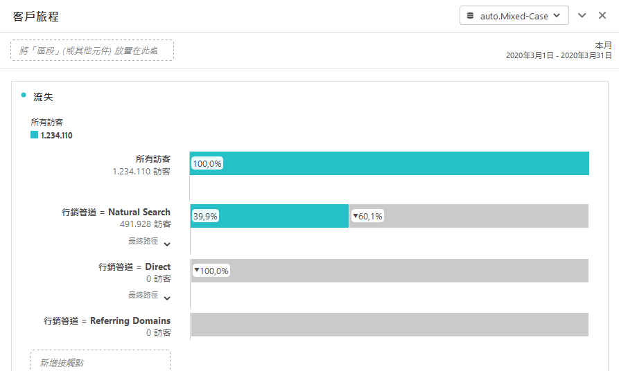 
 </td> 
  </tr> 
  <tr> 
   <td colname="col1"> <b> <a href="/help/analyze/analysis-workspace/visualizations/c-flow/flow.md"  > 流量視覺效果 </a></b> </td> 
   <td colname="col2"> 
新的流量功能可讓您透過 Analysis Workspace 中全新、更新且彈性的視覺效果，來檢視客戶在網站/應用程式間的流程/歷程，以便了解客戶如何在其網站/應用程式間移動和取得進展。流量可讓您 
 
 
 
    <ul id="ul_F1D4A99743664CB3B17E9485CF5E72FC"> 
     <li id="li_0F7AF953EAB746DC95032FF9A533E560">將客戶的跨資產歷程視覺化呈現 </li> 
     <li id="li_697A47BE06CF4284ACA3DBE4CA4012BF">分析登入、退出後或是在客戶歷程的特定維度項目上的立即下一個步驟。 </li> 
     <li id="li_D13AD928AC434D599D43836FB334B14D">指定選定路徑中的特定點，動態建立使用者區段 </li> 
    </ul> 
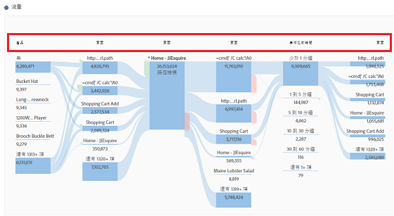 
 </td> 
  </tr> 
  <tr> 
   <td colname="col1"> <b> <a href="/help/components/c-alerts/intellligent-alerts.md"  > 智慧型警報 </a></b> </td> 
   <td colname="col2"> 
所有 Adobe Analytics 通用的全新警報系統，智慧型警報，可讓您在 Analysis Workspace 中建立與管理警報，並有完整的警報預覽與規則貢獻。您可以： 
 
 
 
    <ul id="ul_02BD64D3047942009880B8F1DA1F2A40"> 
     <li id="li_01504AABBC514DF38354683843222541">根據異常 (90％、95％ 或 99％ 臨界值；％ 變化；以上/以下) 建立警報。 </li> 
     <li id="li_9BFE2B4C429D441287F1A37A08E62A40">預覽警報觸發的頻率。 </li> 
     <li id="li_08D310196581483DB499C00358835B73">透過電子郵件或簡訊傳送警報，當中附有可自動產生 Analysis Workspace 專案的連結。 </li> 
     <li id="li_2ADF9465EE474CDB839ED867662CCE6F">建立在單一警報中擷取多個量度的「堆疊」警報. </li> 
    </ul> 
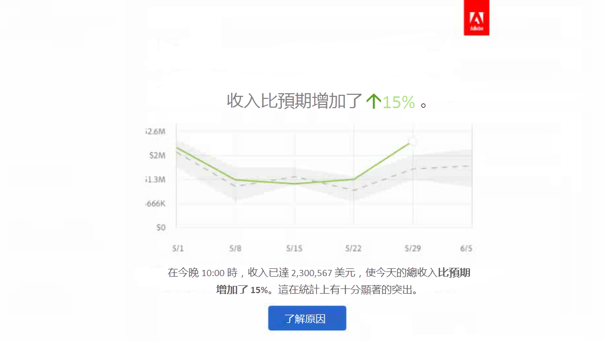 
 </td> 
  </tr> 
  <tr> 
   <td colname="col1"> <b> <a href="/help/analyze/analysis-workspace/virtual-analyst/c-anomaly-detection/anomaly-detection.md"  > 異常偵測和貢獻分析 </a></b> </td> 
   <td colname="col2"> 
讓您知道趨勢資料的變化是否顯著以及造成的原因。 
 
現在「異常偵測」和「貢獻分析」是 Analysis Workspace 的核心工作流程。 
 
重要提示：「貢獻分析」僅適用於 Adobe Analytics Premium 客戶。 
 
您可以： 
 
 
 
    <ul id="ul_9CEE47788F3640838D8598F2E2C020D6"> 
     <li id="li_787236BB5EA545B8833B311C06C24337">自動偵測您的資料中具有統計顯著意義的資料異常。 </li> 
     <li id="li_2FB3D94DEEF14DD5ADA6AD69E15F243D">對任何每日異常執行貢獻分析，並將其內嵌至 Analysis Workspace 專案。 </li> 
    </ul> 
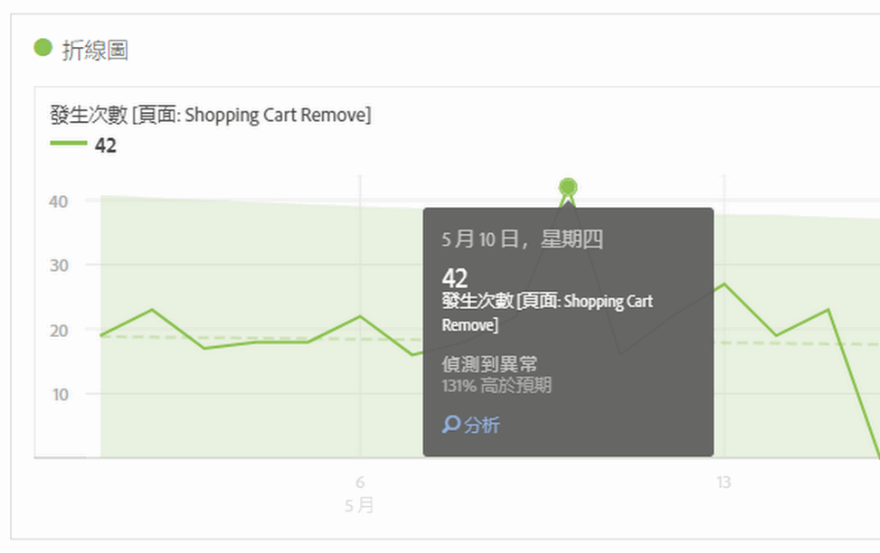 
 
 
 </td> 
  </tr> 
  <tr> 
   <td colname="col1"> <b> <a href="/help/analyze/analysis-workspace/build-workspace-project/starter-projects.md"  > 入門專案 </a></b> </td> 
   <td colname="col2"> 為了讓使用者能更輕鬆地開始使用 Analysis Workspace，我們為一些常見的業務問題建立了一些預先建立的專案範本，例如 
 
 
    <ul id="ul_603F5ACC16F74D53AEB9F762FAC91656"> 
     <li id="li_6B3F2E5D4B044EC19D45E5501E33DB91">使用者保留率 </li> 
     <li id="li_7240EE8852FC4642B3AD4837C990A775">行動應用程式贏取 </li> 
    </ul> 
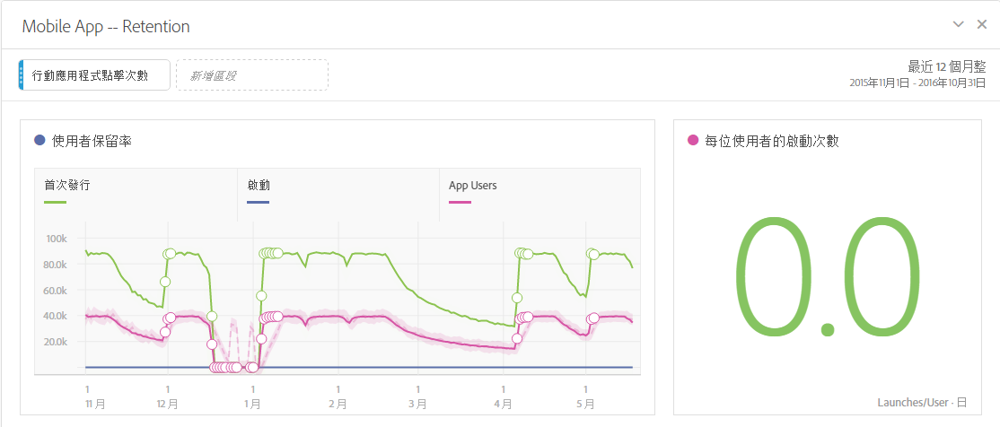 
 </td> 
  </tr> 
  <tr> 
   <td colname="col1"> <b><a href="/help/analyze/analysis-workspace/visualizations/freeform-analysis-visualizations.md">色階分佈圖視覺效果</a></b> </td> 
   <td colname="col2"> 
色階分佈圖可讓使用者查看任何成功事件中使用者的分佈。您可以自訂貯體和貯體大小，以容納任何分佈並識別高價值和低價值的使用者。 
 
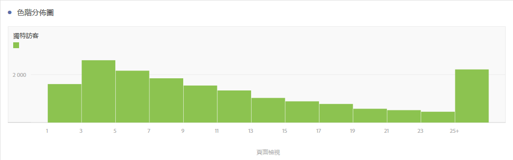 
 </td> 
  </tr> 
  <tr> 
   <td colname="col1"> 其他更新 </td> 
   <td colname="col2"> 
    <ul id="ul_2585F74DC7754C819017F280E16BF06F"> 
     <li id="li_412446013E7F42DBB1BF50F9E2C4D92F"> 
      <!--AN-124610: -->將「計算重複例項」新增到專案層級的設定中 (「專案 &gt; 專案資訊和設定」)。此設定指定是否要將重複執行個體計入報表。如果相同變數具有多個循序值，則可以將其計為該變數的一個或多個執行個體。 </li> 
     <li id="li_480E1B307C62418CBC2F50ADE32B9EE9">在行事曆中「取消」和「執行」指令旁新增了一個名為「套用至所有面板」的新按鈕。將「執行」變更為「套用」。如果您按一下新按鈕，不僅會更改當前面板的選定日期範圍，也會更改專案中的所有其他面板。 </li> 
     <li id="li_4D10DFE307344D06AA60792FABE5B57E"> 
      <!--AN-124168: -->左側導軌中新增了以下動作的「動作」按鈕：標記、收藏、核准、<b>共用 (新功能！)</b>、<b>刪除 (此為新增按鈕！)</b>。 </li> 
     <li id="li_946EC05568D4447193E9307546DF6F9B">在搜尋列中新增一個篩選器，可以對標籤、我的最愛、已核准的項目和元件進行篩選。 </li> 
     <li id="li_4EA118ACCD3B4F88B0ECF72717F631FA">新增預覽圖示至手動列 (而不是列出維度項目的動態列)，可讓您預覽區段、量度和日期範圍。 </li> 
     <li id="li_81D5241EA3FD49CEA0E9F412837D87A8"> 
      <!--AN-128702: -->將 Analysis Workspace 教學課程的 YouTube 連結更新為：<a href="https://www.youtube.com/playlist?list=PL2tCx83mn7GuNnQdYGOtlyCu0V5mEZ8sS"  >https://www.youtube.com/playlist?list=PL2tCx83mn7GuNnQdYGOtlyCu0V5mEZ8sS</a>。 </li> 
     <li id="li_D81DB98C49664D2884CCCC1DB0058CD8"> 
      <!--AN-124004:-->為了視覺效果，我們在操作功能表中新增了一個名為「重新開始」的滑鼠右鍵選項 (將用於流量、Venn 圖表、長條圖)，該選項會刪除目前視覺效果的配置，並開啟一個新面板，讓您可以在其中重新進行配置。 </li> 
     <li id="li_84632BFCE1794B49A31FF45067FA04B7">一個名為「可見圖例」的新增視覺效果設定，可用於隱藏「摘要編號/摘要變更」視覺效果的篩選器的詳細資訊文字。 </li> 
     <li id="li_EE8C48642DD54A04B08F4222F9565BF6">「摘要變更」視覺效果中的全新視覺效果設定，可讓您針對兩個不同百分比「顯示差異」。如為非百分比的值，選取「顯示差異」選項時，系統將顯示數值。 </li> 
     <li id="li_17AAABCA7B3A477182FB70453CA2EEBB">調整時間維度中的資料列數量。 </li> 
     <li id="li_35A91D50CD514CD0B939C24AEEC64BF4">更新「區段產生器」和「計算量度產生器」的左側導軌的外觀和質感，使其近似 Analysis Workspace 的外觀和質感。 </li> 
    </ul> </td> 
  </tr> 
 </tbody> 
</table>

## 2016 年 6 月

2016 年 6 月 16 日發行的新功能：

* [新群組權限](https://marketing.adobe.com/resources/help/en_US/reference/groups.html) ，可讓管理員允許或拒絕使用者存取 **[!UICONTROL Analytics]** > **[!UICONTROL Workspace]** 標籤。 截至 2016 年 6 月 16 日止，所有使用者擁有權限可存取此索引標籤。若要拒絕存取，只需從「Analysis Workspace 存取」群組移除使用者。
* 行動設定檔案中遺失[區段比較](/help/analyze/analysis-workspace/c-panels/c-segment-comparison/segment-comparison.md)會透過自動分析您可以存取的每個單一量度和維度，找出任何兩個區段之間在統計上最顯著的差異。
* [新專案功能表結構](/help/analyze/analysis-workspace/build-workspace-project/freeform-overview.md)可重新排列頂端功能表使其可延伸性更高。例如，建立「**新增同類群組面板**」現在包含建立「空白面板」及在「同類群組面板」視覺效果中拖曳。
* [新的左側欄](/help/analyze/analysis-workspace/build-workspace-project/freeform-overview.md)：面板、視覺效果、元件
* 新的 Venn 視覺效果類型，可讓您拖曳至最多 3 個區段及量度，並建立 Venn 圖表。
* 排名表格中的[「趨勢選取範圍」](/help/analyze/analysis-workspace/analysis-workspace-features.md#section_34930C967C104C2B9092BA8DCF2BF81A) (線條圖表) 現在提供連結功能。
* [「建立視覺效果」圖示](/help/analyze/analysis-workspace/visualizations/freeform-analysis-visualizations.md)：按一下此圖示可提供您下一個動作 (長條圖、Venn...) 的智慧猜測
* 展開的「[手動列](/help/analyze/analysis-workspace/build-workspace-project/column-row-settings/manual-vs-dynamic-rows.md)」功能
* 「[新增區段](/help/analyze/analysis-workspace/components/t-freeform-project-segment.md)」拖放區域
* 小幅更新：

   * 可刪除面板中所有的視覺效果和專案中的所有面板。(先前，您必須保留至少一個視覺效果或一個面板。)
   * 變更為[快速鍵](/help/analyze/analysis-workspace/build-workspace-project/fa-shortcut-keys.md) (快捷鍵) 可加快操作 Analysis Workspace 的速度。
   * 樣式變更：視覺效果中較小字體; 列上的顏色切換; 日期選擇器下移 (面板上)。

## 2016 年 4 月

2016 年 4 月 21 日發行的新功能：

<table id="table_2649645FDED84B71952F741ABB3FC20E"> 
 <thead> 
  <tr> 
   <th colname="col1" class="entry"> 功能 </th> 
   <th colname="col2" class="entry"> 說明 </th> 
  </tr> 
 </thead>
 <tbody> 
  <tr> 
   <td colname="col1"> 傳送檔案 </td> 
   <td colname="col2"> 
透過電子郵件傳送 Analysis Workspace 專案，或排程進行傳送。參閱<a href="/help/analyze/analysis-workspace/curate-share/t-schedule-report.md"  >傳送檔案 - 排程專案進行傳送</a>。 
 </td> 
  </tr> 
  <tr> 
   <td colname="col1"> 下載 PDF </td> 
   <td colname="col2"> 
您可從「動作」功能表下載 PDF 格式的 Analysis Workspace 專案 (類似於下載 CSV 格式檔案)。 
 </td> 
  </tr> 
 </tbody> 
</table>

## 2016 年 1 月

2016 年 1 月 21 日發行的新功能

* [還原動作](/help/analyze/analysis-workspace/new-features-in-analysis-workspace.md#section_12890C393D5E4FC8A3CF050318BD8482)
* [連結至本專案](/help/analyze/analysis-workspace/new-features-in-analysis-workspace.md#section_453E70F7409F4501B8E976A0D18C9A46)
* [項目符號圖表、散點圖和樹狀圖視覺效果](/help/analyze/analysis-workspace/new-features-in-analysis-workspace.md#section_B19EA50EBF5546E99D3A142827153FD6)
* [區段、量度和日期的另存新檔功能](/help/analyze/analysis-workspace/new-features-in-analysis-workspace.md#section_04C8B10A0751453AAE5F1BC35938C6CE)
* [加入新區段按鈕](/help/analyze/analysis-workspace/new-features-in-analysis-workspace.md#section_85CC88C02C79456EA2B41F2BFBB64FC4)
* [條件式格式](/help/analyze/analysis-workspace/new-features-in-analysis-workspace.md#section_5775B505D83041408B8C3EAEC5D7C32B)
* [維度預覽](/help/analyze/analysis-workspace/new-features-in-analysis-workspace.md#section_F519EBF889B244E8B25BB6BA2833325A)
* [可見圖例](/help/analyze/analysis-workspace/new-features-in-analysis-workspace.md#section_28D10D86CAE343AB838808C1DD2E7983)
* [將 Y 軸固定於零](/help/analyze/analysis-workspace/new-features-in-analysis-workspace.md#section_83DF5DE79EF04F9F8DCB3154F5E799B3)
* [標籤標題顯示專案名稱](/help/analyze/analysis-workspace/new-features-in-analysis-workspace.md#section_497C61A030984BCCA2CEA553312C3226)
* [轉讓專案所有權](/help/analyze/analysis-workspace/new-features-in-analysis-workspace.md#section_989C2CCB80B5408EB85E6B12C8D943E3)

## 還原動作 {#section_12890C393D5E4FC8A3CF050318BD8482}

現在您可以還原在「Analysis Workspace」中執行的大多數動作。

To undo, click **[!UICONTROL Undo]** from the action menu.

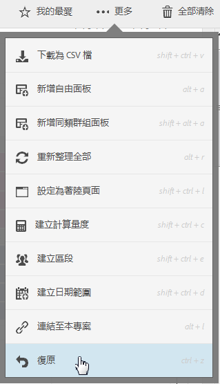

您也可以使用標準的 Windows 和 Mac [鍵盤快速鍵](/help/analyze/analysis-workspace/build-workspace-project/fa-shortcut-keys.md) (ctrl 或 cmd + z) 來還原。

*`Undo`*&#x200B;尤其適合用來還原表格中的劃分。

非&#x200B;*`not`*&#x200B;不可還原的動作:

* Changing the configuration of a [!UICONTROL Cohort Table] (such as dragging metrics, changing values). 不過，您可在按一下 **[!UICONTROL Undo]** 後按一下 **[!UICONTROL Run]**。

* 重新調整面板和子面板的大小或移動面板和子面板。

以下動作會清除您的還原歷史記錄：

* 儲存專案。
* 變更報表套裝。

## 連結至本專案 {#section_453E70F7409F4501B8E976A0D18C9A46}

In a project, click **[!UICONTROL Link to This Project]** from the Actions menu to email a saved project&#39;s URL to other users. 管理員收件者可以編輯並儲存透過此方法共用的專案。除此之外，這些專案都僅供讀取。

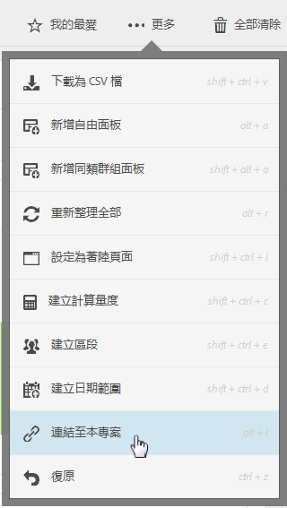

> [!NOTE]如果貴公司使用單一登入 (包括舊式單一登入和透過 Experience Cloud 登入)，將無法使用共用專案連結。

## 項目符號圖表、散點圖和樹狀圖視覺效果 {#section_B19EA50EBF5546E99D3A142827153FD6}

2016 年 1 月發行版提供下列新視覺效果。

**項目符號圖表**

您可以觀察您感興趣的值與其他效能範圍 (目標) 相比較或進行測量的結果。

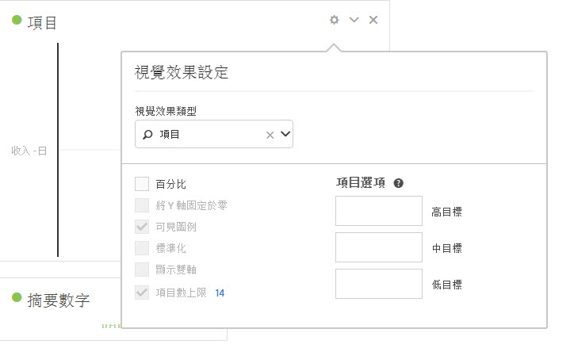

項目符號圖表提供單一的主要測量 (例如本年度至今的收入)，可將該測量與其他一個或多個測量進行比較以豐富其含意 (例如與目標收入比較)，並顯示其效能的定性範圍狀況，例如高、中以及低。You can specify goal ranges in [!UICONTROL Visualization Settings].

**散點圖**

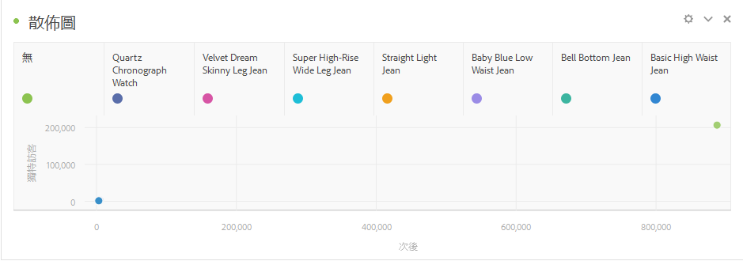

顯示呈現的印象以及有多少獨特使用者看到那些印象。每個資料點的大小提供視覺提示，代表觀看者接觸到廣告的平均次數。大小和資料會依據您選取的維度、日期範圍和篩選器而改變。

> [!NOTE]與散點圖關聯的表格至少需有兩個欄。第一欄定義 X 軸，第二欄定義 Y 軸。如果還有第三欄，散點圖會用來決定點的半徑。換句話說，欄 *1*、*2* 和 *3* 對應至 *X*、*Y* 和&#x200B;*點半徑*。

**樹狀圖**

以一組巢狀矩形顯示階層式 (樹狀結構) 資料。每個樹狀分支都會呈現一個矩形，接著再與代表子分支的較小矩形並排顯示。

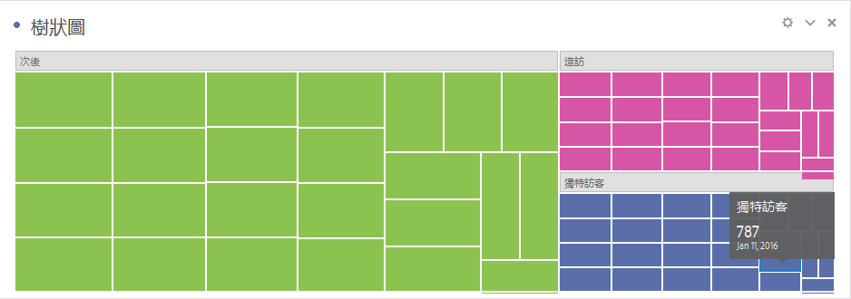

當顏色和大小維度以某種方式關連至樹狀結構時，例如假設某個顏色的關連性特別明顯，使用者通常就能輕鬆觀察出 (換作其他方法很難察覺的) 模式。樹狀圖還有一個優點是，透過結構可以有效地利用空間。

## 區段、量度和日期的另存新檔功能 {#section_04C8B10A0751453AAE5F1BC35938C6CE}

When editing an existing (saved) segment the Analysis Workspace Segment Builder, click **[!UICONTROL Save As]** to make a copy.

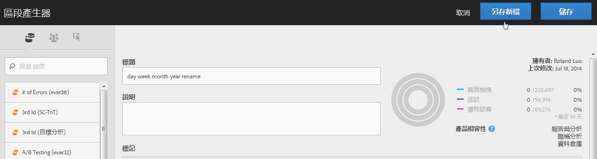

The new segment displays in the [!UICONTROL Segments] group in the [!UICONTROL Components] panel.

*`Save As`* 也可以訪問 [!UICONTROL Calculated Metric Builder] 和 [!UICONTROL Date Range Builder]。

## 加入新區段按鈕 {#section_85CC88C02C79456EA2B41F2BFBB64FC4}

The **[!UICONTROL Add New Segment]** button has been added to the location where you drag-and-drop segments onto a project.

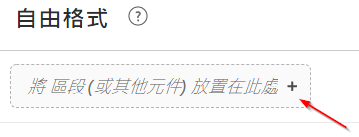

This enhancement is helpful if you prefer to directly create segments when working in a project, rather than using the [!UICONTROL Segment] panel to create segments.

## 條件式格式 {#section_5775B505D83041408B8C3EAEC5D7C32B}

在欄設定中，您可以套用條件式格式至儲存格資料。

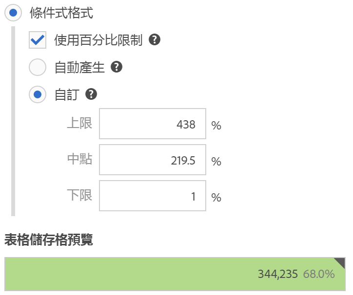

<table id="table_4285E6982FBD4B66AC95AAF6C5C7B347"> 
 <thead> 
  <tr> 
   <th colname="col1" class="entry"> 元素 </th> 
   <th colname="col2" class="entry"> 說明 </th> 
  </tr> 
 </thead>
 <tbody> 
  <tr> 
   <td colname="col1"> 條件式格式 </td> 
   <td colname="col2"> 
 根據資料值，套用下列顏色至儲存格： 
 
    <ul id="ul_97E3AD5F6B41460C882D8B4EE0A8C77A"> 
     <li id="li_88874B4250224DE781C03E4A5931D6A2">綠：高數值 </li> 
     <li id="li_B4863F967C7544D7AA2847696FB85525">黃：中間值 </li> 
     <li id="li_5B06D7CD0C39437898DA55EA653A1124">紅：低數值 </li> 
    </ul> 
取代表格中的維度會重設條件式格式限制。取代量度會重新計算該欄的限制 (其中量度位在 X 軸，維度位在 Y 軸)。 
 </td> 
  </tr> 
  <tr> 
   <td colname="col1"> 自動產生 </td> 
   <td colname="col2"> 
自動產生條件式格式的限制。上限是此欄中的最大值。下限是最小值，而中點是上限和下限的平均。 
 </td> 
  </tr> 
  <tr> 
   <td colname="col1"> 自訂 </td> 
   <td colname="col2"> 
您可以手動指派條件式格式的「上限」、「中點」和「下限」欄位。這可提供由您決定欄的值是好、中等或壞的彈性。 
 </td> 
  </tr> 
 </tbody> 
</table>

## 維度預覽 {#section_F519EBF889B244E8B25BB6BA2833325A}

In the [!UICONTROL Dimensions] component panel, you can hover over the information icon next to a dimension and see a top-five preview.

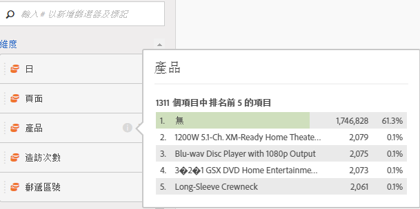

## 可見圖例 {#section_28D10D86CAE343AB838808C1DD2E7983}

在選 [!UICONTROL Visualization Settings] 項中 **[!UICONTROL Legend Visible]** 顯示或隱藏視覺化的圖例。

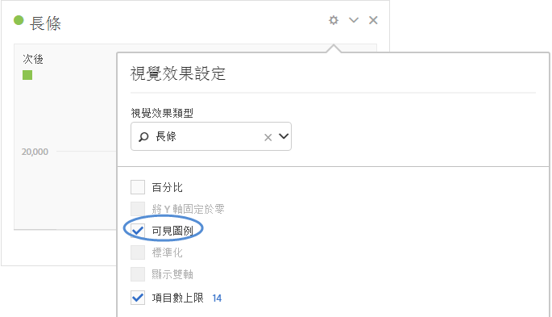

## 將 Y 軸固定於零 {#section_83DF5DE79EF04F9F8DCB3154F5E799B3}

視折線圖或面積圖的數字而定，Y 軸原點不一定為零。啟 **[!UICONTROL Anchor Y Axis at Zero]** 用 [!UICONTROL Visualization Settings] 強制Y軸為零，以更精確地檢視趨勢。 下列範例顯示啟用和停用此設定時，收入圖表所產生的變化：

**停用將 Y 軸固定於零**

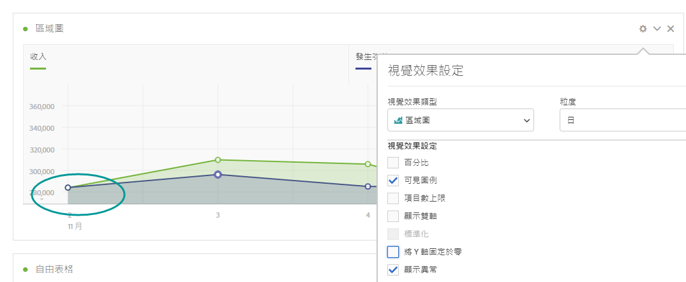

**啟用將 Y 軸固定於零**

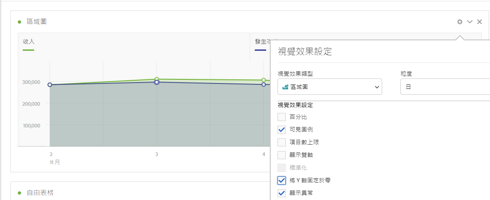

## 標籤標題顯示專案名稱 {#section_497C61A030984BCCA2CEA553312C3226}

儲存專案時，瀏覽器標籤上的標題會顯示為「`<Project Name>` - Analysis Workspace」。如果您在多個瀏覽器標籤中開啟了多個專案，這個改良功能會很有用。

## 轉讓專案所有權 {#section_989C2CCB80B5408EB85E6B12C8D943E3}

管理員可將 [!UICONTROL Analysis Workspace] 專案從一個使用者轉讓給另一個使用者。

導覽至 **[!UICONTROL Admin]** > **[!UICONTROL User Management]** > **[!UICONTROL Transfer]** 以轉移專案。
