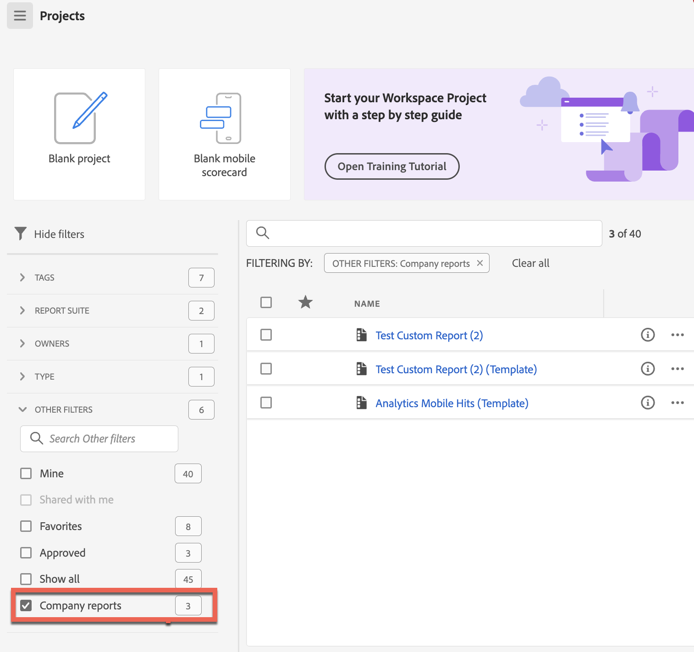

# 建立和管理公司範本

您可以建立自訂報告，並將其儲存以供登入公司的其他人使用。建立專案時可以選擇公司範本，如[從空白專案或報告建立專案](/help/analyze/analysis-workspace/build-workspace-project/create-projects.md#create-a-project-from-a-blank-project-or-a-report) (在文章中，[在Analysis Workspace中建立專案](/help/analyze/analysis-workspace/build-workspace-project/create-projects.md))中所述。

## 建立自訂公司範本

若要建立新的公司範本：

1. 在 Analysis Workspace 中將專案建置成您想要的狀態。
1. 選取&#x200B;[!UICONTROL **專案**] > **[!UICONTROL 另存為公司範本……]**。

   

1. 更新報表名稱、新增說明及新增任何標籤，然後選取[儲存為公司範本] [!UICONTROL ****]。

   範本會新增至「建立專案」強制回應視窗中的「公司」範本清單中，並可供您登入公司的使用者使用。

   如需使用者如何根據公司範本建立專案的詳細資訊，請參閱[建立專案](/help/analyze/analysis-workspace/build-workspace-project/create-projects.md)中的「從空白專案或報告建立專案」。

## 管理公司範本

管理員可以篩選專案清單，以顯示和管理公司範本。 釘選專案保持釘選狀態，後面接著由報表圖示識別的公司範本清單。 在此視圖中，您可以刪除、重命名、核准一個或多個報告或加標記。

若要顯示和管理公司範本，請執行下列動作：

1. 在篩選器邊欄中，選取&#x200B;**其他篩選器**，然後選取&#x200B;**公司範本**。

   此時會顯示公司範本的清單。 除非已釘選，否則不會顯示所有的一般專案。

   

   顯示公司範本後，管理員可以刪除、重新命名、新增標籤或核准報告。

1. 在報告清單中，選取單一報告或選取多個報告。

1. 按一下報告旁邊的「**...**」省略號圖示，以查看可用選項 (刪除、重命名、加標記和核准)。

   

1. 選取一個選項 (刪除、重命名、加標記和核准)。

1. 若要在完成時返回一般檢視，請在篩選邊欄中再次取消勾選公司範本選項。

### 刪除公司範本

管理員可以使用「公司範本」清單選項（如上所述）刪除報表，或從「建立專案」模式中刪除報表。

