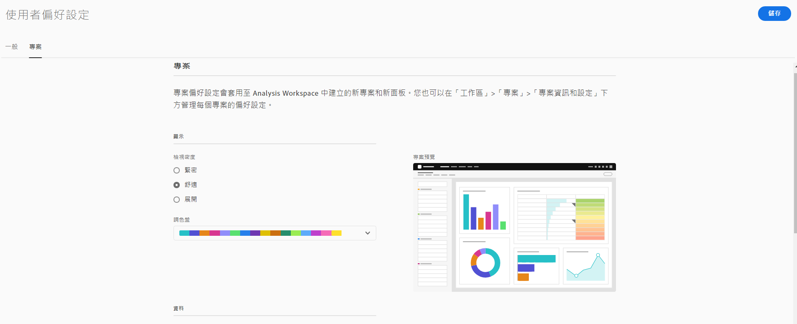

# 用戶偏好設定

「[!UICONTROL 元件] > [!UICONTROL 使用者偏好設定]」頁面可讓您管理使用者層級的Analysis Workspace及其相關元件設定。 使用者偏好設定會套用至所有&#x200B;*new*&#x200B;專案或面板。

## 一般偏好設定

一般偏好設定適用於您在瀏覽器中的Adobe Analytics體驗。

| 偏好設定 | 選項 |
| --- | --- |
| 登陸頁面 | <ul><li>專案清單（預設）</li><li>空白專案</li><li>從清單中選擇的特定項目</li></ul> |
| 提示 | <ul><li>啟用（預設）</li><li>停用</li></ul> |

## 專案偏好設定

專案偏好設定適用於在Analysis Workspace建立的新專案和新面板。 在[!UICONTROL Workspace] > [!UICONTROL Project] > [!UICONTROL Project info &amp; settings]下，也可以按項目管理某些首選項。

| 區域 | 偏好設定 | 選項 |
| --- | --- | --- |
| **顯示** |  |  |
|  | [檢視密度](https://experienceleague.adobe.com/docs/analytics/analyze/analysis-workspace/build-workspace-project/view-density.html?lang=zh-Hant) | <ul><li>精簡</li><li>舒適</li><li>已擴充（預設）</li></ul> |
|  | [調色盤](https://experienceleague.adobe.com/docs/analytics/analyze/analysis-workspace/build-workspace-project/color-palettes.html?lang=zh-Hant) | <ul><li>Adobe提供的浮動視窗（預設）</li><li>自訂定義的浮動視窗</li></ul> |
| **資料** |  |  |
|  | [報表套裝](https://experienceleague.adobe.com/docs/analytics/analyze/analysis-workspace/panels/panels.html?#report-suite) | <ul><li>最近（預設）</li><li>從清單中選取的特定報表套裝</li></ul> |
|  | [日曆](https://experienceleague.adobe.com/docs/analytics/analyze/analysis-workspace/panels/panels.html?#calendar) | 從下列清單中選擇： <ul><li>Adobe提供的範圍（預設為本月）</li><li>自訂定義的範圍</li></ul> |
|  | [面板類型](https://experienceleague.adobe.com/docs/analytics/analyze/analysis-workspace/panels/panels.html) | <ul><li>自由格式（預設）</li><li>空白</li><li>快速深入分析</li></ul> |
|  | 數字格式 | <ul><li>1,000.00（預設）</li><li>1.000,000</li><li>100萬</li></ul> |
|  | CSV 分隔字元 | <ul><li>逗號（預設值）</li><li>分號</li><li>冒號</li><li>直立線符號</li><li>時段</li><li>空格</li><li>定位</li></ul> |
