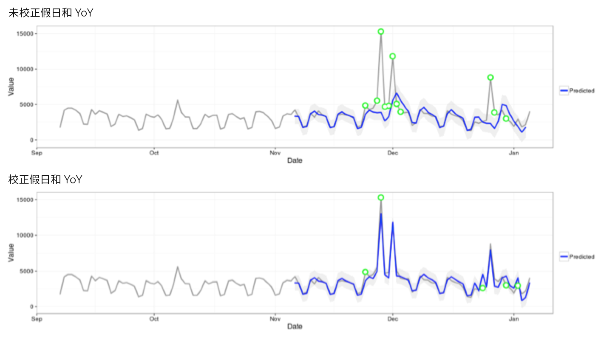

# 異常偵測所使用的統計技術

Analysis Workspace 中的異常偵測使用一系列先進的統計技術來判斷是否應將某個觀察值視為異常。

根據報表中使用的日期粒度，我們採用 3 種不同統計技術，分別進行每小時、每日、每週/每月異常偵測。各種統計技術概述如下。

## 每日粒度的異常偵測{#section_758ACA3C0A6B4D399563ECABFB8316FA}

對於每日粒度報表，演算法會考量數個重要因素，盡可能提供最準確的結果。首先，演算法會根據我們在時間序列模型和極端值偵測模型 (稱為功能篩選) 這兩種類別其一當中所選的可用資料，決定使用哪種模型。

如何選取時間序列模型是根據下列誤差、趨勢和季節性 (ETS) 類型的組合，如 [Hyndman et al.(2008)](https://www.springer.com/us/book/9783540719168) 所述。此演算法會特別嘗試下列組合:

1. ANA (相加誤差、無趨勢、相加季節性)
1. AAA (相加誤差、相加趨勢、相加季節性)
1. MNM (相乘誤差、無趨勢、相乘季節性)
1. MNA (相乘誤差、無趨勢、相加季節性)
1. AAN (相加誤差、相加趨勢、無季節性)

演算法會選取具有最佳平均絕對百分差 (MAPE) 者，測試上述每項的適合性。但如果最佳時間序列模型的 MAPE 大於 15%，就會套用功能篩選。通常，資料高度重複者 (例如每週或每月重複) 最適合時間序列模型。

選取好模型後，演算法接著會根據假日以及年度季節性調整結果。對於假日，演算法會查看在報告日期範圍內是否有下列假日:

* 陣亡將士紀念日
* 7 月 4 日
* 感恩節
* 黑色星期五
* 網路星期一
* 12 月 24-26 日
* 1 年 1 月
* 12 月 31 日

系統會根據多個客戶資料點中的廣泛統計分析，識別哪些假日的趨勢最能帶來最大數量的客戶，進而選取合適的假日。此清單當然不是對所有客戶或業務週期都詳盡無遺，但我們發現套用這些假日可大幅改善幾乎所有客戶資料集的整體演算法效能。

選取好模型，也確定報告日期範圍內的假日後，演算法會以下列方式進行:

1. 建立異常參考期 – 包括報表日期範圍前的最多 35 天，以及 1 年前的相符日期範圍 (必要時計入閏日並包含可能落在前一年不同日曆天上的適用假日)。
1. 根據最新資料，測試目前期間內的假日 (不包括前一年) 是否異常。
1. 如果目前日期範圍內的假日為異常，則根據前一年的假日，調整目前假日的期望值和信賴區間 (考慮加入之前與之後的各 2 天)。目前假日的校正是根據下列項目的最低平均絕對百分差:

   1. 相加效應
   1. 相乘效應
   1. YoY 差異

注意以下範例中聖誕節和新年當天效能的大幅改善:

## 每小時粒度的異常偵測 {#section_014C9E9209AF43F8A03D5D46E3B3AEE7}

每小時資料依賴的時間序列演算法與每日粒度演算法相同。不過，每小時粒度又大幅依賴兩個趨勢模式: 24 小時週期以及週末/平常日週期。為了擷取這兩個季節效應，每小時演算法使用上述方法，為週末和平常日建造了兩個不同的模型。

每小時趨勢的訓練窗口依賴一個 336 小時回溯窗口。

## 每週和每月粒度的異常偵測 {#section_5D421576BFBC4B24A58DFCC0A6407545}

每週和每月趨勢的表現方式，與以每日或每小時粒度為基礎的每週或每日趨勢不同，因此要使用不同的演算法。對於每週和每月，使用稱為「一般化極值 Student 化離差」(GESD) 檢定的兩步驟離群值偵測方法。此檢定會考慮預期異常值的最大數並結合調整後的盒形圖方法 (離群值探索的非參數方法) 來判斷離群值的最大數。兩步驟為:

1. 調整盒形圖函數: 此函數決定給定輸入資料內的異常值最大數。
1. GESD 函數: 使用步驟 1 的輸出，套用至輸入資料。

接著，假日和 YoY 季節性異常偵測步驟會從今年的資料中減去去年的資料，然後使用上述的兩步驟程序再次對資料進行反覆運算，驗證異常狀況與季節性相關。這兩個資料粒度都使用選定報告日期範圍的 15 期回溯包含 (15 個月或 15 週) 以及 1 年前的對應日期範圍用以訓練。
