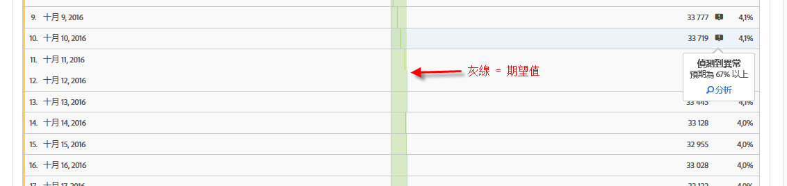
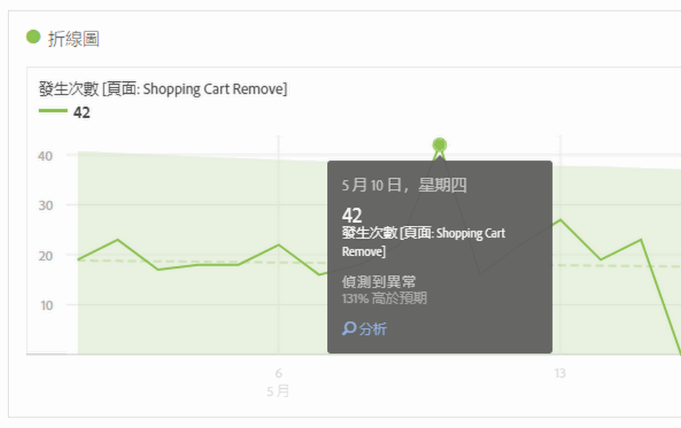
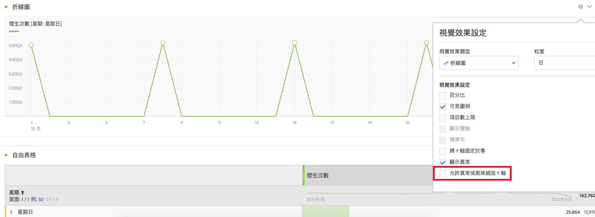

# 檢視分析工作區中的異常

您可以在表格或線性圖中檢視異常。

## View anomalies in a table {#section_869A87B92B574A38B017A980ED8A29C5}

在時間序列自由表格中，如果偵測到資料異常，該列現在會自動標記深灰色驚嘆號。

並在每一列中以垂直灰線指出期望值。將滑鼠移到驚嘆號上方時，會指出異常值偏離預期值的程度 (以 + 或 - % 表示)。

## View anomalies in a line chart {#section_7C1192AFDB4345A8A2CCFB3AE0C47D82}

線性圖會顯示淺綠色信賴帶以及異常值 (白點)。

按一下白點，白點會隨即變成綠色，並顯示下列資訊:

* 異常情形發生日期
* 異常情形的原始值
* 高於或低於期望值的百分比，期望值會加上綠色實線。
* 啟動[貢獻分析](../../../../analyze/analysis-workspace/virtual-analyst/contribution-analysis/ca-tokens.md)的分析連結。

如果線性圖中有多個量度，我們只會顯示異常值，您必須將滑鼠移到每個異常值上方，以查看該量度的信賴帶。

異常偵測信賴區間不會自動縮放視覺效果中的 Y 軸，如此可能會使圖表更清晰。

您可以選擇允許信賴區間縮放圖表。Just click the Settings (gear) icon and check **[!UICONTROL Allow Anomaly Detection to Scale Y Axis]**.

