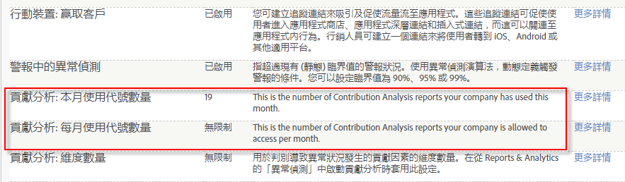

# 貢獻分析概述

貢獻分析會探索您資料中的隱藏模式，說明統計異常並識別聚合讀者區段間非預期客戶動作、界外值、選定量度突升或突降背後的關聯。

發生異常。原因為何? 異常偵測報告顯示訂購中有不尋常的尖峰，您想知道為什麼。發生什麼反常的事? 誰正在回應哪個促銷活動或轉接? 中毒了嗎? 什麼特定因素造成這個異常現象? 而最重要的可能是: 我如何獲取有關客戶的重要資訊，並重複這表現? (或者，如果發生量度下降或是負量度上升，我日後要如何避免?)

貢獻分析能幫助您立即評估資料，解答異常為何發生。過去得耗費數週，現在只要幾秒鐘便能將異常貢獻劃分出來，提供讀者區段的模式，協助您發展出客戶互動的敘述。您可以策略性地利用貢獻分析來識別及擷取有意義的關聯以開發新的讀者區段，或高明地運用它識別出觸發警示的界外或假性活動。

[異常偵測](/help/analyze/analysis-workspace/virtual-analyst/c-anomaly-detection/anomaly-detection.md)可根據選取的量度和選取的讀者區段識別資料尖峰和極端的統計下降。它依據培訓期間設置歷史基準，然後繪製與特定事件相互關聯的極度偏移。它可以擷取「貢獻分析」要評估的統計相關資料點，報告正面量度「訂購」中的陡峭上升、或負面量度「彈回數」中的上升、或是這兩者中的下降。一旦識別統計異常，貢獻分析可讓您針對所有異常資料點深入鑽研，並評估相關的行銷和促銷活動變數。它會執行進階演算和機器學習程序，評估重要尖峰或下降的貢獻因素的關聯性。這些計算接著會顯示在互動視覺效果中，這些視覺效果可提供您各種不同觀點，以便瞭解某些現象為何發生，以及如何做出對應。

「貢獻分析」幫助您發展出敘述，描述異常為何發生及如何回應，可擷取相關量度並識別隱藏點，提供您讀者互動與客戶興趣趨勢的總體原因。有時候異常很容易看出來及更正，例如 2,000 艘小艇的錯誤訂購。有時候就很複雜，像是識別某地區某時段只對特定目標促銷活動有反應的新興趨勢。將不同維度之量度及其關聯的貢獻項目組合在一起，可以給您讀者互動的整體概念，並協助提供異常資料點的內容。

以下是一些想法: 

* 身分再行銷的潛力，方式是透過監控產品要求變化。
* 提升客戶體驗，方式是透過對特定讀者興趣有所反應。
* 身分假性訂購，和界外報告一樣早。
* 保護您自己，藉由識別高使用量和下載，防止商業間諜行為。
* 監控作業，如報告遺失 javascript 標記。

全面分析異常後，會產生排名最前的項目的貢獻摘要，依發生總次數和項目的貢獻值百分比排序。已標準化的貢獻分數可讓您輕鬆比較和對比其他重要維度項目，並與之建立關聯。

## 貢獻分析代號 - 概述 {#section_3EF8D2BBCE6E4C309D753BCF04A453D0}

>[!IMPORTANT]
>
>「貢獻分析」已從 Reports &amp; Analytics 功能集中移除，現在只能透過 Analysis Workspace 使用。

具有「貢獻分析」使用權限的所有客戶可以在 Analysis Workspace 中，每月以有限次數執行完整的「貢獻分析」。惟單點產品 (SiteCatalyst 15) 客戶、Analytics Foundation 客戶及 Analytics Select 客戶&#x200B;**除外**，因為他們沒有取得「貢獻分析」功能。

每間公司的執行次數，會根據貴公司購買的 Adobe Analytics 產品所授予的權限，受到每月代號數的限制。此外還包括是否能限制「貢獻分析」的存取權，避免他人誤用代號。

## 常見問題集 {#section_11D0431AD2014B96AB9561CA66A367CE}

<table id="table_357775E5058644099E26B15A6790E8AF"> 
 <thead> 
  <tr> 
   <th colname="col1" class="entry"> 問題 </th> 
   <th colname="col2" class="entry"> 回答 </th> 
  </tr>
 </thead>
 <tbody> 
  <tr> 
   <td colname="col1"> 
<b>為什麼 Adobe 要推出代號? </b> 
 </td> 
   <td colname="col2"> 
自 2015 年推出「貢獻分析」後，這項功能已經成為 Adobe Analytics 中回響最熱烈的功能之一。您每月皆可執行小量的「完整」分析 (而非只有部分 Analytics 產品的 3 個維度)，因此能夠更加瞭解完整不受限的「貢獻分析」所能提供的功能。 
 </td> 
  </tr> 
  <tr> 
   <td colname="col1"> 
<b>代號如何在「貢獻分析」中運作? 使用現有的「貢獻分析」載入專案是否要扣除掉一個代號，或是在執行全新的「貢獻分析」時才需要這樣做?</b> 
 </td> 
   <td colname="col2"> 
每間登入公司 (非每位使用者) 每月都能取得特定數量的代號，讓您在 Analysis Workspace 中執行「完整」的貢獻分析。 
 
您每次產生一個新的貢獻分析，就要支付一個代號。使用預先執行的「貢獻分析」載入專案並不需要扣除代號。 
 </td> 
  </tr> 
  <tr> 
   <td colname="col1"> 
<b>代號適用於 Reports &amp; Analytics 中的「貢獻分析」嗎?</b> 
 </td> 
   <td colname="col2"> 
不可以。Reports &amp; Analytics 2018 年 4 月版將不再繼續提供「貢獻分析」。 
 </td> 
  </tr> 
  <tr> 
   <td colname="col1"> 
<b>如果我的公司用完代號，但想要執行更多「貢獻分析」，該怎麼做?</b> 
 </td> 
   <td colname="col2"> 
您可以升級至其他 Adobe Analytics 產品，例如從 Standard (每月 2 個代號) 升級為 Ultimate (每月 20 個代號)。您無法單純購買更多代號，您必須在現有的包裝架構內升級。 
 </td> 
  </tr> 
  <tr> 
   <td colname="col1"> 
<b>我該如何限制對「貢獻分析」的存取權?</b> 
 </td> 
   <td colname="col2"> 
依預設，僅管理員有權執行貢獻分析，但管理員可以在<a href="https://docs.adobe.com/content/help/zh-Hant/core-services/interface/manage-users-and-products/admin-getting-started.html"  > Admin Console</a> 中建立權限群組，藉此將存取權授與其他使用者 。您必須確認使用者具備正當理由，且不會濫用存取權，才可將使用貢獻分析的權限授予對方。 
 
此權限稱為「貢獻分析」，其位於「Analytics &gt; 管理 &gt; 使用者管理 &gt; 編輯群組 &gt; 編輯所有報表存取權 &gt; 自訂報表套裝工具 &gt; 工具和報表」當中。 
 </td> 
  </tr> 
  <tr> 
   <td colname="col1"> 
<b>我該如何得知敝公司每個月有權使用多少代號，以及在當月中已使用的數量?</b> 
 </td> 
   <td colname="col2"> 
請前往「管理 &gt; 公司設定 &gt; 查看功能存取層級」。此頁面中有 2 個新項目: 
 
 
 </td> 
  </tr> 
 </tbody> 
</table>

## 異常偵測和貢獻分析使用權限 {#section_9278D58F21A840AA9B1ED1BD07A1EF0A}

以下列表是 Analysis Workspace 中「異常偵測」和「貢獻分析」的詳細使用權限清单。

>[!IMPORTANT]
>
>「異常偵測」和「貢獻分析」這兩項功能已從 Reports &amp; Analytics 功能集中移除，現在只能透過 Analysis Workspace 使用。請注意，Adobe Analytics Select 與 Adobe Analytics Foundation 客戶在 Workspace 中只能存取「每日粒度」的異常偵測功能。

<table id="table_5C9B7E4AE82640B5A913519E576889B5"> 
 <thead> 
  <tr> 
   <th colname="col1" class="entry"> Adobe Analytics 使用權限 </th> 
   <th colname="col2" class="entry"> 異常偵測 </th> 
   <th colname="col3" class="entry"> 貢獻分析 </th> 
  </tr>
 </thead>
 <tbody> 
  <tr> 
   <td colname="col1"> 
Foundation 
 </td> 
   <td colname="col2"> 
僅每日粒度 
 </td> 
   <td colname="col3" colsep="1"> 
沒有代號 
 </td> 
  </tr> 
  <tr> 
   <td colname="col1"> 
<a href="https://www.adobe.com/zh-Hant/data-analytics-cloud/analytics/select.html?promoid=B4XQ3X7G&amp;mv=other"  > Select </a> 
 </td> 
   <td colname="col2"> 
僅每日粒度 
 </td> 
   <td colname="col3"> 
沒有代號 
 </td> 
  </tr> 
  <tr> 
   <td colname="col1"> 
<a href="https://www.adobe.com/zh-Hant/data-analytics-cloud/analytics/prime.html?promoid=91BF51TR&amp;mv=other"  >Prime</a> 
 </td> 
   <td colname="col2"> 
是 
 </td> 
   <td colname="col3"> 
每月 10 個代號 
 </td> 
  </tr> 
  <tr> 
   <td colname="col1"> 
<a href="https://www.adobe.com/tw/data-analytics-cloud/analytics/ultimate.html?promoid=8N4B5F1V&amp;mv=other"  > Ultimate</a> 
 </td> 
   <td colname="col2"> 
是 
 </td> 
   <td colname="col3"> 
每月 20 個代號 
 </td> 
  </tr> 
  <tr> 
   <td colname="col1"> 
+Predictive Workbench 
 </td> 
   <td colname="col2"> 
是 
 </td> 
   <td colname="col3"> 
代號数量不受限制 
 </td> 
  </tr> 
  <tr> 
   <td colname="col1"> 
標準 
 
    <ul id="ul_73D52020793B44868C9CE0F90893075D"> 
     <li id="li_21EE0871C87E43C8B781219B2BA0FA74">Adobe Analytics Core </li> 
     <li id="li_AB3593200F33439BAEE8FEB13CAE57F4">Adobe Analytics OD </li> 
     <li id="li_2B7D625519BC4A4CB598C95F15D3029B">Adobe Analytics: MA </li> 
    </ul> </td> 
   <td colname="col2"> 
是 
 </td> 
   <td colname="col3"> 
每月 2 個代號 
 </td> 
  </tr> 
  <tr> 
   <td colname="col1"> 
Premium (360、Attribution) 
 </td> 
   <td colname="col2"> 
是 
 </td> 
   <td colname="col3"> 
每月 2 個代號 
 </td> 
  </tr> 
  <tr> 
   <td colname="col1"> 
Premium (Complete、<a href="https://www.adobe.com/tw/data-analytics-cloud/analytics/predictive-intelligence.html"  >Predictive Intelligence</a>) 
 </td> 
   <td colname="col2"> 
是 
 </td> 
   <td colname="col3"> 
代號数量不受限制 
 </td> 
  </tr> 
 </tbody> 
</table>
