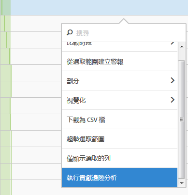
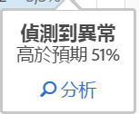
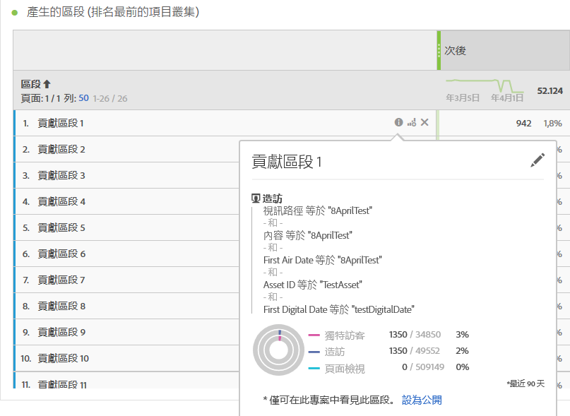
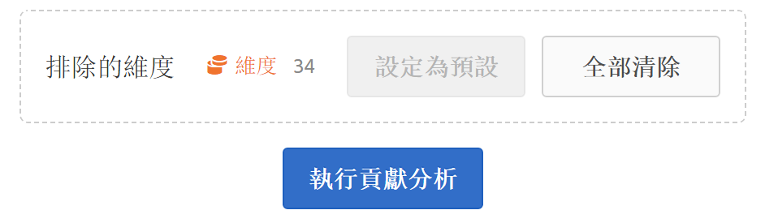
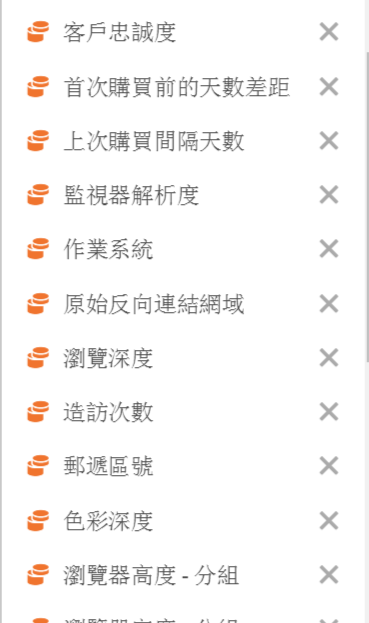

# 執行貢獻分析

貢獻分析是一項密集的機器學習程式，旨在發現Adobe Analytics中觀察到的異常的貢獻者。 其目的是協助使用者以比其他可能更快的速度，找出焦點或進行額外分析的機會。

## 執行貢獻分析 {#section_7D2C5E48A5664727941DF4C90976D9DC}

在專案中叫用貢獻分析有兩個分法：

* In a freeform table with daily granularity, right-click any row and select **[!UICONTROL Run Contribution Analysis]**. 您甚至可以在未顯示異常的列上執行貢獻分析。

   >[!NOTE]
   >
   >我們目前僅支援設有每日粒度的貢獻分析。

   

* 在折線圖中，將滑鼠移至折線圖中異常資料點的上方。Click the **[!UICONTROL Analyze]** link that appears.

   

1. (Optional) After you have clicked **[!UICONTROL Run Contribution Analysis]** in either the line chart or a table, you can narrow the scope of (and thus speed up) the analysis by [excluding dimensions](/help/analyze/analysis-workspace/virtual-analyst/contribution-analysis/run-contribution-analysis.md#section_F6932F4BF74544B5872164E7B1E0C6FC).

1. 等待貢獻分析載入。 這可能需要相當長的時間，視您的報表套裝大小和維度數量而定。 貢獻分析會對每個維度的前50,000個項目執行分析。
1. 然後，分析工作區會直接在此專案中載入新的貢獻分析面板。 如果您曾在「Reports &amp; Analytics」中使用過「貢獻分析」，您會發現很多面板都很熟悉：

   * 顯示當天瀏覽次 **數** 的視覺化。
   * 上下文 **的每月瀏覽趨勢** 行。
   * **促成此異常** 的排名最前的項目(依貢獻分數加上相關量度排序 )，以及從大小調整角度將量度置於上下文的「獨特訪客」量度。

   * 「產 [生的區段](https://marketing.adobe.com/resources/help/zh_TW/analytics/contribution/ca_workflow_premium.html) 」（排名最前的項目叢集）表格會根據貢獻分數、異常發生次數及對異常數度的整體貢獻百分比來識別排名最前項目的關聯。 接著會擷取為觀眾區隔（貢獻區段1、貢獻區段2等）。 按一下「i」(資訊) 按鈕可讓您檢視每個自動區段的定義，包括組成其的排名最前的項目：

      

1. 由於貢獻分析現在是 Analysis Workspace 的一部分，因此您可以從表格的右鍵功能表運用它的多個功能，讓您的分析結果更具意義，例如：

   * [依據另一個維度劃分每個維度項目。](/help/analyze/analysis-workspace/components/dimensions/t-breakdown-fa.md)
   * [顯示一或多列的趨勢。](/help/analyze/analysis-workspace/analysis-workspace-features.md#section_34930C967C104C2B9092BA8DCF2BF81A)
   * [新增視覺效果。](/help/analyze/analysis-workspace/visualizations/freeform-analysis-visualizations.md)
   * [建立警報。](/help/components/c-alerts/intellligent-alerts.md)
   * [建立或比較區段。](/help/analyze/analysis-workspace/c-panels/c-segment-comparison/segment-comparison.md)

>[!NOTE]我們會在「貢獻分析」及與其連結的「智慧型警報」專案內，以藍點標示出正在接受分析的異常項目。如此即可以更清楚的方式指明分析所得的異常項目。

## 排出貢獻分析中的維度 {#section_F6932F4BF74544B5872164E7B1E0C6FC}

有時候，您可能會想從貢獻分析中排除某些維度。 例如，您可能根本不關心任何與瀏覽器或硬體相關的維度，而您想要移除這些維度以加速分析。

1. 按一下(或 **[!UICONTROL Run Contribution Analysis]** 折線 **[!UICONTROL Analyze]** 圖中)後，會顯示 **[!UICONTROL Excluded Dimensions]** 面板。

1. 只要將任何不想要的維度拖曳至面 **[!UICONTROL Excluded Dimensions]** 板，然後按一下即可儲存清單 **[!UICONTROL Set as Default]**。 Or, click **[!UICONTROL Clear All]** to start over with selecting dimensions to exclude.

   

1. After you have added dimensions to exclude (or chosen not to), click **[!UICONTROL Run Contribution Analysis]** again.
1. 若您需要修訂排除的維度的清單，可以在「維度」上連按兩下，排除的維度的清單隨即顯示:

   

1. Just delete any unwanted dimensions by clicking the x next to them, then save the list by clicking **[!UICONTROL Set as Default]**.

