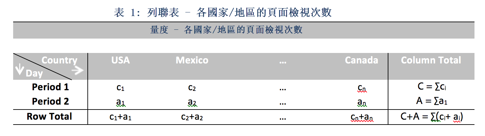
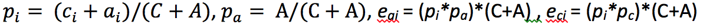

# 貢獻分析中所使用的統計技術

「貢獻分析」是密集型機器學習程序，專門設計來找出 Adobe Analytics 中所觀察到異常值的貢獻者。目的是要協助使用者比以往更快找出重點區域或機會以便進行其他分析。

「貢獻分析」透過對使用者「貢獻分析」報表中可用的每個維度項目執行兩部分演算法，藉此完成分析。演算法的運作順序如下:

1. 系統會針對每個維度計算 Cramer V 檢定統計值。在以下範例中，假設有一個列聯表，內含兩個期間內，各個國家/地區的頁面檢視次數。

   

   在表 1 中，Cramer V 值可用於依照國家評估期間 1 (例如歷史記錄) 和期間 2 (例如發生異常的日期) 之間頁面檢視次數的關聯性。Cramer V 的值低表示關聯性低。Cramer V 的範圍為 0 (無關聯) 到 1 (完全關聯)。Cramer V 統計值會使用以下計算中:

   

1. 計算個別維度項目時，皮爾遜殘差 (PR) 值會用於評估異常量度和每個維度項目之間的關聯性。PR 遵循標準常態分布，因此即使偏差無法比較，演算法仍可比較兩個隨機變數的 PR 值。在實務上，誤差不明並使用有限樣本校正來估計。

   在前述範例的表 1 中，對國家/地區 i 和期間 2 進行有限樣本校正，其 PR 由下式算出:

   

   此處，

   

   (可對期間 1 取得類似公式。)

   計算最終結果時，每個維度項目的得分會經過 Cramer V 評估值的加權，並重新調整為介於 0 和 1 之間的數字，以便提供貢獻分數。

