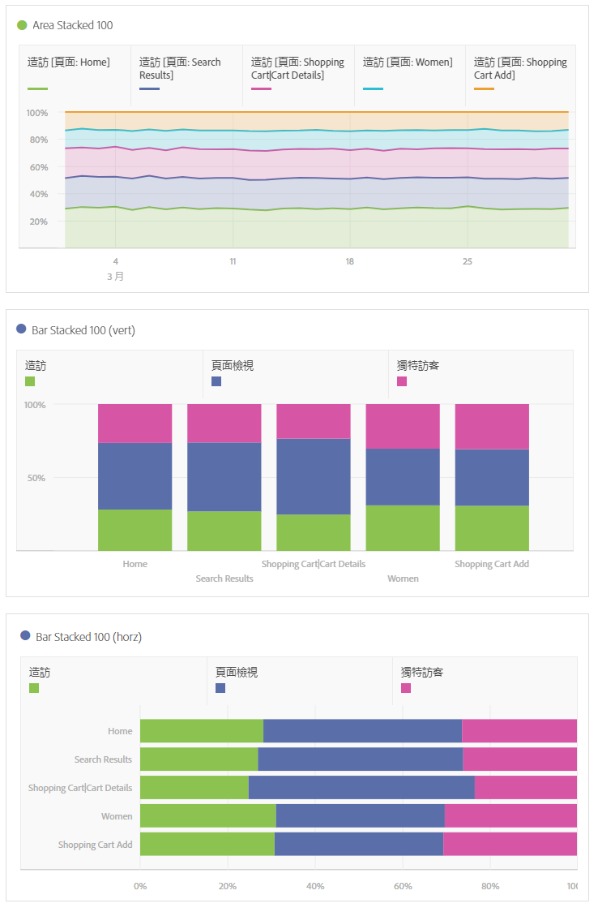

# 區域圖和堆疊區域圖

>[!BEGINSHADEBOX]

_本文記錄了_  _**Adobe Analytics**&#x200B;中的區域圖和棧疊區域圖視覺效果。_ _檢視本文的_  _**Customer Journey Analytics**&#x200B;版本的[區域圖和棧疊區域圖](https://experienceleague.adobe.com/en/docs/analytics-platform/using/cja-workspace/visualizations/area)。_

>[!ENDSHADEBOX]

區域圖視覺效果有標準和棧疊選項。

## 區域 {#area}

<!-- markdownlint-disable MD034 -->

>[!CONTEXTUALHELP]
>id="workspace_area_button"
>title="區域圖"
>abstract="建立區域圖視覺效果來表示多個量度的交集。"

<!-- markdownlint-enable MD034 -->

此視覺效果類似折線圖，但折線下方有一塊上色區域。有多個量度且以要視覺化方式表示多個量度之間交會的區域時，可使用區域圖。

## 堆疊區域圖 {#area-stacked}

<!-- markdownlint-disable MD034 -->

>[!CONTEXTUALHELP]
>id="workspace_areastacked_button"
>title="堆疊區域圖"
>abstract="建立區域圖視覺效果來表示多個量度的堆疊。"

<!-- markdownlint-enable MD034 -->

此視覺效果類似區域圖，但各數列始於前一個數列的頂端。

針對堆疊區域圖的全新視覺效果設定可讓圖表以「100% 堆疊」的視覺效果方式呈現。

以下是有關「100% 堆疊視覺效果」的影片：

>[!VIDEO](https://video.tv.adobe.com/v/23131/?quality=12)
