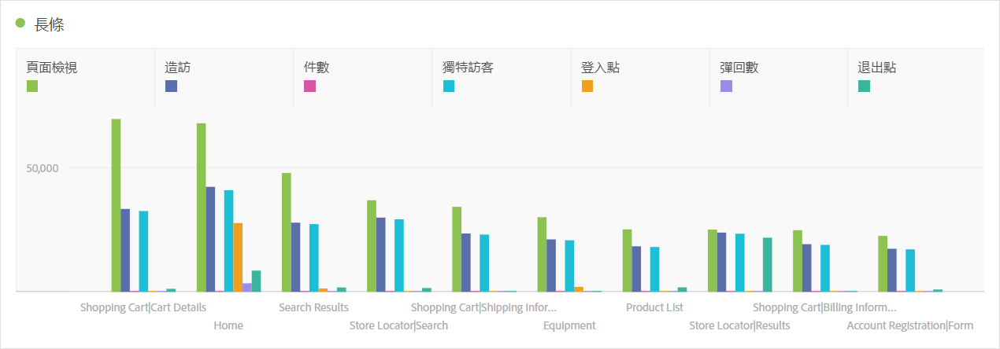
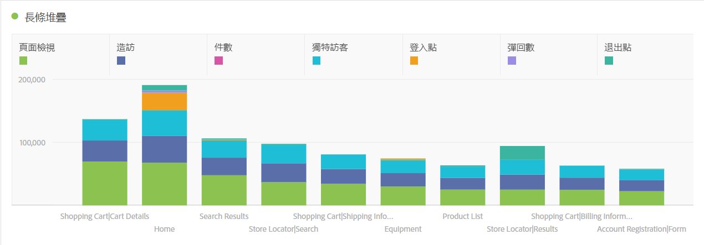

# 條狀圖 (堆疊)

>[!BEGINSHADEBOX]

_本文記錄了_  _**Adobe Analytics**&#x200B;中的長條圖和棧疊長條圖。_ _若需本文的_  _**Customer Journey Analytics**&#x200B;版本，請參閱[棧疊長條圖和棧疊長條圖](https://experienceleague.adobe.com/zh-hant/docs/analytics-platform/using/cja-workspace/visualizations/bar)。_

>[!ENDSHADEBOX]

此長條圖視覺效果具有標準和堆疊選項。

## 長條圖 {#bar}

<!-- markdownlint-disable MD034 -->

>[!CONTEXTUALHELP]
>id="workspace_bar_button"
>title="長條圖"
>abstract="建立長條圖視覺效果來表示一個或多個量度的各種值。"

<!-- markdownlint-enable MD034 -->

 **[!UICONTROL 長條圖]**&#x200B;視覺效果顯示代表一或多個量度之多個值的長條。

視覺效果設定中的顆粒度下拉式清單可讓您將趨勢視覺效果 (例如折線圖、長條圖) 從每日變更為每週、每月等。

## 堆疊長條圖 {#bar-stacked}

<!-- markdownlint-disable MD034 -->

>[!CONTEXTUALHELP]
>id="workspace_barstacked_button"
>title="堆疊長條圖"
>abstract="建立長條圖視覺效果來表示一個或多個堆疊量度的各種值。"

<!-- markdownlint-enable MD034 -->

此  **[!UICONTROL 堆疊長條圖]**&#x200B;視覺效果類似長條圖，但數列長條堆疊在彼此頂端。

使用**[!UICONTROL 設定]**&#x200B;中的 **[!UICONTROL 100% 堆疊]**&#x200B;選項，將圖表轉換為 100% 堆疊視覺效果。

>[!MORELIKETHIS]
>
>[將視覺效果新增至面板](/help/analyze/analysis-workspace/visualizations/freeform-analysis-visualizations.md#add-visualizations-to-a-panel)
>[視覺效果設定](/help/analyze/analysis-workspace/visualizations/freeform-analysis-visualizations.md#settings)
>[視覺化內容選單](/help/analyze/analysis-workspace/visualizations/freeform-analysis-visualizations.md#context-menu)
>