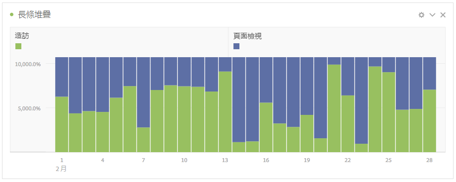

# 長條圖和堆疊長條圖

>[!BEGINSHADEBOX]

_本文記錄了_  _**Adobe Analytics**&#x200B;中的橫條圖和棧疊橫條圖視覺效果。_ _檢視此文章的_  _**Customer Journey Analytics**&#x200B;版本的[長條圖和棧疊長條圖](https://experienceleague.adobe.com/en/docs/analytics-platform/using/cja-workspace/visualizations/bar)。_

>[!ENDSHADEBOX]

橫條圖視覺效果有標準和棧疊選項。

## 長條圖 {#section_2E96E55D4E8E488CBCA6A3508DDF3918}

<!-- markdownlint-disable MD034 -->

>[!CONTEXTUALHELP]
>id="workspace_bar_button"
>title="長條圖"
>abstract="建立長條圖視覺效果來表示一個或多個量度的各種值。"

<!-- markdownlint-enable MD034 -->

此視覺效果顯示代表一或多個量度多個值的垂直長條。

視覺效果設定中的詳細程度下拉式清單可讓您將趨勢視覺效果 (例如折線圖、長條圖) 從每日變更為每週、每月等。

## 堆疊長條圖 {#section_9EA83779AE964635907EE5031A785A49}

<!-- markdownlint-disable MD034 -->

>[!CONTEXTUALHELP]
>id="workspace_barstacked_button"
>title="堆疊長條圖"
>abstract="建立長條圖視覺效果來表示一個或多個堆疊量度的各種值。"

<!-- markdownlint-enable MD034 -->

此視覺效果類似長條圖，但數列長條堆疊在彼此頂端。

針對堆疊橫條圖的全新視覺效果設定可讓圖表以「100% 堆疊」的視覺效果方式呈現。

以下是有關「100% 堆疊視覺效果」的影片：

>[!VIDEO](https://video.tv.adobe.com/v/23131/?quality=12)
