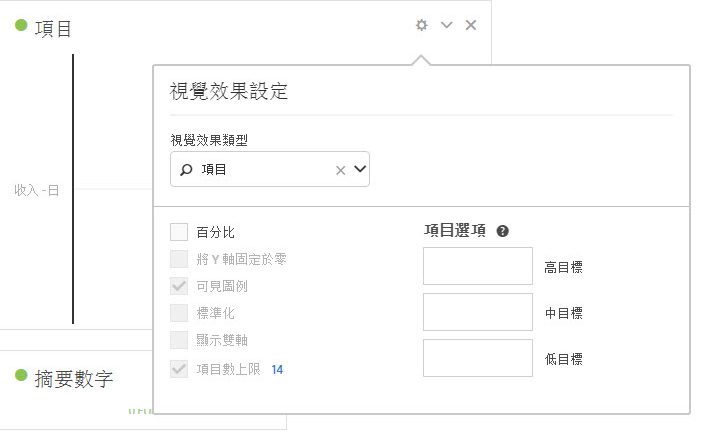

# 項目符號圖表 {#bullet-graph}

<!-- markdownlint-disable MD034 -->

>[!CONTEXTUALHELP]
>id="workspace_bullet_goalvalue"
>title="目標值"
>abstract="**[!UICONTROL 高目標]**&#x200B;是您的主要目標。**[!UICONTROL 低目標]**&#x200B;和&#x200B;**[!UICONTROL 中目標]**&#x200B;會建立低於[!UICONTROL 高目標]的範圍。注意：當勾選「**[!UICONTROL 百分比]**」選項時，請以整數形式輸入目標。例如：如果您的目標是百分之二十，輸入 `20`。"

<!-- markdownlint-enable MD034 -->

<!-- markdownlint-disable MD034 -->

>[!CONTEXTUALHELP]
>id="workspace_bullet_button"
>title="項目符號"
>abstract="建立項目符號圖視覺效果以顯示量度與效能範圍 (目標) 相比較或進行衡量的結果。"

<!-- markdownlint-enable MD034 -->

>[!BEGINSHADEBOX]

_本文會在_  _**Adobe Analytics**&#x200B;中記錄專案符號視覺效果。_ _檢視此文章的_  _**Customer Journey Analytics**&#x200B;版本的[專案符號](https://experienceleague.adobe.com/en/docs/analytics-platform/using/cja-workspace/visualizations/bullet-graph)。_

>[!ENDSHADEBOX]

可讓您查看您感興趣的值與其他效能範圍 (目標) 相比較或進行測量的結果。

項目符號圖表中含有單一的主要測量值 (例如今年至今的收入)，且可用於輸入質化的成效範圍 (例如與目標收入比較)。您可以指定「高」、「中」和「低」的範圍。您可在「[!UICONTROL 視覺效果設定]」中指定目標範圍。

以下是有關項目符號圖視覺效果的影片：

>[!VIDEO](https://video.tv.adobe.com/v/23989/?quality=12)
