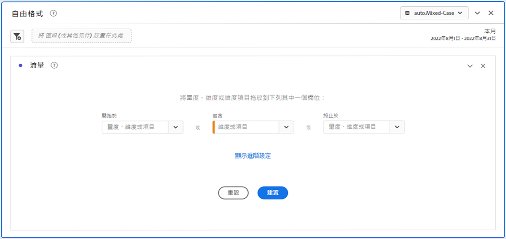
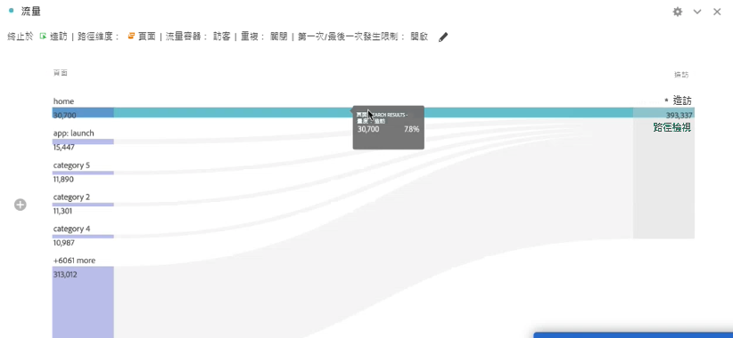
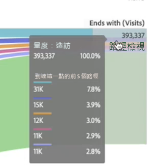
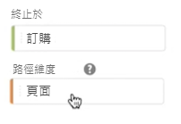
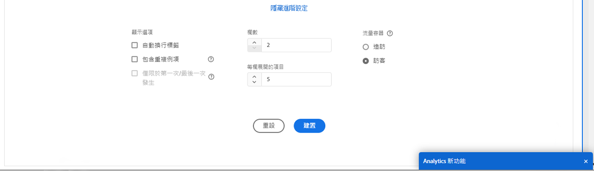

# 設定流量視覺效果 {#configure-a-flow-visualization}

>[!CONTEXTUALHELP]
>id="workspace_flow_startswith"
>title="開始於"
>abstract="此欄位僅可在初始建置時設定。若要更新此欄位，請選取「**[!UICONTROL 重設]**」以建置新的「流量」視覺效果。"

>[!CONTEXTUALHELP]
>id="workspace_flow_contains"
>title="包含"
>abstract="此欄位僅可在初始建置時設定。若要更新此欄位，請選取「**[!UICONTROL 重設]**」以建置新的「流量」視覺效果。"

>[!CONTEXTUALHELP]
>id="workspace_flow_endswith"
>title="終止於"
>abstract="此欄位僅可在初始建置時設定。若要更新此欄位，請選取「**[!UICONTROL 重設]**」以建置新的「流量」視覺效果。"

>[!CONTEXTUALHELP]
>id="workspace_flow_pathingdimension"
>title="路徑分析維度"
>abstract="選取一個維度，以用作前往或離開您選取之元件的路徑。"

>[!CONTEXTUALHELP]
>id="workspace_flow_container"
>title="流量容器"
>abstract="選取用於顯示路徑分析 (數量) 的容器。"

>[!CONTEXTUALHELP]
>id="workspace_flow_include_repeats_disabled"
>title="包括重複項目 (已停用)"
>abstract="無法從包括多值維度的「流量」視覺效果中移除重複項目。"

>[!CONTEXTUALHELP]
>id="workspace_flow_include_repeats_default"
>title="包括重複項目"
>abstract="「流量」視覺效果是根據維度的例項而定。此設定提供您要包括或排除重複執行個體的選項，例如：頁面重新載入次數。"

>[!CONTEXTUALHELP]
>id="workspace_flow_limit_occurrence"
>title="僅限於第一次/最後一次發生次數"
>abstract="結果僅限為第一個/最後一個接觸點是進入/退出時的路徑。"

>[!CONTEXTUALHELP]
>id="workspace_flow_numberofcolumns"
>title="欄數"
>abstract="此欄位僅可在初始建置時設定。若要更新此欄位，請選取「**[!UICONTROL 重設]**」以建置新的「流量」視覺效果。"

>[!CONTEXTUALHELP]
>id="workspace_flow_itemsexpandedpercolumn"
>title="每欄展開的項目"
>abstract="此欄位僅可在初始建置時設定。若要更新此欄位，請選取「**[!UICONTROL 重設]**」以建置新的「流量」視覺效果。"

>[!CONTEXTUALHELP]
>id="workspace_flow_resettoupdate"
>title="重設以更新"
>abstract="此欄位僅可在初始建置時設定。若要更新此欄位，請選取「**[!UICONTROL 重設]**」以建置新的「流量」視覺效果。"

流量視覺效果可協助您瞭解源自網站或應用程式上特定轉換事件的歷程。 或導致特定轉換事件。 此視覺效果會透過您的維度（和維度專案）或量度追蹤路徑。

您可以設定感興趣的路徑的起點或終點。 或分析流經維度或維度專案的所有路徑。

## 使用

1. 新增  **[!UICONTROL 流量]**&#x200B;視覺效果。請參閱[新增視覺效果至面板](../freeform-analysis-visualizations.md#add-visualizations-to-a-panel)。

1. 使用以下選項之一，錨定您的流量視覺效果：

   * [!UICONTROL **開頭為**] (量度、維度或項目)，或
   * [!UICONTROL **包含**] (量度、維度或項目)，或
   * [!UICONTROL **結束於**] (量度、維度或項目)

   這些類別皆會顯示為螢幕上的&#x200B;*放置區*。您可以使用 3 種方式填入拖放區域：

   * 使用下拉式選單來選取量度或維度。
   * 從左側面板拖曳維度或量度。
   * 開始輸入維度或量度名稱，然後當名稱出現在下拉式清單時即可選取。

   >[!IMPORTANT]
   >
   >計算量度不可在&#x200B;**[!UICONTROL 開頭為]**&#x200B;或&#x200B;**[!UICONTROL 結束於]**&#x200B;的欄位中使用。

1. 如果您選擇一個量度，您還需要提供一個&#x200B;[!UICONTROL **路徑分析維度**]，以用於通往或來自選取元件的路徑，如此處所示。此預設為&#x200B;[!UICONTROL **「頁面」**]。

   

1. (可選) 請選取「**[!UICONTROL 顯示進階設定]**」，以設定下列任何選項：

   | 設定 | 說明 |
   | --- | --- |
   | **[!UICONTROL 繞排標籤]** | 一般而言，系統會截斷「流量」元素的標籤以節省螢幕空間，但您可勾選此方塊以完整顯示標籤。預設 = 未勾選。 |
   | **[!UICONTROL 包含重複例項]** | 「流量」視覺效果是根據維度的例項而定。此設定提供您要包括或排除重複例項的選項，例如頁面重新載入次數。不過，無法從包括多值維度 (例如 listVars、listProps、s.product、銷售 eVars 等) 的「流量」視覺效果中移除重複項目。 
此選項預設為停用。
 |
   | **[!UICONTROL 僅限於第一次/最後一次發生次數]** | 將路徑限制為維度、項目/或量度開始或結束於第一次或最後一次發生次數的路徑。請參閱[僅限第一次/最後一次發生次數](#example-scenario-for-limit-to-firstlast-occurrence)，以了解更多詳細的解釋。 |
   | **[!UICONTROL 欄數]** | 流量圖中所需的欄數。您最多可以指定 5 個欄。 |
   | **[!UICONTROL 每欄展開的項目]** | 每欄中所需的項目數。您最多可以指定每欄展開 10 個項目。 |
   | **[!UICONTROL 流量容器]** | 您可以在&#x200B;**[!UICONTROL 造訪]**&#x200B;和&#x200B;**[!UICONTROL 訪客]**&#x200B;之間切換以分析路徑。 這些設定可協助您瞭解訪客在訪客層級的參與程度（跨越造訪），或將分析限制在單一造訪。 |

   >[!IMPORTANT]
   >
   >**[!UICONTROL 欄數]**&#x200B;和&#x200B;**[!UICONTROL 每欄展開的項目]**&#x200B;組合可確定建立流量視覺效量所需的基本請求數。這些數字越高，呈現視覺效果所需的時間就越長。

1. 選取「**[!UICONTROL 建立]**」。

### 範例

假設您想要追蹤使用者往返您網站上最受歡迎頁面的路徑。

1. 依上所述建立流量視覺效果。
1. 拖曳&#x200B;[!UICONTROL **頁面**]&#x200B;維度至「**[!UICONTROL 包含]**」欄位，然後選取「[!UICONTROL **建置**]」。
1. 使用檢視次數最多的頁面 (可在視覺效果中央的焦點節點內看到) 建置流量視覺效果。您也可以看到會引導至該頁面的上層頁面 (位於焦點節點的左側) 以及引導出該頁面的上層頁面 (位於焦點節點的右側)。
1. 如[設定](#configure)所述，在流量分析資料。

## 設定

流量設定的摘要會顯示在視覺效果的頂端。圖表中的路徑會依照比例顯示。具有較多活動的路徑看起來比較寬。

若要深入研究資料，您有幾個選項：

* 流量圖是互動式的。將滑鼠移到圖表上方，可變更顯示的詳細資料。

* 選取圖表中的節點，會顯示該節點的詳細資料。再次選取節點，以將其摺疊。

  

* 您可以篩選欄以僅顯示特定結果，例如包括和排除、指定條件等。

* 請選取左側或右側的「」以展開一欄。

* 若要自訂輸出，請使用[內容選單](#context-menu)選項。

* 若要使用不同選項編輯流量或重建，請選取設定摘要旁的「」。

## 篩選器

將滑鼠游標停留在欄上方時，會出現一個篩選器。選取篩選器，您會獲得與在自由格式表格中相同的篩選器對話框。請參閱[篩選和排序](freeform-table/../../freeform-table/filter-and-sort.md)。

* 使用「**[!UICONTROL 顯示進階]**」以設定進階設定來使用運算子清單包括或排除特定條件。請參閱[篩選和排序](../freeform-table/filter-and-sort.md)，以了解更多詳細資訊。
* 您篩選某一欄後，該特定欄會反映此篩選結果。藍色表示已篩選該欄。篩選器可以減少欄，僅顯示篩選器中允許的項目。或者移除所有項目，篩選器中您所需的一個項目除外。
* 只要有資料流入剩餘節點，所有下游和上游欄均保持不變。
* 若要移除篩選器，請選取「」以開啟篩選器選單。移除套用的所有篩選器，然後選取「**[!UICONTROL 儲存]**」。流量應會回到其先前的未篩選狀態。

## 內容選單

使用流量視覺效果中任意節點上的內容選單，其中包含下列選項：

| 選項 | 說明 |
|--- |--- |
| **[!UICONTROL 焦點放在這個節點]** | 將焦點變更至選取的節點。焦點節點會出現在流量圖的中央。 |
| **[!UICONTROL 重新開始]** | 將您帶回自由格式圖表產生器，您可以在那裡建置新的流量圖。 |
| **[!UICONTROL 建立此路徑的篩選器]** | 建立篩選器。此選取項目會將您帶往「篩選產生器」，讓您在該處設定新篩選器。 |
| **[!UICONTROL 劃分]** | 依據可用的「維度」、「量度」或「時間」來劃分節點。 |
| **[!UICONTROL 篩選欄]** | 出現如同在自由格式表格中可用的相同篩選器選項。請參閱[篩選和排序表格](/help/analyze/analysis-workspace/visualizations/freeform-table/filter-and-sort.md)中的「套用簡易或進階篩選器置表格」，了解有關可用選項的更多資訊。 |
| **[!UICONTROL 排除項目]**&#x200B;或&#x200B;**[!UICONTROL 還原排除項目]** | 從欄中移除特定節點，並自動將其建立為欄頂端的篩選器。若要還原排除項目，請從內容選單選取「**[!UICONTROL 還原排除項目]**」。您也可以開啟欄頂端的篩選器，並移除包含剛剛排除的項目的方塊。 |
| **[!UICONTROL 趨勢]** | 建立節點的趨勢圖。 |
| **[!UICONTROL 顯示下一欄]**/**[!UICONTROL 顯示上一欄]** | 顯示視覺效果下一欄 (右邊) 或上一欄 (左邊)。 |
| **[!UICONTROL 隱藏欄]**n | 隱藏視覺效果的選取欄。 |
| **[!UICONTROL 展開整個欄]** | 展開該欄以顯示所有節點。依預設，只會顯示前五個節點。 |
| **[!UICONTROL 從選取項目中建立客群]** | 根據選取欄建立客群。 |
| **[!UICONTROL 摺疊整個欄]** | 隱藏該欄中的所有節點。 |

## 僅限於第一次/最後一次發生次數

使用此選項時，請記住：

* **[!UICONTROL 「僅限於第一次/最後一次發生」]**&#x200B;只會計算系列中的第一次/最後一次發生次數。**[!UICONTROL 「開頭為」]**&#x200B;或&#x200B;**[!UICONTROL 「結束於」]**&#x200B;條件的所有其他發生次數都會被捨棄。
* 如果與&#x200B;**[!UICONTROL 開頭為]**&#x200B;流量搭配使用，則僅包括符合開始條件的第一次發生次數。在下列範例中，**全部***新增至購物車* 的發生次數和&#x200B;*產品主類別*流量中的每個步驟均包括在內。
  

  在下列範例中，僅&#x200B;**第一次***新增至購物車* 的發生次數和&#x200B;*產品主類別*流量中的每個步驟均包括在內。
  
* 如果與&#x200B;**[!UICONTROL 結束於]**&#x200B;流量搭配使用，則僅包括符合結束條件的最後一次發生次數。在下列範例中，**全部***產品主類別* 的發生次數和&#x200B;*新增至購物車*流量中的每個步驟均包括在內。
  

  在下列範例中，僅&#x200B;**最後一次***產品主類別* 的發生次數和&#x200B;*新增至購物車*流量中的每個步驟均包括在內。
  
* 使用的系列因容器而異。如果使用&#x200B;**[!UICONTROL 訪客]**&#x200B;容器，則一連串事件為造訪。 如果使用&#x200B;**[!UICONTROL 訪客]**&#x200B;容器，則事件系列是所提供日期範圍內特定使用者的所有點選。
* 在&#x200B;**[!UICONTROL 開始於]**&#x200B;或&#x200B;**[!UICONTROL 結束於]**&#x200B;欄位中使用量度或維度項目時，可以在進階設定中設定&#x200B;**[!UICONTROL 僅限於第一次/最後一次發生次數]**&#x200B;選項。

>[!MORELIKETHIS]
>
>[將視覺化新增至面板](/help/analyze/analysis-workspace/visualizations/freeform-analysis-visualizations.md#add-visualizations-to-a-panel)
>>[視覺效果設定](/help/analyze/analysis-workspace/visualizations/freeform-analysis-visualizations.md#settings)
>>[視覺化內容選單](/help/analyze/analysis-workspace/visualizations/freeform-analysis-visualizations.md#context-menu)
>

<!--
## Create a flow visualization {#configure}

1. Add a blank panel to your project and click the visualizations icon in the left rail. 

   Or
   
   Add a visualization in any of the ways described in the "Add visualizations to a panel" section in [Visualizations overview](/help/analyze/analysis-workspace/visualizations/freeform-analysis-visualizations.md).

1. Anchor your Flow visualization using one of the following options:

   * [!UICONTROL **Starts with**] (metrics, dimensions, or items), or
   * [!UICONTROL **Contains**] (dimensions, or items), or
   * [!UICONTROL **Ends with**] (metrics, dimensions, or items)

   Each of these categories is shown onscreen as a "drop zone." You can populate the drop zone in 3 ways:

   * Use the drop-down menu to select metrics or dimensions.
   * Drag dimensions or metrics from the left rail.
   * Begin typing the name of a dimension or metric, then select it when it appears in the drop-down list.

   >[!IMPORTANT]
   >
   >Calculated metrics cannot be used in the  **[!UICONTROL Starts with]** or **[!UICONTROL Ends with]** fields.

1. If you choose a metric, you also need to provide a [!UICONTROL **Pathing Dimension**] to use as your path leading to or coming from your selected component, as shown here. The default is [!UICONTROL **Page**].

   

1. (Optional) Select **[!UICONTROL Show advanced settings]** to configure any of the following options:

   

   | Setting | Description |
   | --- | --- |
   | **[!UICONTROL Wrap labels]** | Normally, the labels on the Flow elements are truncated to save screen real estate, but you can make the entire label visible by checking this box.  Default = unchecked. |
   | **[!UICONTROL Include repeat instances]** | Flow visualizations are based on instances of a dimension. This setting gives you the option to include or exclude repeated instances, e.g. Page reloads. However, repeats cannot be removed from Flow visualizations that include multi-valued dimensions, such as listVars, listProps, s.product, merchandising eVars, etc. 
This option is disabled by default.
 |
   | **[!UICONTROL Limit to first/last occurrence]** | Limit paths to those that start/end with the first/last occurrence of a dimension/item/metric. See the section below, [Example scenario for 'limit to first/last occurrence'](#example-scenario-for-limit-to-firstlast-occurrence), for a more detailed explanation. |
   | **[!UICONTROL Number of columns]** | The number of columns you want in your Flow diagram. You can specify a maximum of 5 columns. |
   | **[!UICONTROL Items expanded per column]** | The number of items you want in each column. You can specify a maximum of 10 items expanded per column.  |
   | **[!UICONTROL Flow container]** | <ul><li>Visit</li><li>Visitor</li></ul> Lets you switch between Visit and Visitor to analyze visitor pathing. These settings help you understand visitor engagement at the visitor level (across visits), or constrain the analysis to a single visit.|

   >[!IMPORTANT]
   >
   >The combination of **[!UICONTROL Number of columns]** and **[!UICONTROL Items expanded per column]** determine the number of underlying requests required to create the flow visualization. The higher those numbers, the longer it takes to render a visualization.

1. Select **[!UICONTROL Build]**.

>[!INFO]
>
>**Example:** Suppose that you want to trace the path that users took both to and from the most popular pages on your site.
>
>To do this, you would
> 
>1. Begin creating a flow visualization as described above.
>1. Drag the [!UICONTROL **Page**] dimension into the **[!UICONTROL Contains]** field, then select [!UICONTROL **Build**].
>1. The Flow visualization builds with the most-viewed page visible in the focus node in the center of the visualization. You also see the top pages leading into that page (to the left of the focus node) as well as the top pages leading out of that page (to the right of the focus node).
>1. Analyze data in the flow, as described in [View and change the Flow output](#view-and-change-the-flow-output).

## View and change the Flow output {#output}

A summary of the Flow configuration appears at the top of the diagram. The thickness of a path in the diagram is proportional to its activity, with paths with more activity appearing thicker than those with less activity.

To drill down further into the data, you have several options:

* The flow diagram is interactive. Mouse over the diagram to change the details that are shown.

* When you select on a node in the diagram, the details for that node appear. Select on the node again to collapse it.

   

* You can filter a column to display only certain results, such as including and excluding, specifying criteria, and so forth.

* Select the plus sign (+) on the left to expand a column.

* Use the right-click options explained below to further customize the output.

* Select the pencil icon next to the configuration summary to further edit the flow or rebuild it with different options.

* You can also export and further analyze your Flow diagram as part of a project's .CSV file by going to **[!UICONTROL Project]** > **[!UICONTROL Download CSV]**.

## Filtering

Above each column, a filter appears when you hover over it. By selecting the filter, you get the same filter dialog that exists in the Freeform table today. This filter works the same as it does in the Freeform table.

* Use advanced settings to include or exclude certain criteria with our list of operators.
* Once you have filtered an item from the list, that specific column will reflect the filtering. (The filter either reduces it to only show the item allowed in the filter, or it removes all items except for the one item you want in the filter.
* All downstream and upstream columns should persist, as long as there is data flowing into the remaining nodes.
* Once applied, the filter icon appears in blue above the column it is filtering.
* To remove a filter, select the filter icon to open the filter menu. Remove any filters applied and then select **[!UICONTROL Save]**. The flow should return to its previous, unfiltered state.

## Right-click options {#right-click}

| Option | Description |
|--- |--- |
| [!UICONTROL Start over] | Returns you to the Freeform diagram builder, where you can build a new Flow diagram. |
| [!UICONTROL Create segment for this path] | Create a segment. This takes you into the Segment Builder, where you can configure the new segment. |
| [!UICONTROL Breakdown] | Break the node down by available Dimensions, Metrics, or Time. |
| [!UICONTROL Trend] | Create a trended diagram for the node. |
| Show next column / Show previous column | Reveals the next (right) or previous (left) column of the visualization. |
| Hide column | Hides the selected column from the visualization. | 
| [!UICONTROL Expand entire column] | Expand a column to show all nodes. By default, only the top five nodes display. |

## Example scenario for 'limit to first/last occurrence'

When using this option, keep in mind that:

* **[!UICONTROL Limit to first/last occurrence]** counts only the first/last occurrence in the series. All other occurrences of the **[!UICONTROL Starts with]** or **[!UICONTROL Ends with]** criteria are discarded.
* If used with a **[!UICONTROL Starts with]** flow, only the first occurrence that matches the start criteria is included.
* If used with an **[!UICONTROL Ends with]** flow, only the last occurrence that matches the end criteria will be included.
* The series used differs based on the container. If using the **[!UICONTROL Visit]** container, the series of hits will be the session. If using the **[!UICONTROL Visitor]** container, the series of hits will be all the hits for a given user in the provided date range.
* The **[!UICONTROL Limit to first/last occurrence]** option can be configured in the advanced settings when using a Metric or Dimension Item in the "Starts with" or "Ends with" fields.

Example series of hits:

Home > Products > Add to cart > Products > Add to Cart > Billing > Order Confirmation

### Consider a flow analysis using the following settings:

* Start with[!UICONTROL  Add to cart] (Dimension Item)
* [!UICONTROL Page] pathing dimension
* [!UICONTROL Visit] container

If **[!UICONTROL Limit to first/last occurrence]** is *disabled*, then this single series of hits counts 2 occurrences of "Add to Cart".
Expected Flow Output:
"Add to Cart" (2) —> "Products" (1)
                  -> "Billing" (1)

However, if **[!UICONTROL Limit to first/last occurrence]** is *enabled*, only the first occurrence of "Add to cart" is included in the analysis.
Expected Flow Output:
"Add to Cart" (1) —> "Products" (1)

### Consider the same series of hits but using the following settings:

* Ends with [!UICONTROL Add to cart] (Dimension Item)
* [!UICONTROL Page] pathing dimension
* [!UICONTROL Visit] container

If **[!UICONTROL Limit to first/last occurrence]** is *disabled*, then this single series of hits would count 2 occurrences of "Add to Cart".
Expected Flow Output:
"Products" (2) <— "Add to cart" (2)

However, if **[!UICONTROL Limit to first/last occurrence]** is *enabled*, only the last occurrence of [!UICONTROL Add to cart] would be included in the analysis.
Expected Flow Output:
"Products" (1) <— "Add to cart" (1)

-->