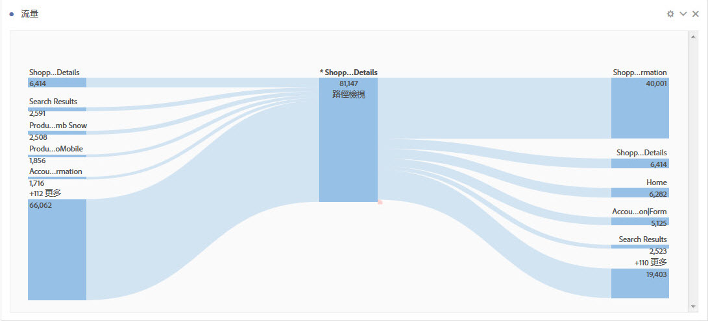
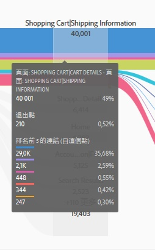
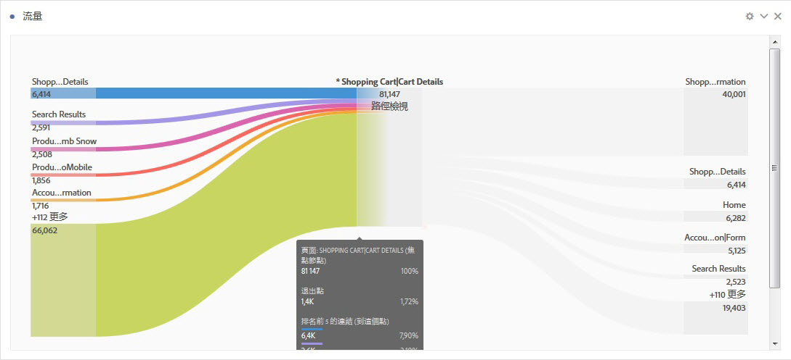
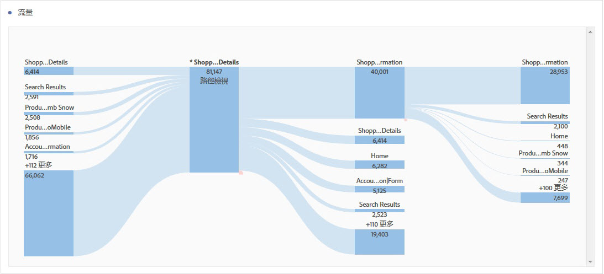

# 設定流量視覺效果

流量可讓您追蹤穿越頁面或維度 (例如 eVar) 的路徑：

* 登入 (僅限維度)
* 維度或項目
* 退出 (僅限維度)

這些類別都會顯示在螢幕上的「拖放區域」中。從清單拖曳項目然後將它們放在所需的拖放中即可。不屬於維度的頁面和其他項目只能放在中間的拖放區域。如果您將維度放到中間區域，會有一個報表自動執行並插入該維度的排名最前項目。

當您將項目放到拖放區域，隨即會開啟一個流量圖。流量圖所顯示的內容，取決於您放下維度或項目的拖放區域。「退出」和「登入」會顯示您放到「登入」或「退出」拖放區域中之維度 (例如頁面) 的所有項目。例如，如果您將一個維度放到中央拖放區域，就會開啟該維度的流量圖。

將滑鼠移到圖表中央的「焦點節點」上方，即可檢視該節點的相關資訊。

流量圖是互動式的。將滑鼠移到圖表上方，可變更顯示的詳細資料。

圖表中的路徑會依照比例顯示。具有較多活動的路徑看起來比較寬。

按一下圖表中的節點，會顯示該節點的詳細資料。例如，如果按一下頂部圖表右上方的&#x200B;**[!UICONTROL 「搜尋結果」]**，圖表會展開並顯示搜尋結果節點的更多詳細資料。再次按一下該節點即可將其摺疊。

依預設，圖表會顯示前五個流量。如果按一下圖表底部的&#x200B;**[!UICONTROL 「更多」]**&#x200B;節點，圖表會向下展開並顯示另外五個流量。繼續按&#x200B;**[!UICONTROL 「更多」]**，可繼續展開直到沒有其他可顯示的流量為止。

在流量圖中的探索完全沒有限制。

您也可以前往&#x200B;**[!UICONTROL 「專案]** > **[!UICONTROL 下載 CSV」]**，匯出並進一步分析您專案 .CSV 檔案的「流量」圖表。
