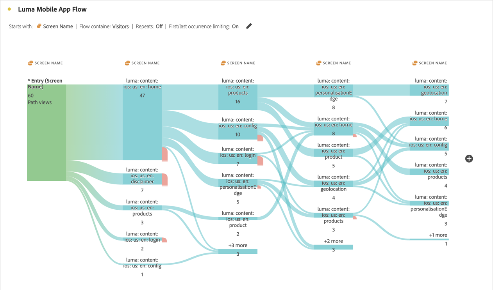

# 維度間流量

維度間流量可讓您檢查多個維度間的用戶路徑。

>[!BEGINSHADEBOX]

如需示範影片，請參閱 [維度間流量](https://video.tv.adobe.com/v/24041?quality=12&learn=on){target="_blank"}。

>[!ENDSHADEBOX]

本文說明此流量如何用於兩個使用案例：行動應用程式互動和事件，以及促銷活動如何推動網站造訪。

## 行動應用程式互動和事件

此範例流程中使用[!UICONTROL 熒幕名稱]維度，以檢視使用者在應用程式中如何使用各種熒幕（場景）。 傳回的頂端畫面是&#x200B;**[!UICONTROL luma： content： ios： en： home]**，這是應用程式的首頁：

若要探索此應用程式中熒幕與事件型別（例如加入購物車、購買及其他）之間的互動，請拖放&#x200B;**[!UICONTROL 事件型別]**&#x200B;維度：

* 在流程中任何可用步驟之上，若要取代該維度：

  

* 在目前的流量視覺效果之外，若要新增維度：

  

以下的流量視覺效果顯示新增&#x200B;**[!UICONTROL 事件型別]**&#x200B;維度的結果。 此視覺效果可提供行動應用程式使用者在將產品新增至購物車、關閉應用程式、顯示選件等之前，如何透過應用程式中的各種畫面移動的深入分析。

## 行銷活動如何推動網站造訪

您想要分析哪些行銷活動促使訪客造訪網站。 您建立以&#x200B;**[!UICONTROL 促銷活動名稱]**&#x200B;作為維度的流量視覺效果

您以&#x200B;**[!UICONTROL 格式化頁面名稱]**&#x200B;維度取代最後&#x200B;**[!UICONTROL 促銷活動名稱]**&#x200B;維度，並在流量視覺效果結尾新增另一個&#x200B;**[!UICONTROL 格式化頁面名稱]**&#x200B;維度。

您可以將滑鼠停留在任何流程上以檢視更多詳細資料。 例如，哪些行銷活動導致了購物車結帳。

