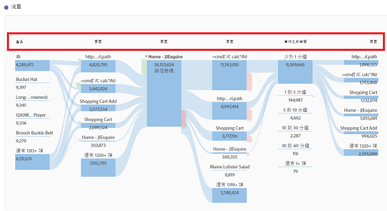
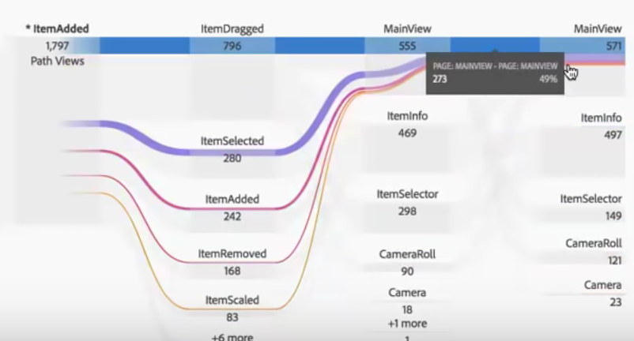

# 維度間流量

維度間流量可讓您檢查多個維度間的用戶路徑。以下是有關 Analysis Workspace 中的文繞圖和多維度流量的影片：

>[!VIDEO](https://video.tv.adobe.com/v/24041/?quality=12)

每個「流量」欄頂端的量度標籤，可讓您在流量視覺效果中使用多維度時更符合使用直覺：

我們將審視 2 個使用案例：一個應用程式使用案例和一個網頁使用案例。

## 使用案例一：應用程式 {#app}

將「[!UICONTROL 動作名稱]」維度新增至流量，而排名最前的傳回項目是 [!UICONTROL ItemAdded]：

若要探索螢幕/頁面和此應用程式中動作之間的互動關係，您可以接著根據您想探索什麼內容，將頁面維度拖曳至多個位置：

* 將其拖曳至拖放區域的任一端 (位於顯示的黑框矩形內部) 可&#x200B;**更換**&#x200B;該處的排名最前結果：

   

* 將其拖曳至結尾處的空白區域 (注意黑色括弧) 可&#x200B;**增加到**&#x200B;視覺效果：

  

如果您打算用「頁面」維度取代右欄中的 ItemScaled 項目，以下是產生的結果。排名最前結果現在更換為「頁面」維度的排名最前結果：

現在您可以查看客戶如何在動作和頁面之間移動了。您可以按一下不同節點，進一步探索流量：

如果您將其他「動作名稱」維度新增至視覺效果結尾處，以下是產生的結果：

如此可對應用程式進行一些深入的分析，甚至可能對您正在分析的應用程式進行一些變更。

## 使用案例二：網頁 {#web}

此使用案例顯示如何分析哪個促銷活動對網站帶動最多的登入活動。

將「促銷活動名稱」維度拖曳至一個新流量：

現在，我想查看這些促銷活動帶動哪些頁面的流量，所以我將「頁面」維度拖曳至流量右側，將其新增至視覺效果：

