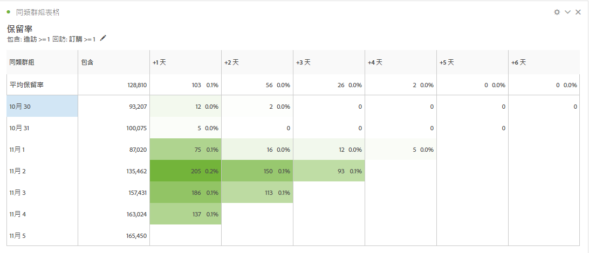
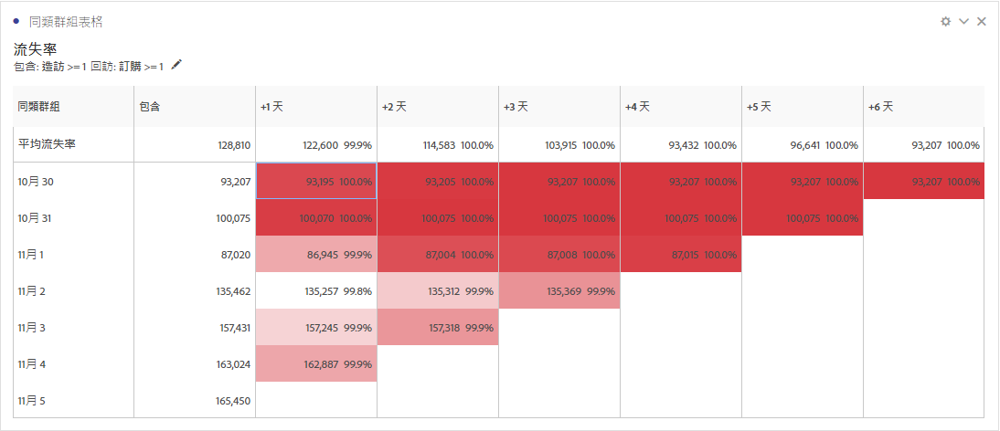
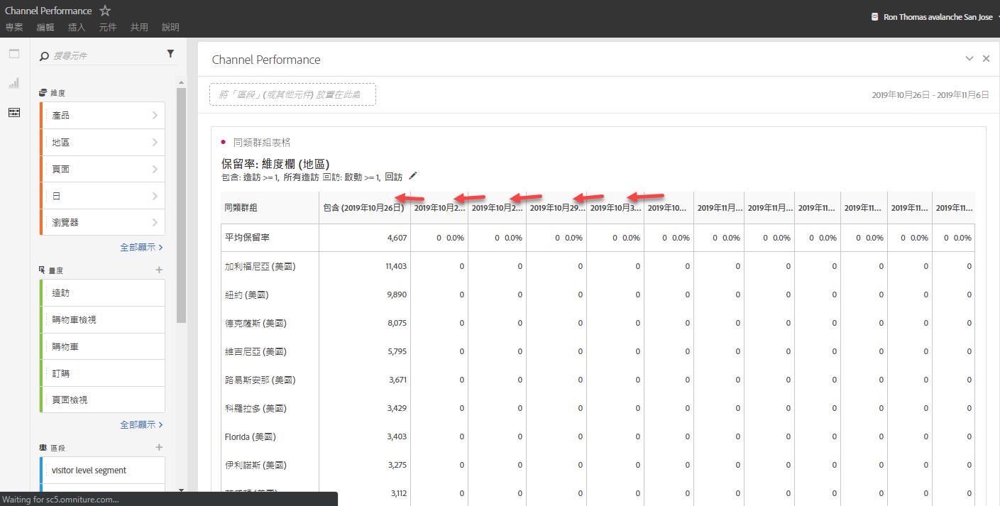
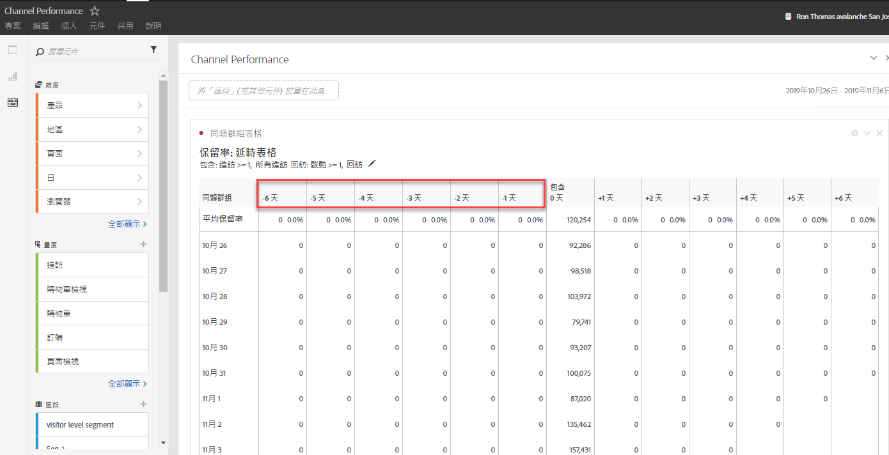
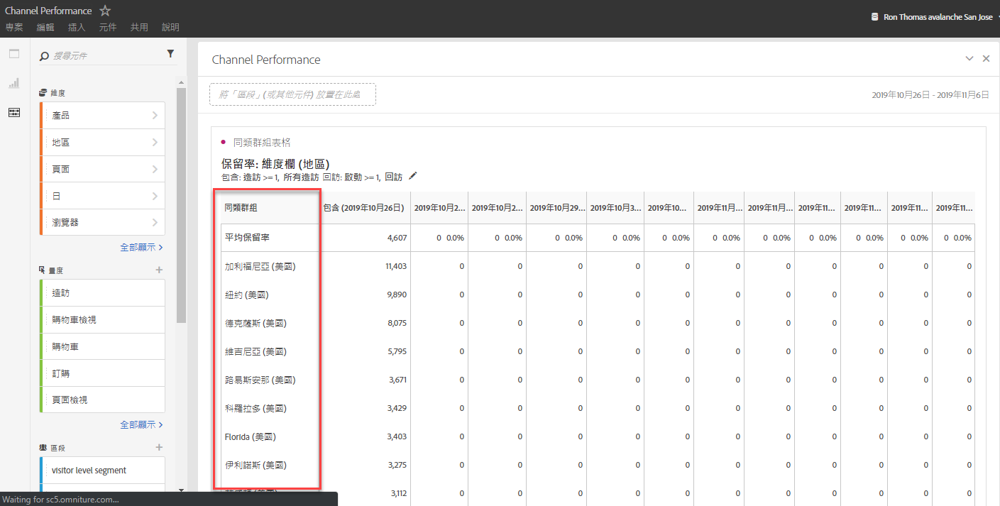

# 同類群組表格概觀 {#cohort-table-overview}

<!-- markdownlint-disable MD034 -->

>[!CONTEXTUALHELP]
>id="workspace_cohorttable_button"
>title="同類群組表格"
>abstract="建立同類群組視覺效果，根據事件的完成情形將使用者分組，並分析一段時間內的持續參與度和流失情況。"

<!-- markdownlint-enable MD034 -->

<!-- markdownlint-disable MD034 -->

>[!CONTEXTUALHELP]
>id="workspace_cohorttable_panel"
>title="同類群組表格"
>abstract="根據事件的完成情形將使用者分組，然後分析他們在一段時間內的持續參與度及流失情況。  **參數&#x200B;** **包含條件**：這些元件用以定義初始訪客同類群組。 **回訪條件**：這些元件用以判斷訪客是否已回訪。"

<!-- markdownlint-enable MD034 -->

>[!BEGINSHADEBOX]

*本文會記錄&#x200B;**Adobe Analytics**中的同類群組表格。 檢視此文章的&#x200B;**Customer Journey Analytics**版本的[同類群組表格](https://experienceleague.adobe.com/en/docs/analytics-platform/using/cja-workspace/visualizations/cohort-table/cohort-analysis)。*

>[!ENDSHADEBOX]

*`cohort`* 是指一段指定時間內，共享相同特徵的一組人。[!UICONTROL 例如當您想知道一個同類群組與某個品牌的互動關係時，就很適合使用同類群組分析。]您可輕易看出趨勢中的變化，然後據以做出回應。(網路上有[!UICONTROL 同類群組分析]的解釋可供參考，例如 [Cohort Analysis 101](https://en.wikipedia.org/wiki/Cohort_analysis)。)

建立同類群組報表後，您可以組織其元件 (特定的維度、量度和區段)，接著將同類群組報表與他人共用。請參閱[監管與共用](/help/analyze/analysis-workspace/curate-share/curate.md)。

[!UICONTROL 同類群組分析]的用途範例：

* 推行專為刺激所需動作的促銷活動。
* 在客戶生命週期的正確時間點轉移行銷預算。
* 識別何時應終止試用或優惠方案，以獲取最大價值。
* 獲得定價、升級路徑等領域的 A/B 測試相關想法。

所有具有 [!UICONTROL Analysis Workspace] 存取權限的 Analytics 客戶，皆可使用[!UICONTROL 同類群組分析]。

有關 Analysis Workspace 中同類群組表格的影片：

>[!VIDEO](https://video.tv.adobe.com/v/25965/?quality=12)

>[!IMPORTANT]
>
>[!UICONTROL 同類群組分析]不支援無法設為區段的量度（包括計算量度）、非整數量度（例如收入）或發生次數。
>
>只有可以在區段中使用的量度才能用於[!UICONTROL 同類群組分析]，而且這些量度一次只能遞增 >1 的值。

## 同類群組分析功能

以下幾節將說明同類群組分析功能，這些功能可讓您對您正在建立的同類群組進行微調控制。

如需建立同類群組及執行[!UICONTROL 同類群組分析]報表的詳細資訊，請參閱[設定同類群組分析報表](/help/analyze/analysis-workspace/visualizations/cohort-table/t-cohort.md)。

### [!UICONTROL 保留率表格]

[!UICONTROL 保留率]同類群組報表會回傳訪客人數：每個資料儲存格分別顯示該同類群組中，在該時段內執行了動作的原始訪客數目和百分比。您可以包含最多 3 個量度和最多 10 個區段。

以下是有關計算滾動保留率的影片：

>[!VIDEO](https://video.tv.adobe.com/v/25962/?quality=12)

### [!UICONTROL 流失率表格]

[!UICONTROL 流失率]同類群組與保留率表格相反，會顯示在一段時間內離開或從未符合同類群組回傳條件的訪客。您可以包含最多 3 個量度和最多 10 個區段。

以下是有關流失分析的影片：

>[!VIDEO](https://video.tv.adobe.com/v/25966/?quality=12)

### [!UICONTROL 滾動式計算]

可讓您根據上一欄計算保留率或流失率，而非根據包含欄。

### [!UICONTROL 延時表格]

衡量包含事件發生前後的經過時間。此工具非常適合用來進行事前/事後分析。**[!UICONTROL 包含]**&#x200B;欄位於表格的中央，包含事件前後的時段會顯示於兩側。

### [!UICONTROL 自訂維度同類群組]

根據選取的維度建立同類群組，而非根據以時間為主的同類群組 (預設)。使用[!UICONTROL 行銷管道]、[!UICONTROL 行銷活動]、[!UICONTROL 產品]、[!UICONTROL 頁面]、[!UICONTROL 地區]等 Adobe Analytics 維度，說明保留率在不同維度值的變化。

