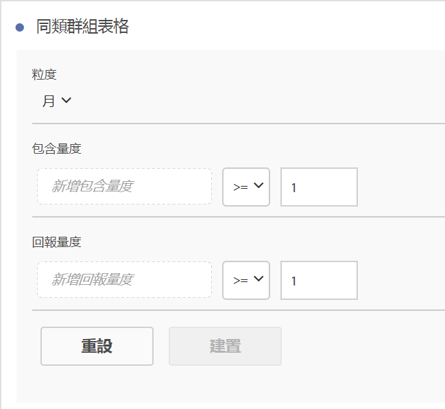
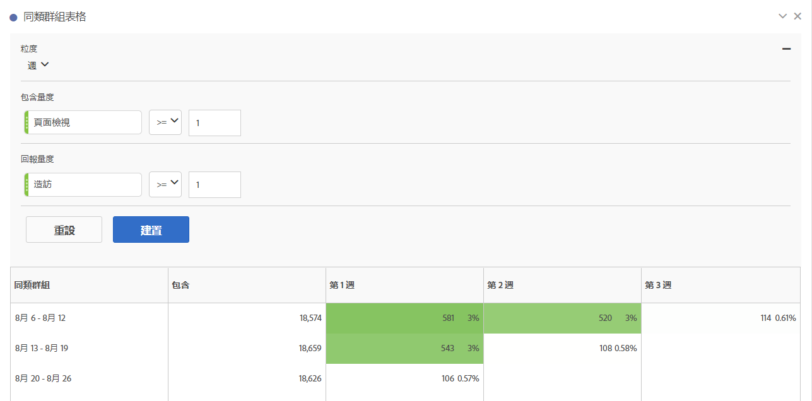

# 設定[!UICONTROL 同類群組分析]報表

在 Analysis Workspace 中建立同類群組並執行[!UICONTROL 同類群組分析]報表。

1. 在 Analysis Workspace 中，按一下左側邊欄中的&#x200B;**[!UICONTROL 「視覺效果」]**&#x200B;圖示，接著將&#x200B;**[!UICONTROL 「同類群組表格」拖曳至畫布]**。

   

1. 按照下表的定義，對&#x200B;**[!UICONTROL 「包含條件」]**、**[!UICONTROL 「回傳條件」]**、**[!UICONTROL 「同類群組類型」]**&#x200B;和&#x200B;**[!UICONTROL 「設定」]**&#x200B;設定定義。

   | 元素 | 說明 |
   |--- |--- |
   | **[!UICONTROL 包含條件]** | 您可以套用最多 10 個包含區段和最多 3 個包含量度。量度會指定將使用者放入同類群組的條件。例如，如果包含量度是「訂購」，則只有在同類群組分析的時間範圍內下訂單的使用者，才會包含在初始同類群組中。 量度間的預設運算子為「和」，但您可以將其變更為「或」。此外，您也可以為這些量度新增數值篩選條件。例如：「造訪 >= 1」。  |
   | **[!UICONTROL 回訪標準]** | 您可以套用最多 10 個回訪區段和最多 3 個回訪量度。該量度指出已保留使用者 (保留率) 或未保留使用者 (流失率)。例如，如果回訪量度是「視訊檢視」，則只有在後續時段 (在將使用者新增至同類群組後) 檢視視訊的使用者，才會表示為保留。可以量化保留的另一個量度是「造訪」。 |
   | **[!UICONTROL 詳細程度]** | 日、週、月、季或年的時間詳細程度。 |
   | **[!UICONTROL 類型]** | **[!UICONTROL 保留率]** (預設)：保留率同類群組會衡量一段時間中，訪客同類群組回訪您網站的程度。這是我們一直以來都有的標準同類群組，其代表回訪和重複的使用者行為。[!UICONTROL 保留率]同類群組在表格中以綠色表示。 **[!UICONTROL 流失率&#x200B;]**：流失率 (也稱為「減少」或「流失」) 同類群組會衡量一段時間中，您網站的訪客同類群組流失程度。流失率 = 1 - 保留率。[!UICONTROL 流失率會向您顯示客戶未回訪的頻率，非常適合用來衡量黏著度及商機。]您可以使用流失率來分析並找出重點區域，瞭解可能需要關注哪些同類群組區段。[!UICONTROL 流失率]同類群組在表格中以紅色表示 (類似於**[!UICONTROL &#x200B;流量&#x200B;]**視覺效果中的流失)。  |
   | **[!UICONTROL 設定]** | **[!UICONTROL 滾動式計算]**：根據上一欄計算保留率或流失率，而非根據「包含」欄 (預設)。[!UICONTROL 「滾動式計算」會變更「回訪」期間的計算方法。]正常的計算方法會單獨找出符合「回訪」標準，且屬於包含期間的使用者，無論他們是否在先前期間的同類群組中。相對地，[!UICONTROL 滾動式計算]會找出符合「回訪」標準、且屬於先前時段的使用者。因此，[!UICONTROL 滾動式計算]會篩選並彙集在各時段持續符合「回訪」標準的使用者。[!UICONTROL 回訪標準會套用至所選期間之前的各個期間。]  **[!UICONTROL 延時表格&#x200B;]**：[!UICONTROL 延時]表格會衡量包含事件發生前後的經過時間。[!UICONTROL 「延時表格」非常適合用於事前/事後分析。]例如，若您有即將推出的產品或行銷活動，且您想追蹤執行前後的使用者行為並查看成效，[!UICONTROL 延時]表格將會並排顯示事前和事後的使用者行為，讓您瞭解直接的影響。[!UICONTROL 延時]表格中的包含前儲存格，是根據在包含時段符合[!UICONTROL 包含]標準，且在包含時段前符合[!UICONTROL 回訪]標準的使用者來計算的。請注意，[!UICONTROL 延時]表格和[!UICONTROL 自訂維度]同類群組無法同時使用。  **[!UICONTROL 自訂維度同類群組]**：根據選取的維度建立同類群組，而非根據以時間為主的同類群組 (預設)。許多客戶希望能透過時間以外的其他方法分析其同類群組，而新的「自訂維度同類群組」功能，可靈活地根據客戶選擇的維度建立同類群組。 使用行銷管道、行銷活動、產品、頁面、地區等 Adobe Analytics 維度，說明保留率在不同維度值的變化。[!UICONTROL 自訂維度]同類群組區段定義只會將維度項目套用為包含時段的一部分，而非回訪定義的一部分。  [!UICONTROL 選擇「自訂維度同類群組」選項後，您可以將任何需要的維度拖放至拖放區域。]這可讓您比較同一時段中類似的維度項目。例如，您可以並排比較城市、產品和促銷活動等的表現。它會傳回您的前 14 個維度項目。不過，您可以使用篩選器 (將游標停留在拖曳的維度右方即可使用)，僅顯示需要的維度項目。[!UICONTROL 自訂維度]同類群組無法與[!UICONTROL 延時]表格功能搭配使用。  |

1. （選用）按一下齒輪圖示調整&#x200B;**[!UICONTROL 同類群組表格設定]**。

   | 設定 | 說明 |
| 僅顯示百分比 | 移除數值並僅顯示百分比。|
| 將百分比四捨五入為最接近的整數 | 將百分比值四捨五入為最接近的整數，不顯示顯小數點後的值。|
| 顯示平均百分比列 | 在表格頂端插入新列，然後在每個欄中加入平均值。|

## 建立[!UICONTROL 同類群組分析]報表

1. 按一下&#x200B;**[!UICONTROL 「建立」]**。

   

   報表會顯示下過訂單 ( *`Included`* 欄) 的訪客，以及在後續的造訪中回訪您網站的訪客。隨時間減少的造訪次數可讓您找出問題並採取行動。
1. (選用) 從選取項目建立區段。

   選取儲存格 (連續或非連續)，然後按一下滑鼠右鍵 >**[!UICONTROL 「從選取項目建立區段」]**。

1. 在[「區段產生器」](/help/components/segmentation/segmentation-workflow/seg-build.md)中進一步編輯區段，然後按一下&#x200B;**[!UICONTROL 「儲存」]**。

   已儲存的區段可用於 [!UICONTROL Analysis Workspace] 中的[!UICONTROL 區段]面板。
1. 命名同類群組專案，將其儲存。
1. (選用) [組織與共用](/help/analyze/analysis-workspace/curate-share/curate.md)專案元件。

   >[!NOTE]
   >
   >您必須先儲存專案，才能進行組織。

## 下載同類群組視覺效果

如同Analysis Workspace中的其他視覺效果，您可以將「同類群組視覺效果」下載為CSV或PDF檔案。 如需詳細資訊，請參閱[下載PDF或CSV檔案](/help/analyze/analysis-workspace/curate-share/download-send.md)。
