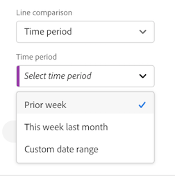
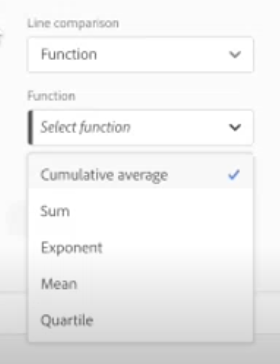
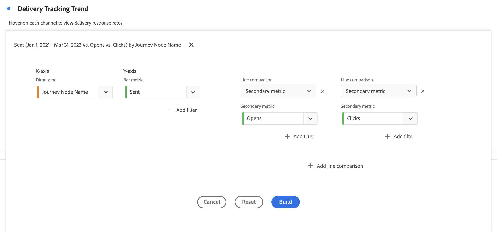
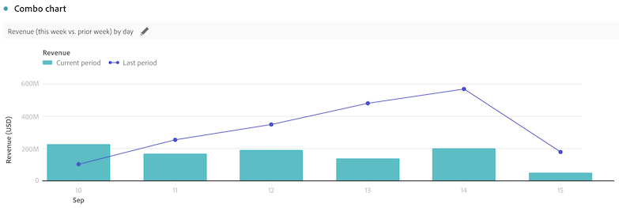
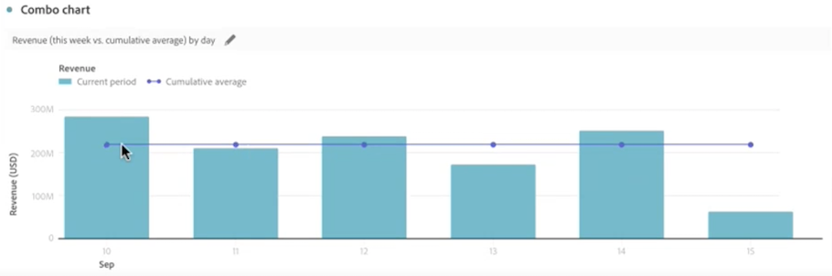
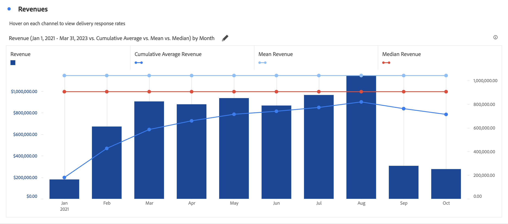

# 組合 {#combo}

<!-- markdownlint-disable MD034 -->

>[!CONTEXTUALHELP]
>id="workspace_combo_button"
>title="組合"
>abstract="快速建立組合圖視覺效果，無需先建立自由格式表格。"

<!-- markdownlint-enable MD034 -->

>[!BEGINSHADEBOX]

_本文會記錄_  _**Adobe Analytics** 中的組合視覺化。_

_請參閱[組合](https://experienceleague.adobe.com/zh-hant/docs/analytics-platform/using/cja-workspace/visualizations/combo-charts)，以取得本文的_  _**Customer Journey Analytics** 版本。_

>[!ENDSHADEBOX]

**[!UICONTROL 組合]**&#x200B;視覺化讓您可輕鬆快速地建置比較視覺化，而無需先建置表格。 您可以輕鬆地以折線/條形組合的形式檢視資料趨勢。

使用[!UICONTROL 組合]進行：

* 比較本週的訂單與上個月 (以及去年) 同時間的訂單。
* 在相同圖表上快速逐一分析和比較多項量度 (例如[!UICONTROL 人員]和[!UICONTROL 收入])。
* 根據一段時間範圍內的函數，分析量度 (例如[!UICONTROL 累積平均值])。

請記住以下事項：

* 您可在單一[!UICONTROL 組合圖表]中新增多筆比較資料。
* 如果您新增一筆或更多比較資料，這些資料必須是相同類型，例如[!UICONTROL 時間比較]。
* 您最多只能新增 5 筆比較資料。
* 對一個量度最多可以套用 3 個篩選器。
* 組合圖表中不支援計算量度。

## 使用

1. 新增[!UICONTROL 組合]視覺化。 請參閱「[將視覺化新增至面板](freeform-analysis-visualizations.md#add-visualizations-to-a-panel)」

1. 從下拉式清單，選取 X 軸的維度和 Y 軸的量度。

1. 選取您要使用的[!UICONTROL 折線比較]類型。

   | 折線比較類型 | 定義 |
   | --- | --- |
   | **[!UICONTROL 時間比較]** | 最常見的比較類型 - 例如，將此時段與 4 週前進行比較。 如果您已選取[!UICONTROL 時間比較]，請針對您要比較的時段進行次要比較。
 |
   | **[!UICONTROL 函數]** | 您可以將[!UICONTROL 平均值]等函數導入比較中。 請參閱[支援的函數](#supported-functions)清單。
 |
   | **[!UICONTROL 次要量度]** | 例如，您可以將[!UICONTROL 收入]與另一個量度比較。
 |

   {style="table-layout:auto"}

1. 選取「**[!UICONTROL 建置]**」。

   輸出看起來會類似下列所示：

   

   目前期間顯示在長條圖中。 折線圖會表示比較期間。 折線圖上的圓點稱為&#x200B;*槓鈴*。

## 支援的函數

如果您選取&#x200B;**[!UICONTROL 函數]**&#x200B;作為[!UICONTROL 折線比較類型]，則會傳回您已選擇的量度函數。

| 函數 | 定義 |
| --- | --- |
| **[!UICONTROL 欄總和]** | 將欄中量度的所有數值 (涵蓋維度的所有元素) 相加。 |
| **[!UICONTROL 累積平均值]** | 傳回最後 N 列的平均值。 |
| **[!UICONTROL 中位數]** | 傳回欄中量度的中位數。 中位數是一組數字中位於中間的數字。 一半數字的值大於或等於中位數，另一半數字的值則小於或等於中位數。 |
| **[!UICONTROL 累積]** | N 列的累積總和。 |
| **[!UICONTROL 欄最大值]** | 傳回量度欄中一組維度元素的最大值。 |
| **[!UICONTROL 平均值]** | 傳回量度的算術平均值或平均值。 |
| **[!UICONTROL 欄最小值]** | 傳回量度欄中一組維度元素的最小值。 |

{style="table-layout:auto"}

以下為收入量度的累積平均值範例：

以下為累積平均值和平均值函數的組合圖表範例：

>[!MORELIKETHIS]
>
>[將視覺效果新增至面板](/help/analyze/analysis-workspace/visualizations/freeform-analysis-visualizations.md#add-visualizations-to-a-panel)
>[視覺效果設定](/help/analyze/analysis-workspace/visualizations/freeform-analysis-visualizations.md#settings)
>[視覺化內容選單](/help/analyze/analysis-workspace/visualizations/freeform-analysis-visualizations.md#context-menu)
>
