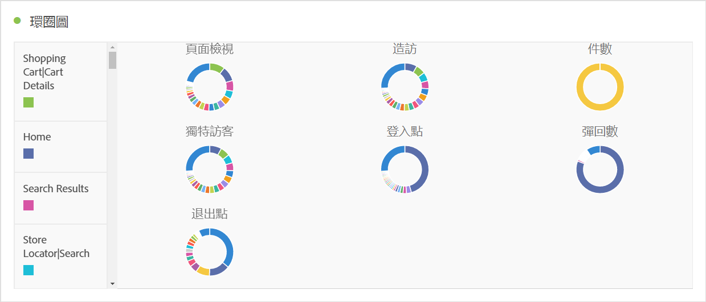

# [!UICONTROL 環形圖] {#donut}

<!-- markdownlint-disable MD034 -->

>[!CONTEXTUALHELP]
>id="workspace_donut_button"
>title="環形圖"
>abstract="建立環形圖視覺效果來比較整體的百分比，通常包含的項目較少。"

<!-- markdownlint-enable MD034 -->

>[!BEGINSHADEBOX]

_本文記錄_  _&#x200B;**Adobe Analytics** 中的環型圖視覺效果。_ _請參閱[環形圖](https://experienceleague.adobe.com/zh-hant/docs/analytics-platform/using/cja-workspace/visualizations/donut)，以取得本文的_  _&#x200B;**Customer Journey Analytics** 版本。_

>[!ENDSHADEBOX]

 **[!UICONTROL 環形圖]**&#x200B;視覺效果類似圓形圖，以整體的部分或篩選器顯示資料。比較整體的百分比時，通常包含的項目較少，可使用環形圖視覺效果。

>[!BEGINSHADEBOX]

請參閱  [新增環形圖視覺效果](https://video.tv.adobe.com/v/334309/?quality=12){target=&#34;_blank&#34;}的示範影片。

>[!ENDSHADEBOX]

>[!MORELIKETHIS]
>
>[將視覺化新增至面板](/help/analyze/analysis-workspace/visualizations/freeform-analysis-visualizations.md#add-visualizations-to-a-panel)
>&#x200B;>[視覺效果設定](/help/analyze/analysis-workspace/visualizations/freeform-analysis-visualizations.md#settings)
>&#x200B;>[視覺化內容選單](/help/analyze/analysis-workspace/visualizations/freeform-analysis-visualizations.md#context-menu)
>

