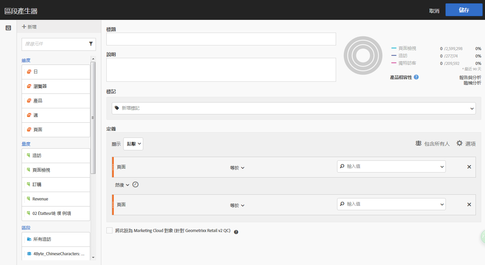
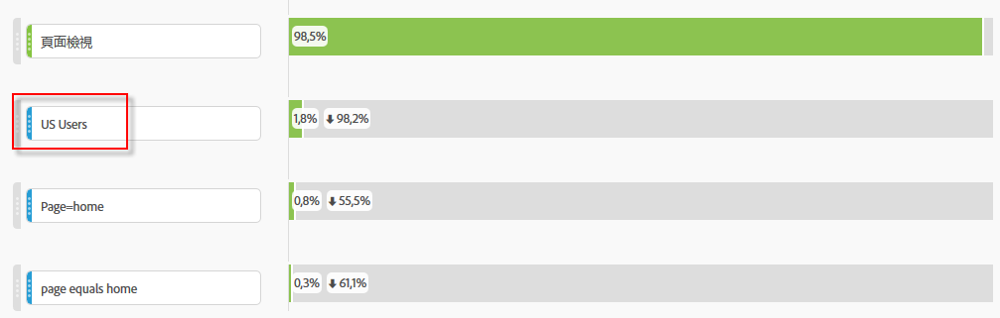
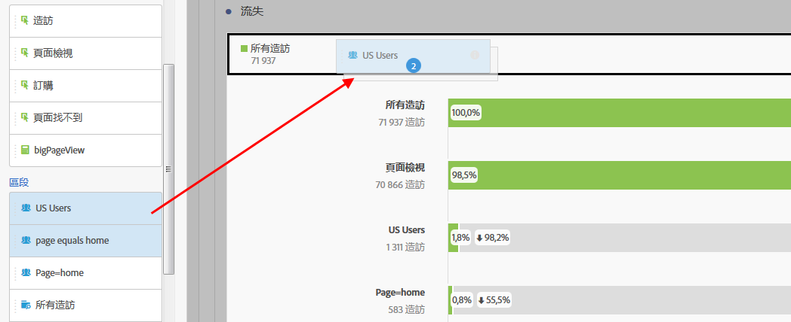
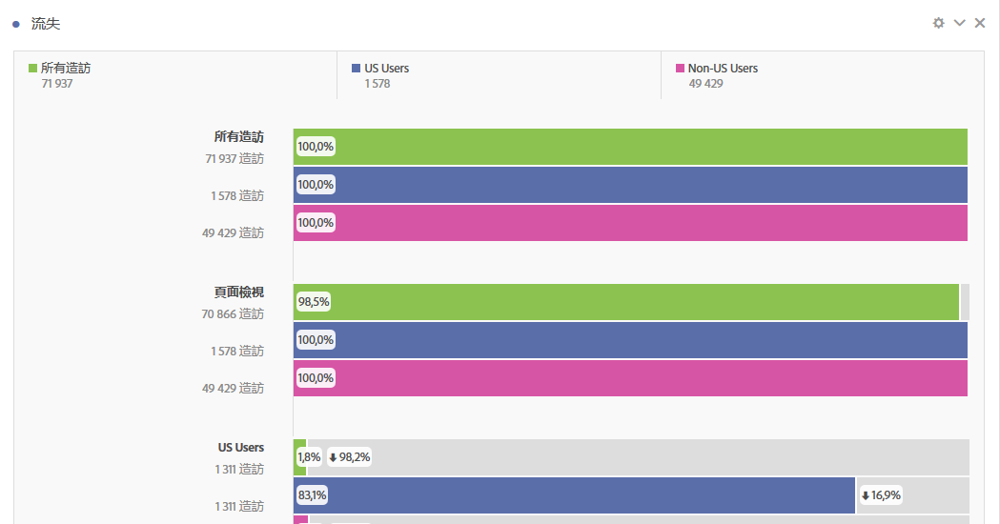

# 在流失分析中套用區段

您可以從接觸點建立區段、新增區段作為接觸點，以及在 Analysis Workspace 的各種區段間比較關鍵工作流程。

>[!IMPORTANT]
>
>在流失分析中當作查核點使用的區段，其所用容器的層級必須低於流失視覺效果的整體設定。分析訪客相關流失率時，當作查核點使用的區段必須為「造訪」或「點擊」相關區段。分析造訪相關流失率時，當作查核點使用的區段必須為「點擊」相關區段。如果使用無效的組合，流失率會計為 100%。我們在「流失視覺效果」中新增一項警告功能，會在您將不相容區段新增為接觸點時顯示。特定的無效區段容器組合會產生無效的流失率圖表，例如：

* 使用以訪客為基礎的區段，作為訪客內容流失視覺效果內的接觸點
* 使用以訪客為基礎的區段，作為造訪內容流失視覺效果內的接觸點
* 使用以造訪為基礎的區段，作為造訪內容流失視覺效果內的接觸點

## 從接觸點建立區段 {#section_915E8FBF35CD4F34828F860C1CCC2272}

1. 從您特別感興趣的某個接觸點建立區段，之後您可以將此區段套用於其他報表。若要這麼做，請以滑鼠右鍵按一下接觸點並選取&#x200B;**[!UICONTROL 「從接觸點建立區段」]**。

   

   「區段產生器」會隨即開啟，預先填入符合您所選接觸點的預先建立連續區段：

   

1. 提供區段的標題和描述，然後將其儲存。

   您現在可以在任意報表中使用這個區段了。

## 將區段新增為接觸點 {#section_17611C1A07444BE891DC21EE8FC03EFC}

如果您想查看美國用戶 (舉例來說) 的趨勢以及如何影響流失，只需將美國用戶區段拖曳至流失中：

或者，您也可以將美國用戶區段拖曳至其他檢查點尚，用以建立 AND 接觸點。

## 比較流失率中的區段 {#section_E0B761A69B1545908B52E05379277B56}

您可以在「流失」視覺效果中比較無數區段。 （請注意，以下影片說明您最多可以比較3個區段，這是錯誤的。）

以下是有關比較流失中的區段的影片：

>[!VIDEO](https://video.tv.adobe.com/v/24046/?quality=12)

1. 從左側的[!UICONTROL 「區段」]欄選取您想要比較的區段。在我們的範例中，已選取 2 個區段：美國用戶和非美國用戶。
1. 將這些區段拖曳至頂端的「區段」拖放區域。

   

1. 選用：您可將「所有造訪」保留作為預設容器，也可將其刪除。

   

1. 您現在可以比較這兩個區段的流失，例如某個區段在哪裡表現較另一個區段優秀，或是使用其他分析角度。
