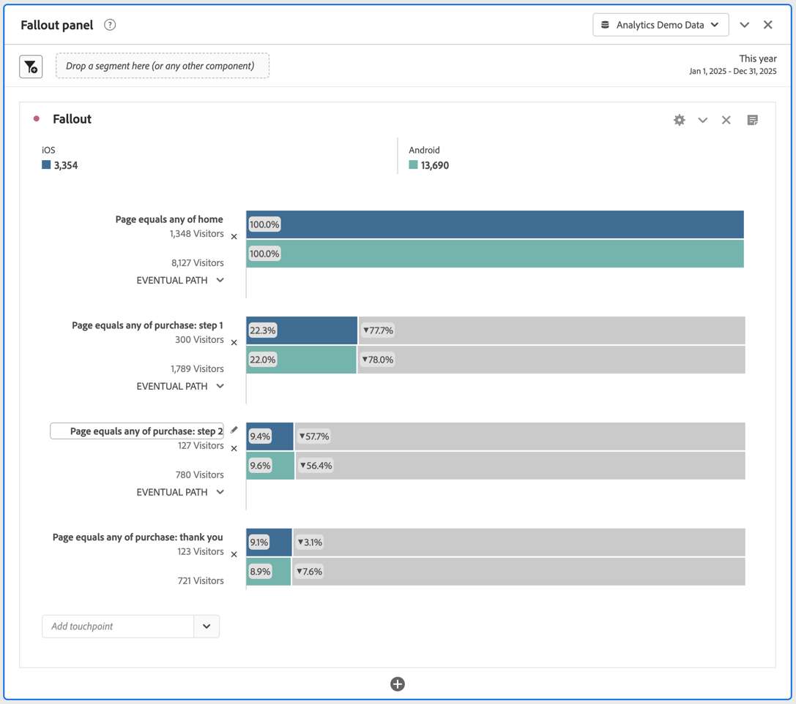

# 在流失分析中套用區段

您可以從接觸點建立區段、新增區段作為接觸點，以及在 Analysis Workspace 的各種區段間比較關鍵工作流程。

>[!IMPORTANT]
>
>在流失分析中當作查核點使用的區段，其所用容器的層級必須低於流失視覺效果的整體設定。分析訪客相關流失率時，當作查核點使用的區段必須為「造訪」或「點擊」相關區段。分析造訪相關流失率時，當作查核點使用的區段必須為「點擊」相關區段。如果使用無效的組合，流失率會計為 100%。當您新增不相容的區段作為接觸點時，流失視覺效果中會顯示警告。 特定的無效區段容器組合會產生無效的流失率圖表，例如：
>
>* 使用以訪客為基礎的區段，作為訪客內容流失視覺效果內的接觸點。
>* 使用以訪客為基礎的區段，作為造訪內容流失視覺效果內的接觸點。
>* 使用以造訪為基礎的區段，作為造訪內容流失視覺效果內的接觸點。
>

## 從接觸點建立區段

1. 從您特別感興趣的某個接觸點建立區段，之後您可以將此區段套用於其他報表。若要這麼做，請以滑鼠右鍵按一下接觸點並選取&#x200B;**[!UICONTROL 「從接觸點建立區段」]**。

   

   「區段產生器」會隨即開啟，預先填入符合您所選接觸點的預先建立連續區段：

   

1. 提供區段的標題和描述，然後將其儲存。

   您現在可以在任何需要的專案中使用此區段。

## 將區段新增為接觸點

如果您想檢視行動應用程式點選量趨勢以及如何影響流失，只需將行動應用程式點選量區段拖曳至流失中：

或者，您也可以將行動應用程式點選區段拖曳至其他查核點上，建立AND接觸點。

## 比較流失率中的區段

您可以在「流失」視覺效果中比較無數區段。 （請注意，以下影片說明您最多可以比較3個區段，這是錯誤的。）

>[!BEGINSHADEBOX]

如需示範影片，請參閱 [在流失視覺效果中比較區段](https://video.tv.adobe.com/v/24046?quality=12&learn=on){target="_blank"}。

>[!ENDSHADEBOX]

1. 從左側的[!UICONTROL 區段]面板選取您要比較的區段。 在此範例中，選取了兩個區段： **[!UICONTROL iOS]**&#x200B;和&#x200B;**[!UICONTROL Android]**。
1. 將三個區段拖曳至視覺效果頂端的區段放置區。

   

1. 選用性：您可以保留&#x200B;*所有人員*&#x200B;作為預設容器，或刪除容器。

1. 您現在可以比較三個區段的流失，例如某個區段在哪裡表現較另一個區段優秀，或是使用其他分析角度。
