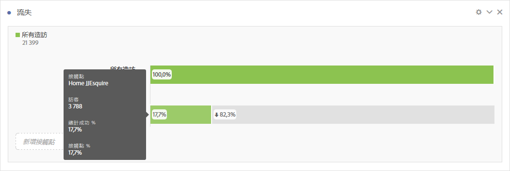
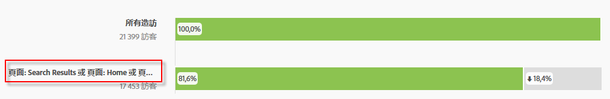
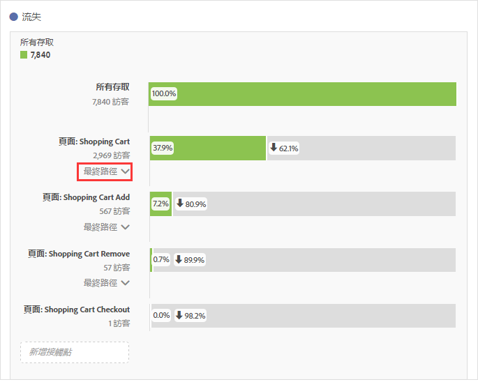

# 設定流失視覺效果

您可指定接觸點來建立多維度流失序列。通常，接觸點就是網站上的某個頁面。但接觸點不限於頁面。例如，您可以新增事件 (例如件數)，以及獨特訪客和回訪次數。您也可以新增維度，例如類別、瀏覽器類型或內部搜尋詞。

您甚至可以在接觸點內新增區段。例如，您可能想比較 iOS 和 Android 使用者之類的區段。將想要的區段拖曳至流失上方，這些區段的相關資訊就會加入流失報表中。如果只想顯示這些區段，您也可以移除「所有造訪」基線。

對於可新增的步驟數或是可使用的維度數並沒有限制。

您可對 eVar 進行路徑分析，包括銷售 eVar 和 [listVar](https://marketing.adobe.com/resources/help/zh_TW/sc/implement/listN.html) (可在每個點擊擁有多個值的變數，例如產品、listVar、銷售 eVar 和清單屬性)。舉例來說，假設某人正在同一頁面上查看鞋子和上衣，而在下一頁改為查看上衣和襪子。來自鞋子的下一個產品流量報表會是上衣和襪子，「而非」上衣。

1. 從「視覺效果」下拉式清單將[!UICONTROL 「流失」]視覺效果拖曳至[!UICONTROL 「自由表格」]中。

1. 將「頁面」維度拖曳至「自由表格」中，然後從那裡將頁面 (在此例中是「首頁 - JJEsquire」) 拖曳至&#x200B;**[!UICONTROL 「新增接觸點」]**&#x200B;欄位，作為第一個接觸點。

   

   將滑鼠移到接觸點上方，查看流失和該層級的其他相關資訊，例如接觸點的名稱、該點的訪客計數，並可查看該接觸點的成功率 (以及比較其他接觸點的成功率)。

   長條灰色部分裡頭圈起來的數字，是接觸點之間的流失 (不是那一點的整體流失)。接觸點 % 顯示流失報表中從先前步驟到目前步驟的成功流過。

   您也可以將單一頁面新增到流失報表，而不是整個維度。按一下頁面維度上的右箭頭「>」，挑選要新增到流失報表的特定頁面。

1. 繼續新增接觸點，直到完成您的序列。

   您也可以拖曳一或多個其他接觸點至某個接觸點，藉以&#x200B;**合併多個接觸點**。

   >[!NOTE]
   >
   >多個區段必須以 AND 連結，但多個項目 (例如維度項目和量度) 則須以 OR 連結。

   

1. 您也可以在路徑內&#x200B;**將個別觸控點限制為下一次點擊** (而非「最終」)。在各接觸點下方，為含有「最終路徑」和「下一次點擊」選項的選擇器，如下所示：

   

<table id="table_A91D99D9364B41929CC5A5BC907E8985"> 
 <tbody> 
  <tr> 
   <td colname="col1"> 
最終路徑 
 
(預設值) 
 </td> 
   <td colname="col2"> 
列入計數的訪客「最終」會著陸至路徑的下個頁面，但不一定會至下一次點擊。 
 </td> 
  </tr> 
  <tr> 
   <td colname="col1"> 
下一次點擊 
 </td> 
   <td colname="col2"> 
列入計數的訪客會著陸至該下一次點擊路徑的下個頁面。 
 </td> 
  </tr> 
 </tbody> 
</table>

## 流失設定 {#section_0C7C89D72F0B4D6EB467F278AC979093}

| 設定 | 說明 |
|--- |--- |
| 流失容器 <ul><li>瀏覽</li><li>訪客</li></ul> | 可讓您切換瀏覽和訪客，分析訪客路徑。預設為「訪客」。這些設定可協助您了解訪客層級的訪客參與程度 (跨越造訪)，或是將分析限制在單一造訪。 |
| 將「所有訪客」顯示為第一個接觸點 | 如果您不想將「所有訪客」顯示為第一個接觸點，您可以取消選取此項。 |

**以滑鼠右鍵按一下接觸點**，下列選項就會出現：

| 選項 | 說明 |
|--- |--- |
| 趨勢接觸點 | 在線性圖中查看接觸點的趨勢資料，其中包含一些預先建立的異常偵測資料。 |
| 趨勢接觸點 (%) | 顯示總流失百分比趨勢。 |
| 顯示所有接觸點趨勢 (%) | 在同一圖表上顯示流失中所有接觸點的百分比趨勢 (「所有造訪」若包含則除外)。 |
| 將此接觸點的落空分解成細目 | 當訪客繼續至下一個接觸點時，檢視訪客在兩個接觸點之間所進行的操作。這會建立顯示維度的自由表格。您可以更換維度和表格上的其他元素。 |
| 將此接觸點的流失分解成細目 | 檢視未通過漏斗的人，在選定步驟後立即做了什麼事。 |
| 從接觸點建立區段 | 從選取的接觸點建立新的區段。 |
