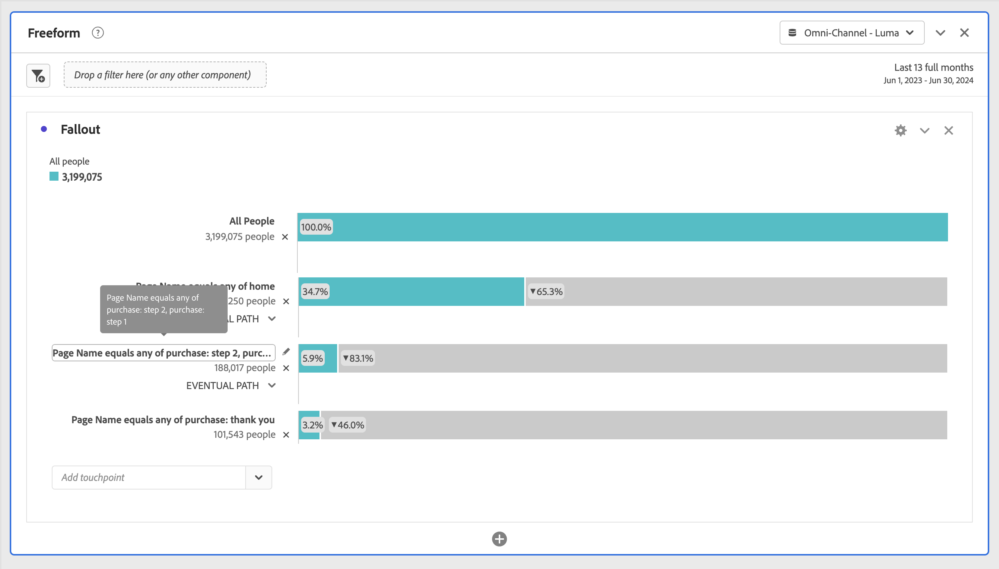

# 設定流失視覺效果

您可指定接觸點來建立多維度流失序列。通常，接觸點就是網站上的某個頁面。但接觸點不限於頁面。例如，您可以新增事件（例如件數），以及不重複人員和回訪。 您也可以新增維度，例如類別、瀏覽器類型或內部搜尋詞。

您甚至可以在接觸點內新增區段。例如，您可能想要比較區段，例如iOS和Android™使用者。 將想要的區段拖曳至流失上方，這些區段的相關資訊就會加入流失報表中。如果只想顯示這些區段，您可以移除「所有造訪」基準線。

可新增的步驟數或使用的維度數沒有限制。

您可以對維度、量度和區段進行路徑分析。 例如，假設某人正在同一頁面上檢視鞋子和上衣，而在下一頁他們正在檢視上衣和襪子。 來自鞋子的下一個產品流量報表會是上衣和襪子，「而非」上衣。

## 使用

1. 新增 **[!UICONTROL 流失]**&#x200B;視覺效果。 請參閱[將視覺效果新增至面板](../freeform-analysis-visualizations.md#add-visualizations-to-a-panel)。
1. 從「頁面」維度將頁面（例如home）拖曳至「*新增接觸點*」下拉式功能表。

   

   將滑鼠指標暫留在接觸點上，可檢視流失和該層級的其他相關資訊，例如接觸點的名稱和該點的人員計數。 並檢視該接觸點的成功率（以及與其他接觸點的成功率比較）。

   長條灰色部分裡頭圈起來的數字，是接觸點之間的流失 (不是那一點的整體流失)。**[!UICONTROL 接觸點%]**&#x200B;會顯示流失報表中，從上一個步驟到目前步驟的成功流失。

   您也可以將單一頁面新增到流失報表，而不是整個維度。按一下頁面維度上的向右箭頭，挑選特定頁面以新增至流失報表。

1. 繼續新增接觸點，直到完成您的序列。

   您可以將一或多個其他元件拖曳到接觸點上，以&#x200B;**結合多個接觸點**。

   >[!NOTE]
   >
   >多個區段必須以AND連結，但多個專案（例如維度專案和量度）則須以OR連結。

   

1. 您也可以在路徑內&#x200B;**將個別接觸點限製為下一個事件** （而非&#x200B;*最終*）。 在每個接觸點下方，有一個選擇器，其選項為&#x200B;**[!UICONTROL 最終路徑]**&#x200B;和&#x200B;**[!UICONTROL 下一個事件]**，如下所示：

   

   | 選項 | 說明 |
   |---|---|
   | **[!UICONTROL 最終路徑]** （預設） | 計算的人數，最終&#x200B;*會*&#x200B;登陸路徑中的下一個頁面，但不一定會登陸下一個事件。 |
   | **[!UICONTROL 下一個事件]** | 將登陸下一個事件路徑中下一頁的資料計算在內。 |

## 設定

在視覺效果中，有特定設定可供使用。

| 流失容器 | 說明 |
|--- |--- |
| **[!UICONTROL 工作階段]**&#x200B;或&#x200B;**[!UICONTROL 人員]** | 在[!UICONTROL 工作階段]和[!UICONTROL 人員]之間切換以分析人員路徑。 預設為[!UICONTROL 人員]。這些設定可協助您了解人員層級的人員參與程度 (跨工作階段)，或是將分析限制為單一工作階段。 |

## 內容選單

在視覺效果中，可以使用特定的內容功能表選項。

| 選項 | 說明 |
|--- |--- |
| **[!UICONTROL 趨勢接觸點]** | 在線性圖中查看接觸點的趨勢資料，其中包含一些預先建立的異常偵測資料。 |
| **[!UICONTROL 趨勢接觸點(%)]** | 顯示總流失百分比趨勢。 |
| **[!UICONTROL 顯示所有接觸點的趨勢(%)]** | 在同一圖表上顯示流失中所有接觸點的百分比趨勢(除了&#x200B;**[!UICONTROL 所有人員]** （如果包含）)。 |
| **[!UICONTROL 在此接觸點劃分割槽間]** | 如果人員繼續進入下一個接觸點，請檢視他們在兩個接觸點（此接觸點和下一個接觸點）之間做了什麼。 這會建立顯示維度的自由表格。您可以更換維度和表格上的其他元素。 |
| **[!UICONTROL 在此接觸點劃分流失]** | 檢視未通過漏斗的人，在選定步驟後立即做了什麼事。 |
| **[!UICONTROL 從接觸點建立區段]** | 從選取的接觸點建立新的區段。 |

>[!MORELIKETHIS]
>
>[將視覺效果新增至面板](/help/analyze/analysis-workspace/visualizations/freeform-analysis-visualizations.md#add-visualizations-to-a-panel)
>[視覺效果設定](/help/analyze/analysis-workspace/visualizations/freeform-analysis-visualizations.md#settings)
>[視覺效果內容功能表](/help/analyze/analysis-workspace/visualizations/freeform-analysis-visualizations.md#context-menu)
>

