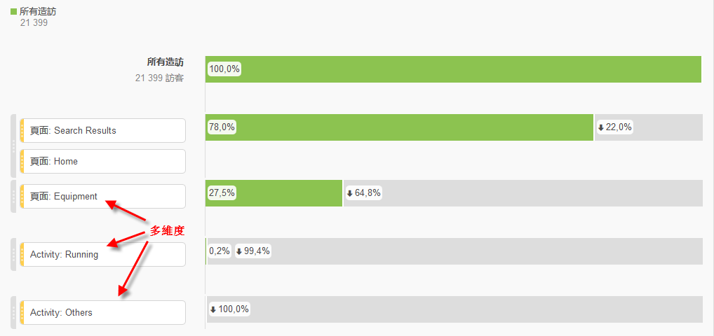
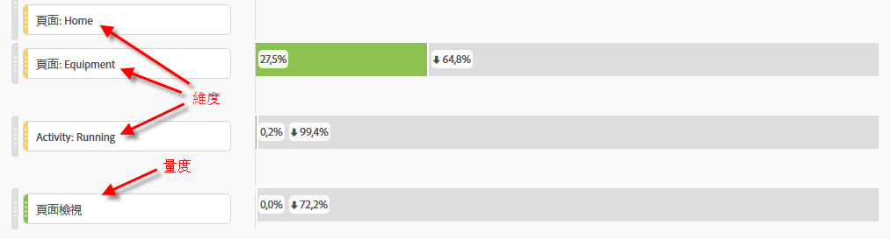
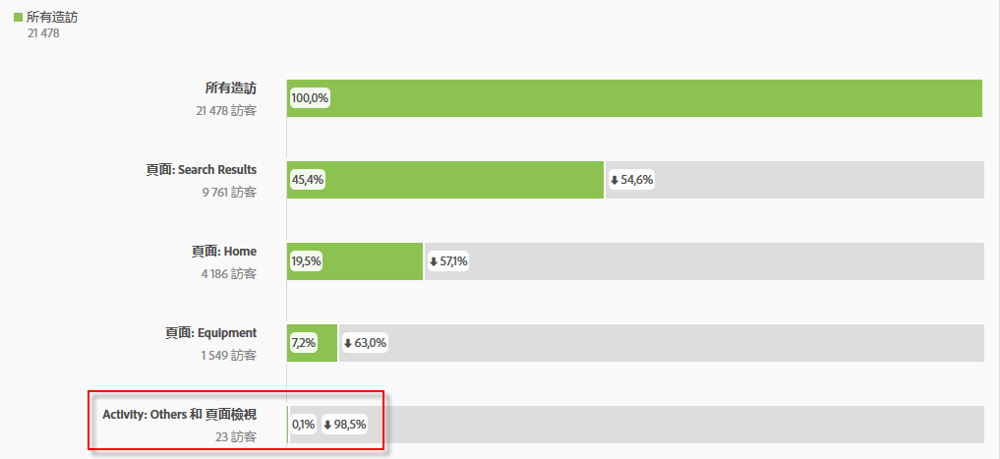

# 多維度流失

Analysis Workspace 中的「流失」可讓您混合搭配維度和量度，作為漏斗和工作流程中的接觸點。如此可讓您在定義想調查的用戶步驟時，擁有更多彈性。

以下是有關該主題的影片：

>[!VIDEO](https://video.tv.adobe.com/v/24043/?quality=12)

**範例**：除了「頁面」維度，您也可以新增動作型維度至「流失」視覺效果。如此可用視覺方式呈現頁面和特定動作在客戶路徑中的相互作用。

系統會動態更新流失，並讓您查看多個維度間的流失情形。

您也可以為此組合再增加其他量度。在此範例中，我們已新增「共用相片」量度來充實客戶採取的路徑：

此外，您也可以在 AND 檢查點中結合不同的維度和量度。只需拖曳其他維度或量度到現有維度或量度的頂端即可：

