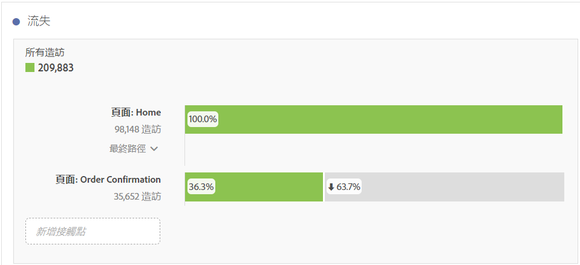
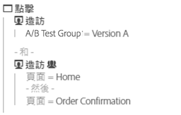
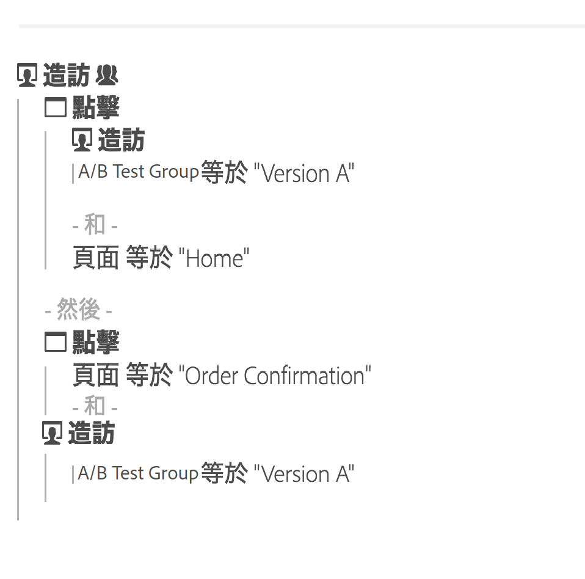

# 流失概述

「流失」視覺效果提供更多選項，供您建立流失報表。流失報表可顯示在一系列預先定義的連續頁面中，訪客在哪個位置離開 (流失) 和繼續通過 (流過)。

「流失」視覺效果可供您

* 在同一份報表中，執行兩個不同區段的並排比較。
* 拖曳、放置和重新安排漏斗步驟 (接觸點)
* 混合搭配來自不同維度和量度的值
* 建立多維度流失報表
* 識別客戶在流失後立即前往何處

流失會顯示一序列中每個步驟或接觸點之間的轉換和流失率。

例如，您可以追蹤訪客在購買過程中的流失點。只要選取起始接觸點和結論接觸點，然後新增中間接觸點即可建立網站導覽路徑。但您也可以執行多維度流失。

流失視覺效果很適合用於分析：

* 網站特定過程的轉換率 (例如購買或註冊過程)。
* 更廣泛的一般流量流程：此流量可顯示在瀏覽過首頁的人當中，有多少人接下來執行了搜尋操作，接著又有多少人最終瀏覽至某一特定項目。
* 網站上事件之間的關聯。關聯顯示在瀏覽過隱私政策的人當中，有百分之幾的人接下來執行了購買操作。

[在 YouTube 觀看「流失率視覺效果」](https://www.youtube.com/watch?v=VcrfHSyIoj8&amp;index=52&amp;list=PL2tCx83mn7GuNnQdYGOtlyCu0V5mEZ8sS)(4:15)

## 區段作為流量和流失的基礎 {#section_654F37A398C24DDDB1552A543EE29AA9}

套用至 Workspace 面板的區段，與在 Reports &amp; Analytics 或 Ad Hoc Analysis 中套用至流失和流量報表的區段，二者的執行方式略有不同。大部分時候，它們提供的結果完全相同。主要差異在於 Reports &amp; Analytics 和 Ad Hoc Analysis 可在序列的每一個步驟套用區段。如此一來，可能造成結果稍微不同。

以兩步驟的流失為例：

如果您接著在 Workspace 面板層級套用區段，區段會像這樣與流失結合：

相較之下，在 Reports &amp; Analytics 和 Ad Hoc Analysis 計算區段時，會以此方式結合區段：

Reports &amp; Analytics 和 Ad Hoc Analysis 會透過每個步驟結合區段。當容器與流失在同一層級 (例如在瀏覽或訪客層級) 時，這會導致瀏覽或訪客數量相符。

然而，如果套用至面板的區段小於流失層級 (例如點擊層級)，則區段會因為報表結合區段的方式而顯示不同結果。再次重申，大部分情況下在 Analysis Workspace 的數量與在 Reports &amp; Analytics 和 Ad Hoc Analysis 的數量相符。只有在以下這些情況皆為真時才&#x200B;**不**&#x200B;相符：

* 區段與流失不在同一層級。
* 區段所含的變數中，訪客數/造訪次數在瀏覽/訪客期間可有多個值。

在某些罕見的情況下，您必須讓 Analysis Workspace 搭配 Reports &amp; Analytics 將區段套用至流失/流量的方式，只要將區段拖曳至 Workspace 中的每個流失步驟，便會產生相同的數字。
