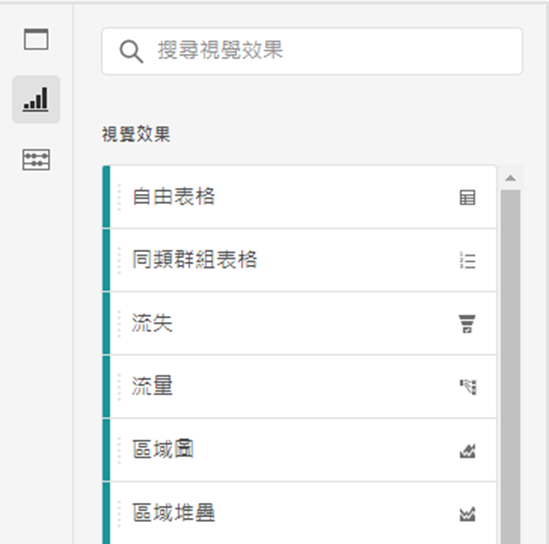

# 視覺效果概觀

Workspace 提供許多視覺效果，可產生資料的視覺化表示法，例如橫條圖、環圈圖、長條圖、折線圖、地圖、散點圖等。如果您使用 Adobe Analytics，多數視覺效果都是您所熟悉的類型。不過，Analysis Workspace 還提供視覺效果設定，以及許多具有互動功能的新或獨特的視覺效果類型。

您可以從 Workspace 左上角圖示、[空白面板](https://experienceleague.adobe.com/docs/analytics/analyze/analysis-workspace/panels/blank-panel.html?lang=zh-Hant)，或透過工作流程中的按一下右鍵選單來存取視覺效果。

Analysis Workspace 中有以下視覺效果類型：

| 視覺效果名稱 | 說明 |
| --- | --- |
| [區域](/help/analyze/analysis-workspace/visualizations/area.md) | 類似線圖，但在線圖下方有一塊上色區域。有多個量度且以要視覺化方式表示多個量度之間交會的區域時，可使用區域圖。 |
| [長條圖](/help/analyze/analysis-workspace/visualizations/bar.md) | 顯示代表一或多個量度多個值的垂直長條。 |
| [項目圖表](/help/analyze/analysis-workspace/visualizations/bullet-graph.md) | 顯示您感興趣的值與其他效能範圍 (目標) 相比較或進行測量的結果。 |
| [同類群組表格](/help/analyze/analysis-workspace/visualizations/cohort-table/cohort-analysis.md) | *`cohort`* 是指一段指定時間內，共享相同特徵的一組人。Cohort Analysis (同類群組分析) 對保留、攪動或延遲分析很有用處。 |
| [環形圖](/help/analyze/analysis-workspace/visualizations/donut.md) | 此視覺效果類似圓餅圖，以整體的部分或區段顯示資料。 |
| [流失](/help/analyze/analysis-workspace/visualizations/fallout/fallout-flow.md) | 流失報告可顯示在一系列預先定義的連續頁面中，訪客在哪個位置離開 (流失) 和繼續通過 (流過)。可以設定為最終或精確的序列 |
| [流量](/help/analyze/analysis-workspace/visualizations/c-flow/flow.md) | 顯示使用您網站和應用程式的正確客戶路徑。 |
| [自由表格](/help/analyze/analysis-workspace/visualizations/freeform-table/freeform-table.md) | 自由表格不僅是資料表格，也是互動式視覺效果。這是 Workspace 的資料分析基礎。 |
| [長條圖](/help/analyze/analysis-workspace/visualizations/histogram.md) | 長線圖會根據量度數量，將訪客人數、瀏覽次數或點擊數放入值區內。 |
| [橫條圖](/help/analyze/analysis-workspace/visualizations/horizontal-bar.md) | 顯示代表一或多個量度多個值的橫條。 |
| [折線圖](/help/analyze/analysis-workspace/visualizations/line.md) | 使用線條呈現量度，顯示一段時間內值的變化。線形圖會延 X 軸使用時間。 |
| [地圖](/help/analyze/analysis-workspace/visualizations/map-visualization.md) | 可讓您建立任何量度 (包括計算量度) 的視覺化地圖。 |
| [散點圖](/help/analyze/analysis-workspace/visualizations/scatterplot.md) | 顯示維度項目與最多三個量度之間的關係。 |
| [摘要數字](/help/analyze/analysis-workspace/visualizations/summary-number-change.md) | 以 1 個大數字來顯示選取的儲存格。 |
| [摘要變更](/help/analyze/analysis-workspace/visualizations/summary-number-change.md) | 以 1 個大數字/百分比來顯示選取儲存格之間的變化。 |
| [文字](/help/analyze/analysis-workspace/visualizations/text.md) | 可讓您將使用者定義文字新增至您的 Workspace。除了運用面板/視覺效果的說明之外，還有助於為您的分析和深入見解新增額外內容 |
| [樹狀圖](/help/analyze/analysis-workspace/visualizations/treemap.md) | 以一組巢狀矩形顯示階層式 (樹狀結構) 資料。 |
| [Venn](/help/analyze/analysis-workspace/visualizations/venn.md) | 使用圓圈描繪最多 3 個區段的度量重疊。 |

## 設定 {#settings}

每個視覺效果都有各自的設定可供您管理。若要存取[!UICONTROL 視覺效果設定]，請按一下「[!UICONTROL 視覺效果設定]」齒輪圖示。

| 設定 | 說明 |
| --- | --- |
| 視覺效果類型 | 變更用來描繪資料的視覺類型。 |
| 詳細程度 | 若要取得最新式的視覺效果，您可在此下拉選單中變更時間的詳細程度 (日、週、月等)。這項變更也適用於資料來源表。 |
| 百分比 | 以百分比顯示值。 |
| 100% 堆疊 | 區域圖堆疊、橫條圖堆疊、水平橫條圖堆疊等視覺效果的這項設定，會將圖表轉變為「100％ 堆疊」視覺效果。例如： |
| 可見圖例 | 允許您隱藏詳細的圖例文字，以顯示累加數/累加變化的視覺效果。 |
| 項目數上限 | 可讓您限制視覺效果顯示的項目數。 |
| 將 Y 軸固定於零 | 如果圖表上繪製的點都遠高於零，則圖表預設會讓 Y 軸底部「不是零」。如果您勾選此方塊，Y 軸將強制固定於零 (並會重繪圖表)。 |
| 標準化 | 強制量度為相同比例。當繪製的量度大小非常不同時，這項功能會很有用。 |
| 顯示雙軸 | 僅適用於具有兩個量度時 - 可在左側 (針對一個量度) 和右側 (針對另一個量度) 各顯示一個 Y 軸。當繪製的量度大小非常不同時，這項功能會很有用。 |
| 顯示異常 | 以顯示異常偵測方法來強化線圖和自由圖形表格。線圖視覺效果內的異常偵測包含一個預期值 (虛線) 和一個預期範圍 (陰影帶)。 |

## 圖例 {#legend}

視覺效果圖例可幫助您將來源表內的日期與視覺效果內的繪製序列產生關聯。此圖例採互動式 - 您可以按一下圖例項目，即可顯示/隱藏視覺化效果的序列。如果要簡化資料的視覺化，這項功能很有用。

此外，您可以重命名圖例標籤，以幫助您讓視覺效果更易使用。注意：圖例編輯&#x200B;**不**&#x200B;適用於： 樹狀圖、項目符號、累加變化/累加數、文字、自由圖形、長條圖、同類群組圖 (Cohort) 或流量圖 (Flow) 等視覺效果。

若要編輯圖例標籤：

1. 以滑鼠右鍵按一下圖例標籤。
1. 按一下&#x200B;**[!UICONTROL 「編輯標籤」]**。

   

1. 輸入新的標籤文字。
1. 按下 **[!UICONTROL Enter]** 以儲存。

以下是此主題的[影片連結](https://experienceleague.adobe.com/docs/analytics-learn/tutorials/analysis-workspace/visualizations/series-label-editing.html?lang=zh-Hant)。

## 在選單上按一下右鍵{#right-click}

在視覺效果標題按一下右鍵，可以使用視覺效果的其他功能。設定將依視覺效果而異。一些可用設定為：

| 設定 | 說明 |
| --- | --- |
| 插入複製的面板/視覺效果 | 允許您將複製的面板或視覺效果貼至 (「插入」) 專案內另一個位置或完全不同的專案中。 |
| 複製視覺效果 | 允許您按一下右鍵並複製視覺效果，這樣您便可插入專案內另一個位置或完全不同的專案中。 |
| [將項目下載為 CSV 檔](https://experienceleague.adobe.com/docs/analytics/analyze/analysis-workspace/curate-share/download-send.html?lang=zh-Hant?#download-items) | 將所選維度下載為 CSV 檔，最多可下載 50,000 個維度項目。 |
| [將資料下載為 CSV 檔](https://experienceleague.adobe.com/docs/analytics/analyze/analysis-workspace/curate-share/download-send.html?lang=zh-Hant?#download-data) | 將視覺效果資料來源下載為 CSV 檔。 |
| 複製視覺效果 | 完全複製目前的視覺效果，接著可供進行修改。 |
| 編輯說明 | 新增 (或編輯) 視覺效果的文字說明。 |
| 取得視覺效果連結 | 允許您將他人導向專案中的特定視覺效果。收件者按一下連結後必須先登入系統，然後才會被導向所連結的正確視覺效果。 |
| 重新開始 | (適用於流量圖、文氏圖表 Venn、長條圖) 可刪除目前視覺效果的設定，這樣您便可從頭開始再設定。 |

## 「建立視覺效果」圖示{#quick-viz}

如果您不確定要挑選哪個視覺效果，請按一下任何表格列 (停留時適用) 的「**[!UICONTROL 建立視覺效果]**」圖示。這是新增視覺效果的最快方式。按一下圖示會提示 Analysis Workspace 教育性猜測哪個視覺效果最適合您的資料。例如，如果您選取了 1 列，即會建立一個最新式的線圖。例如，如果您選取了 3 個區段列，即會建立一個文氏圖表。

