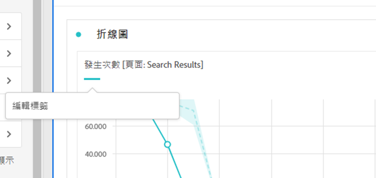
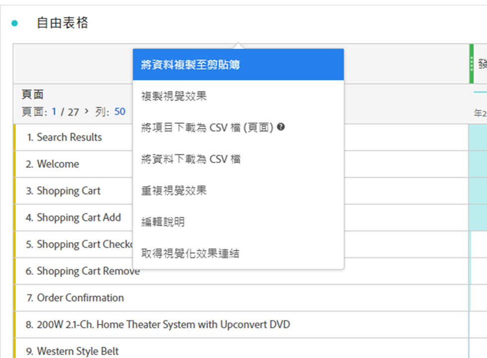
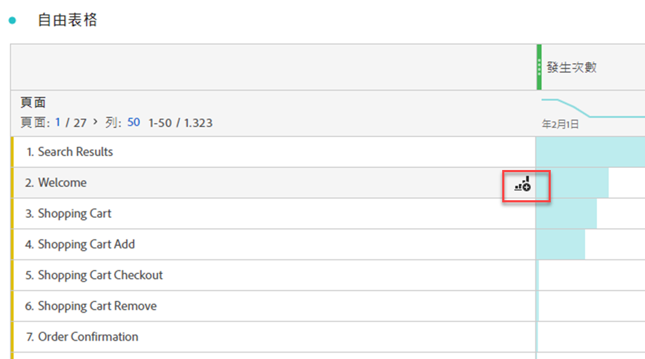
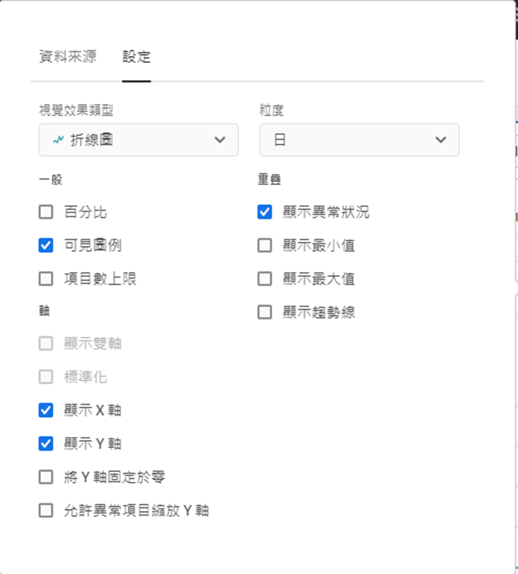
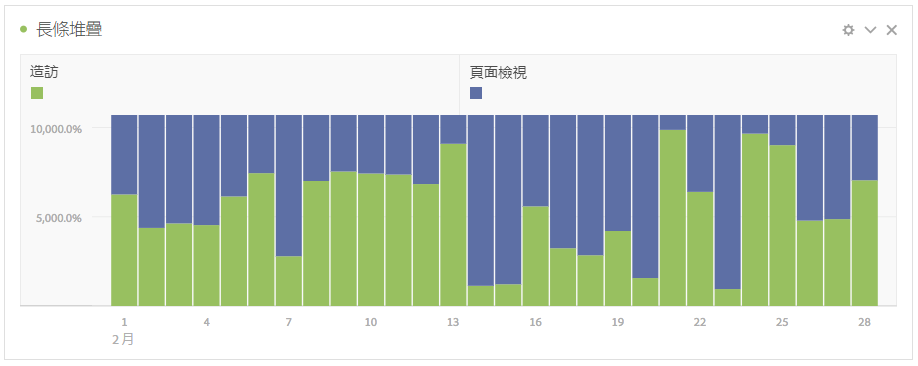

# 視覺效果概觀

Workspace 會提供一些視覺效果，方便您產生資料的視覺呈現方式。例如長條圖、環形圖、直方圖、折線圖、地圖、散佈圖等。

## 類型

Analysis Workspace 中有以下視覺效果類型：

| 圖示 | 名稱 | 說明 |
| :---: | --- | ---| 
|  | [區域](/help/analyze/analysis-workspace/visualizations/area.md) | 區域圖視覺效果。類似線圖，但在線圖下方有一塊上色區域。有多個量度且以要視覺化方式表示多個量度之間交會的區域時，可使用區域圖。 |
|  | [條狀圖](/help/analyze/analysis-workspace/visualizations/bar.md) | 長條圖視覺效果含有代表一或多個量度之多個值的垂直長條。 |
|  | [堆疊長條圖](/help/analyze/analysis-workspace/visualizations/bar.md) | 堆疊長條圖視覺效果含有代表一或多個量度之多個值的垂直長條。 |
| 
 | [項目符號](/help/analyze/analysis-workspace/visualizations/bullet-graph.md) | 項目符號圖顯示您感興趣的值與其他效能範圍 (目標) 相比較或進行測量的結果。 |
|  | [同類群組表格](/help/analyze/analysis-workspace/visualizations/cohort-table/cohort-analysis.md) | 同類群組視覺效果是指一段指定時間內，共享相同特徵的一組人。同類群組表格對保留、攪動或延遲分析很有用處。 |
|  | [組合](combo-charts.md) | 組合圖表讓您能夠快速建立比較視覺效果，而無需先建立表格。 |
|  | [環形圖](/help/analyze/analysis-workspace/visualizations/donut.md) | 環形圖視覺效果類似於圓形圖，以整體的部分或區段來顯示資料。 |
|  | [流失](/help/analyze/analysis-workspace/visualizations/fallout/fallout-flow.md) | 流失視覺效果會顯示在一系列預先定義的連續頁面中，個人在哪個位置離開 (流失) 和繼續通過 (流過)。 |
|  | [流量](/help/analyze/analysis-workspace/visualizations/c-flow/flow.md) | 流量視覺效果會顯示客戶使用您網站和應用程式的正確路徑。 |
| 
 | [自由格式表格](/help/analyze/analysis-workspace/visualizations/freeform-table/freeform-table.md) | 自由格式表格視覺效果是一種互動式視覺效果。自由格式表視覺效果是 Workspace 中資料分析的基礎。 |
|  | [直方圖](/help/analyze/analysis-workspace/visualizations/histogram.md) | 直方圖視覺效果是根據量度數量將個人、瀏覽次數或事件數分類到貯體中。 |
|  | [橫條圖](/help/analyze/analysis-workspace/visualizations/horizontal-bar.md) | 橫條圖視覺效果會顯示代表一或多個量度多個值的橫條。 |
|  | [堆疊橫條圖](/help/analyze/analysis-workspace/visualizations/horizontal-bar.md) | 堆疊橫條圖視覺效果會顯示代表一或多個量度多個值的橫條。 |
|  | [關鍵量度摘要](/help/analyze/analysis-workspace/visualizations/key-metric.md) | 關鍵量度摘要視覺效果結合了線條、摘要變化和摘要數目的視覺效果。 |
|  | [折線圖](/help/analyze/analysis-workspace/visualizations/line.md) | 折線圖視覺效果會使用線條代表量度，以顯示一段時間中值的變化。線形圖會延 X 軸使用時間。 |
|  | [地圖](/help/analyze/analysis-workspace/visualizations/map-visualization.md) | 可讓您建立任何量度（包括計算量度）的視覺化地圖 |
|  | [散佈圖](/help/analyze/analysis-workspace/visualizations/scatterplot.md) | 散點圖視覺效果顯示維度項目與最多三個量度之間的關係。 |
|  | [區段標題](section-header.md) | 若要識別並闡明面板內部區段。 |
|  | [摘要變更](/help/analyze/analysis-workspace/visualizations/summary-number-change.md) | 摘要變化視覺效果會以大數字或百分比來顯示所選儲存格之間的變化。 |
| 
 | [摘要數字](/help/analyze/analysis-workspace/visualizations/summary-number-change.md) | 摘要數字視覺效果會以一個大數字顯示選取的儲存格。 |
|  | [文字](/help/analyze/analysis-workspace/visualizations/text.md) | 文字視覺效果會讓您將使用者定義的文字新增至您的 Workspace。除了運用面板/視覺效果的說明之外，還有助於為您的分析和深入見解新增額外內容 |
|  | [樹狀圖](/help/analyze/analysis-workspace/visualizations/treemap.md)
 | 樹狀圖視覺效果會以一組巢狀矩形顯示階層式 (樹狀結構) 資料。 |
|  | [文氏圖表](/help/analyze/analysis-workspace/visualizations/venn.md) | 文氏圖表視覺效果使用圓圈來描繪最多 3 個區段的量度重疊。 |

<!--

| Name| Icon | Description |
| --- |:---: | ---|
| [Area](/help/analyze/analysis-workspace/visualizations/area.md)|
 | Like a line graph, but with a colored area below the line. Use an area graph when you have multiple metrics and want to visualize the area expressed by the intersection of two or more metrics. |
| [Bar](/help/analyze/analysis-workspace/visualizations/bar.md)|
 | Shows vertical bars representing various values across one or more metrics. |
| [Bullet graph](/help/analyze/analysis-workspace/visualizations/bullet-graph.md)|
 | Shows how a value you are interested in compares to or measures against other performance ranges (goals). |
| [Cohort table](/help/analyze/analysis-workspace/visualizations/cohort-table/cohort-analysis.md)|
 | A *`cohort`* is a group of people sharing common characteristics over a specified period. Cohort Analysis is useful for retention, churn or latency analysis. |
| [Donut](/help/analyze/analysis-workspace/visualizations/donut.md) | 
 | Similar to a pie chart, this visualization shows data as parts or segments of a whole. |
| [Fallout](/help/analyze/analysis-workspace/visualizations/fallout/fallout-flow.md) | 
 | Fallout reports show where visitors left (fell out) and continued through (fell through) a predefined sequence of pages. Can be set to eventual or exact sequences |
| [Flow](/help/analyze/analysis-workspace/visualizations/c-flow/flow.md) | 
 | Shows exact customer paths through your websites and apps. |
| [Freeform table](/help/analyze/analysis-workspace/visualizations/freeform-table/freeform-table.md) | 
 | A Freeform table is not merely a data table, but also an interactive visualization. It is the foundation for data analysis in Workspace.|
| [Histogram](/help/analyze/analysis-workspace/visualizations/histogram.md) | 
 | A histogram buckets visitors, visits or hits into buckets based on a metric volume. |
| [Horizontal bar](/help/analyze/analysis-workspace/visualizations/horizontal-bar.md) | 
 | Shows horizontal bars representing various values across one or more metrics. |
| [Key metric summary](/help/analyze/analysis-workspace/visualizations/key-metric.md) | 
 | Shows how a metric is trending within a single timeframe, or lets you compare metric performance across two timeframes. |
| [Line](/help/analyze/analysis-workspace/visualizations/line.md) | 
 | Represents metrics using a line in order to show how values change over a period of time. A line chart uses time along the x-axis. |
| [Map](/help/analyze/analysis-workspace/visualizations/map-visualization.md) | 
 | Lets you build a visual map of any metric (including calculated metrics). |
| [Scatterplot](/help/analyze/analysis-workspace/visualizations/scatterplot.md) | 
 | Shows the relationship between dimension items and up to three metrics. |
| [Summary number](/help/analyze/analysis-workspace/visualizations/summary-number-change.md) | 
 | Shows the selected cell as 1 large number. |
| [Summary change](/help/analyze/analysis-workspace/visualizations/summary-number-change.md) | 
 | Shows the change between the selected cells as 1 large number/percent. |
| [Text](/help/analyze/analysis-workspace/visualizations/text.md) | 
 | Lets you add user-defined text to your Workspace. Helpful for adding additional context to your analysis and insights, in addition to leveraging panel/visualization descriptions |
| [Treemap](/help/analyze/analysis-workspace/visualizations/treemap.md) | 
 | Displays hierarchical (tree-structured) data as a set of nested rectangles. |
| [Venn](/help/analyze/analysis-workspace/visualizations/venn.md) | 
 | Uses circles to depict the metric overlap of up to 3 segments. |

-->

## 新增視覺效果至面板

1. 開啟您想要新增視覺效果的 Analysis Workspace 專案。

1. 使用下列任一方法新增視覺效果：

   

   * 在左側面板中，選取「 **視覺效果**」，然後將視覺效果拖曳至要新增視覺效果的面板中。

   * 在要新增視覺效果的面板上，選取「」，然後選擇要代表新增的視覺效果圖示。將滑鼠停留在每個視覺效果的圖示上即可查看其名稱。

   * 新增[空白面板](/help/analyze/analysis-workspace/c-panels/blank-panel.md)，然後選取要新增的視覺效果。

   * 在 Analysis Workspace 專案中現有視覺效果的內容選單中，選取「**[!UICONTROL 重複視覺效果]**」或者「**[!UICONTROL 複製視覺效果]**」。

   * 使用 Workspace **[!UICONTROL 插入]**&#x200B;選單以插入視覺效果。

   * 從自由格式表格的內容選單中，選取「**[!UICONTROL 視覺效果]**」。然後從子選單中選取視覺效果。根據表格中的選取項目，Workspace 確定提供哪種視覺化並解釋資料，以建置所要求的視覺化效果。

## 圖例

視覺效果圖例可幫助您將來源表內的日期與視覺效果內的繪製序列產生關聯。圖例為互動式 - 您可以選取圖例項目來顯示/隱藏視覺效果中的系列，如果您想簡化視覺化資料，這相當實用。

此外，您可以重命名圖例標籤，以幫助您讓視覺效果更易使用。注意：圖例編輯&#x200B;**不**&#x200B;適用於： 樹狀圖、項目符號、累加變化/累加數、文字、自由圖形、直方圖、同類群組圖 (Cohort) 或流量圖 (Flow) 等視覺效果。

若要編輯圖例標籤：

1. 以滑鼠右鍵按一下圖例標籤。
1. 按一下&#x200B;**[!UICONTROL 「編輯標籤」]**。

   

1. 輸入新的標籤文字。
1. 按下 **[!UICONTROL Enter]** 以儲存。

### 設定

可使用哪些視覺效果設定，需根據視覺效果而定。下表總結最常見的設定。部分視覺效果的確具有特定設定。請參閱個別的視覺效果文件，以了解更多詳細資訊。

| 選項 | 說明 |
| --- | --- |
| **[!UICONTROL 視覺效果類型]** | 變更用於資料視覺化的視覺效果類型。 |
| **[!UICONTROL 詳細程度]** | 變更趨勢視覺效果的時間詳細程度。這項變更也適用於資料來源表。 |
| **[!UICONTROL 百分比]** | 以百分比顯示值。 |
| **[!UICONTROL 100% 堆疊]** | 將圖表轉變為 100% 堆疊的視覺效果。僅適用於區域、長條圖及堆疊橫條圖視覺效果。 |
| **[!UICONTROL 可見圖例]** | 顯示圖例文字。 |
| **[!UICONTROL 限制項目數量上限]** | 限制視覺效果顯示的項目數。選取後，定義最大項目數。 |
| **[!UICONTROL 顯示註解]** | 顯示對此視覺效果所做的註解。 |
| **[!UICONTROL 隱藏標題]** | 隱藏視覺效果的標題。 |
| **[!UICONTROL 將 y 軸固定於零]** | 強制將 y 軸底部設為零。如果圖表上繪製的值均遠大於零，則圖表預設會讓 Y 軸底部「不為零」。如果啟用此選項，則 y 軸會強制為零 (並重新繪製圖表)。 |
| **[!UICONTROL 顯示雙軸]** | 顯示兩個不同量度的左 y 軸和右 y 軸。此選項僅適用於若您具有兩個量度。當繪製的量度為不同強度時，雙軸非常實用。 |
| **[!UICONTROL 顯示 x 軸]** | 在視覺效果中顯示 x 軸。 |
| **[!UICONTROL 顯示 y 軸]** | 在視覺效果中顯示 y 軸。 |
| **[!UICONTROL 在線上顯示節點]** | 在組合圖表視覺效果中的線條視覺效果上顯示節點。 |
| **[!UICONTROL 標準化]** | 強制量度為相同比例。當繪製的量度為不同強度時，相等的比例相當實用。 |
| **[!UICONTROL 顯示異常狀況]** | 透過顯示異常偵測來強化折線圖和自由格式表格。線圖視覺效果內的異常偵測包含一個預期值 (虛線) 和一個預期範圍 (陰影帶)。 |
| **[!UICONTROL 顯示預測]** | 透過顯示預測值來強化折線圖和自由格式表格。 |
| **[!UICONTROL 顯示最小值]** | 顯示視覺效果中的最小值。 |
| **[!UICONTROL 顯示最大值]** | 顯示視覺效果中的最大值。 |
| **[!UICONTROL 顯示趨勢線]** | 在視覺效果中顯示趨勢線。選取後，您可以從下拉式選單中選取趨勢線型別。 |

您可以自訂您所建立的所有視覺效果設定。如需詳細資訊，請參閱[使用者偏好設定](/help/analyze/analysis-workspace/user-preferences.md)。

## 內容選單 {#right-click}

使用視覺效果標題上的內容選單 (可透過替代選取獲得，例如，使用滑鼠右鍵)，以存取視覺效果的附加功能。並非所有選項皆適用於所有視覺效果。

| 選項 | 說明 |
| --- | --- |
| **[!UICONTROL 插入複製的視覺化呈現]** | 將複製的視覺效果貼上 (插入) 至專案內另一個位置或完全不同的專案中。 |
| **[!UICONTROL 複製資料至剪貼簿]** | 從視覺效果複製資料至剪貼簿。 |
| **[!UICONTROL 複製選取項目至剪貼簿]** | 從視覺效果將選取項目複製至剪貼簿。 |
| **[!UICONTROL 將項目下載為 CSV (*維度名稱*)]** | 將視覺效果的維度項目 (最多 50,000 個) 下載至您的本機裝置。選取維度的最大維度項目數為 50,000。 |
| **[!UICONTROL 複製視覺效果]** | 複製視覺效果，以便於您將其插入至專案內另一個位置或完全不同的專案中。 |
| **[!UICONTROL 下載資料為 CSV 檔]** | 將視覺效果顯示的資料下載至本機裝置。 |
| **[!UICONTROL 複製視覺效果]** | 完全複製視覺效果。 |
| **[!UICONTROL 編輯說明]** | 新增 (或編輯) 視覺效果的文字說明。請參閱[文字](text.md)。 |
| **[!UICONTROL 取得視覺效果連結]** | 直接複製並共用視覺效果連結。共用連結對話框顯示此連結。請選取「複製」以複製此連結至剪貼簿。 |
| **[!UICONTROL 重新開始]** | 刪除目前視覺效果的設定，以便於您可從頭開始再設定。 |

## 設定

部分視覺效果 (例如同類群組表格、流失、流量或其他) 具有設定對話框，以協助您建置視覺效果。使用視覺效果上方的「」來存取和變更設定。

## 視覺化

如果您不確定選擇哪種視覺化效果，請在任意自由格式表格列 (停留時適用) 中選取「 **[!UICONTROL 視覺化]**」。此選取項目為新增視覺效果的最快方式。Analysis Workspace 教育性猜測哪個視覺效果最適合您的資料。例如：如果您已選取一列，即建立一個趨勢[折線圖](line.md)。如果您已選取三個篩選器列，即會建立一個[文氏圖表](venn.md)。

<!--
## Settings {#settings}

| Setting | Description |
| --- | --- |
| Visualization Type | Change the type of visual used to depict the data. |
| Granularity | For trended visualizations, you can change the time granularity (day, week, month, etc.) from this drop-down list. This change also applies to the data source table. |
| Percentages | Displays values in percentages. |
| 100% Stacked | This setting on area stacked, bar stacked or horizontal bar stacked visualizations turns the chart into a "100% stacked" visualization. Example:  |
| Legend Visible | Lets you hide the detailed legend text for the Summary Number/Summary Change visualization. |
| Limit Max Items | Lets you limit the number of items that a visualization displays. |
| Anchor Y Axis at Zero | If all the values plotted on the chart are considerably above zero, the chart default will make the bottom of the y-axis NON-ZERO. If you check this box, the y-axis will be forced to zero (and it will re-draw the chart). |
| Normalization | Forces metrics to equal proportions. This is helpful when plotted metrics are of very different magnitudes. |
| Display Dual Axis | Only applies if you have two metrics - you can have a y-axis on the left (for one metric) and on the right (for the other metric). This is helpful when plotted metrics are of very different magnitudes. |
| Show Anomalies | Enhances line graphs and freeform tables by displaying anomaly detection. Anomaly detection in line visualizations includes an expected value (dashed line) and an expected range (shaded band). |

## Legend {#legend}

A visualization legend helps you to relate date in a source table to plotted series in the visualization. The legend is interactive - you can click a legend item to show/hide a series in the visualization. This is helpful if you want to simplify the data being visualized. 

Additionally, you can rename legend labels to help you make visuals more consumable. Note: legend editing does **not** apply to: Treemap, Bullet, Summary Change/Number, Text, Freeform, Histogram, Cohort or Flow visualizations.

To edit a legend label:

1. Right-click one of the legend labels.
1. Click **[!UICONTROL Edit Label]**.

   

1. Enter the new label text.
1. Press **[!UICONTROL Enter]** to save.

## Right-click menu {#right-click}

Additional functionality for a visualziation is available by right-clicking on the visualization header. Settings will vary by visualization. Some of the settings available are:

| Setting | Description |
| --- | --- |
| Insert Copied Panel/Visualization|Lets you paste ("insert") a copied panel or visualization to another place within the project, or into a completely different project. |
| Copy Visualization | Lets you right-click and copy a visualization, so that you can insert it to another place within the project, or into a completely different project. |
| [Download items as CSV](https://experienceleague.adobe.com/docs/analytics/analyze/analysis-workspace/curate-share/download-send.html?lang=zh-Hant&#download-items) | Download up to 50,000 dimension items for the selected dimension as a CSV. |
| [Download data as CSV](https://experienceleague.adobe.com/docs/analytics/analyze/analysis-workspace/curate-share/download-send.html?lang=zh-Hant&#download-data) | Download visualization data source as a CSV. |
| Duplicate Visualization | Makes an exact duplicate of the current visualization, which you can then modify. |
| Edit Description | Add (or edit) a text description for the visualization. |
| Get Visualization Link | Lets you direct someone to a specific visualization within a project. When the link is clicked, the recipient will be required to login before being directed to the exact visualization linked to. |
| Start Over | (Works for Flow, Venn, Histogram) Deletes the configuration for the current visualization so you can re-configure it from scratch. |

## Create Visual icon {#quick-viz}

If you are not sure which visualization to pick, click the **[!UICONTROL Create Visual]** icon in any table row (available on hover). This the the fastest way to add a visualization. Clicking it prompts Analysis Workspace to take an educated guess at which visualization would best fit your data. For example, if you have 1 row selected, it will create a trended line graph. If you have 3 segment rows selected, it will create a Venn diagram. 

## Change the scale axis on visualizations

Here is a video overview:

>[!VIDEO](https://video.tv.adobe.com/v/24708/?quality=12)

-->
