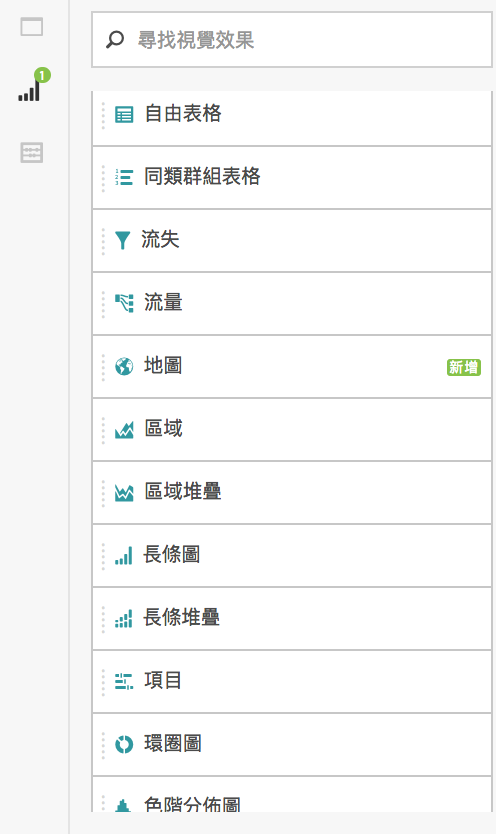
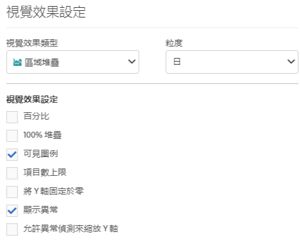
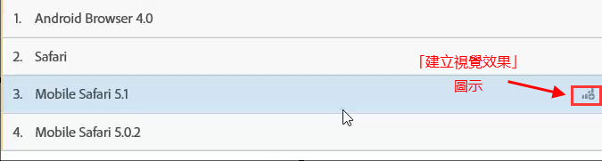
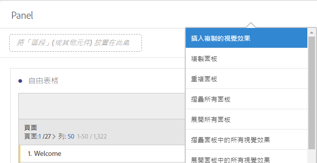

# 視覺效果概述

了解 Analysis Workspace 中的視覺效果和視覺效果設定。

[在 YouTube 觀看「Analysis Workspace 視覺效果類型」](https://www.youtube.com/watch?v=b1zLEywRa6w&index=39&list=PL2tCx83mn7GuNnQdYGOtlyCu0V5mEZ8sS)(2:57)

## 視覺效果面板 {#section_DC07F032FBEF4046A40F7B95C28DA018}

若要顯示「視覺效果」面板，請按一下側邊面板中的「**[!UICONTROL 視覺效果]**」。

如果您有使用 Adobe Analytics，則會對大部分的視覺效果類型 (例如面積圖、長條圖、環圈圖和折線圖) 都很熟悉。不過，Analysis Workspace 還提供視覺效果設定，以及許多具有互動功能的新或獨特的視覺效果類型。

## 視覺效果設定 {#section_D3BB5042A92245D8BF6BCF072C66624B}

若要存取「[!UICONTROL 視覺效果設定]」，請將視覺效果拖曳至「[!UICONTROL 自由面板]」，接著按一下「[!UICONTROL 視覺效果設定]」齒輪圖示。

>[!IMPORTANT]
>
>系統會顯示哪些視覺效果設定，需依視覺效果而定。並非所有設定均可套用至所有視覺效果。此外，部分進階設定&#x200B;**僅**&#x200B;針對特定視覺效果顯示，例如[「色階分布圖」設定](/help/analyze/analysis-workspace/visualizations/histogram.md#section_09D774C584864D4CA6B5672DC2927477)。

<table id="table_E0695243886046979EE609FAE5D6EA00"> 
 <thead> 
  <tr> 
   <th colname="col1" class="entry"> 設定 </th> 
   <th colname="col2" class="entry"> 說明 </th> 
  </tr> 
 </thead>
 <tbody> 
  <tr> 
   <td colname="col1"> 
百分比 
 </td> 
   <td colname="col2"> 
以百分比顯示值。 
 </td> 
  </tr> 
  <tr> 
   <td colname="col1"> 
100% 堆疊 
 </td> 
   <td colname="col2"> 
針對堆疊區域圖/堆疊長條圖/堆疊橫條圖的設定可讓圖表以「100% 堆疊」的視覺化方式呈現。範例: 
 
 
 </td> 
  </tr> 
  <tr> 
   <td colname="col1"> 
可見圖例 
 </td> 
   <td colname="col2"> 
可讓您隱藏「摘要編號/摘要變更」視覺效果的篩選器詳細資料文字。 
 </td> 
  </tr> 
  <tr> 
   <td colname="col1"> 
項目數上限 
 </td> 
   <td colname="col2"> 
可讓您限制視覺效果顯示的項目數。 
 </td> 
  </tr> 
  <tr> 
   <td colname="col1"> 
將 Y 軸固定於零 
 </td> 
   <td colname="col2"> 
 如果圖表上繪製的點都遠高於零，則圖表預設會讓 Y 軸底部「不是零」。如果您勾選此方塊，Y 軸將強制固定於零 (並會重繪圖表)。 
 </td> 
  </tr> 
  <tr> 
   <td colname="col1"> 
標準化 
 </td> 
   <td colname="col2"> 
強制量度為相同比例。請參閱<a href="https://marketing.adobe.com/resources/help/en_US/reference/normalization.html"  >標準化</a>。 
 </td> 
  </tr> 
  <tr> 
   <td colname="col1"> 
顯示雙軸 
 </td> 
   <td colname="col2"> 
僅適用於具有兩個量度時 - 可在左側 (針對一個量度) 和右側 (針對另一個量度) 各顯示一個 Y 軸。 
 </td> 
  </tr> 
  <tr> 
   <td colname="col1"> 
顯示異常 
 </td> 
   <td colname="col2"> 
強化線性圖和自由表格，以顯示資料異常。 
 </td> 
  </tr> 
 </tbody> 
</table>

## 「建立視覺效果」圖示{#section_9C11D9DEDC42413AA53E69A71A509DFC}

如果您不確定要挑選哪個視覺效果，請按一下任何表格列中的「**[!UICONTROL 建立視覺效果]**」圖示。當您在表格列上暫留時，會顯示這個圖示。按一下它會提示 Analysis Workspace 教育性猜測哪個視覺效果最適合您的資料。例如，如果您選取最多 3 個區段，則會建立 Venn 圖表。如果大於 3 個區段，則會建立長條圖。若為其他類型的資料，則會建立線性圖等等。

## 右鍵視覺效果/面板功能表 {#section_05B7914D4C9E443F97E2BFFDEC70240C}

在視覺效果或面板標題旁按一下滑鼠右鍵，可存取與圖表內容相關的設定。您可存取下列部分或全部的設定:

| 設定 | 說明 |
|--- |--- |
| 插入複製的視覺效果/面板 | 讓您將複製的元素貼到 (「插入」) 專案內的其他位置或其他專案中。 |
| 複製視覺效果/面板 | 讓您按一下滑鼠右鍵複製視覺效果或面板。 |
| 複製視覺效果/面板 | 完全複製目前的視覺效果，接著可供進行修改。 |
| 摺疊所有面板 | 摺疊所有專案面板。 |
| 摺疊面板中的所有視覺效果 | 摺疊專案面板中的所有視覺效果。 |
| 展開所有面板 | 展開所有專案面板。 |
| 展開面板中的所有視覺效果 | 展開專案面板中的所有視覺效果。 |
| 編輯描述 | 新增 (或編輯) 視覺效果/面板的文字描述。此描述會顯示在「專案 &gt; 專案資訊和設定」中。 |
| 取得面板連結 | 讓您可將使用者直接導向專案中的特定面板。 |
| 取得視覺效果連結 | 讓您複製並共用此連結以便直接將其他項目傳送至此視覺效果。使用者必須登入。 |
| 重新開始 | (適用於流量、Venn、色階分佈圖) 刪除目前視覺效果的設定，並開啟一個新面板，讓您在其中重新設定。 |

## 編輯圖例標籤 {#section_94F1988CB4B9434BA1D9C6034062C3DE}

您可以重新命名視覺效果圖例 (「流失」、「區域圖」、「堆疊區域圖」、「長條圖」、「堆疊長條圖」、「環形圖」、「色階分布圖」、「橫條圖」、「堆疊橫條圖」、「折線圖」、「散佈圖」和「Venn 圖表」) 中的數列名稱，有助於讓視覺效果更簡單明瞭。

編輯圖例&#x200B;**不**&#x200B;適用於:「樹狀圖」、「項目」、「摘要變更或數字」、「文字」、「自由格式」、「色階分布圖」、「同類群組」或「流量」視覺效果。

以在折線途中編輯圖例標籤為例說明，

1. 以滑鼠右鍵按一下圖例標籤。
1. 按一下&#x200B;**[!UICONTROL 「編輯標籤」]**。

   

1. 輸入新的標籤文字。
1. 按下 **[!UICONTROL Enter]** 以儲存。

以下是此主題的[影片連結](https://www.youtube.com/watch?v=mry3vDrTml0&index=61&list=PL2tCx83mn7GuNnQdYGOtlyCu0V5mEZ8sS)。
