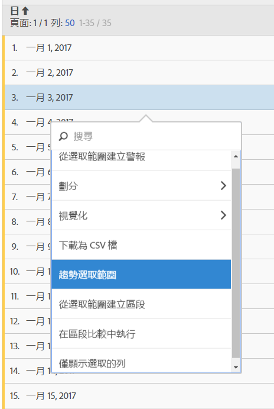

# 自由表格

在 Analysis Workspace 中，資料表 (自由表格) 不僅僅是報表表格，它也是互動式視覺效果。您可以與個別列、選取的幾列，或與整個表格互動。

您可以在表格中最高顯示 400 列。

您可透過獨特方式與表格互動:

* [從表格選取範圍建立警報](/help/components/c-alerts/alert-builder.md)
* 執行[劃分](/help/analyze/analysis-workspace/components/dimensions/t-breakdown-fa.md)並建立內嵌區段 (按一下滑鼠右鍵)
* 在特定儲存格上執行[視覺效果](/help/analyze/analysis-workspace/visualizations/freeform-analysis-visualizations.md)
* 將資料列匯出至 [CSV](/help/analyze/analysis-workspace/curate-share/download-send.md)
* 從所選儲存格執行[趨勢](/help/analyze/analysis-workspace/analysis-workspace-features.md#section_34930C967C104C2B9092BA8DCF2BF81A)視覺效果
* 建立[選取範圍中的區段](/help/analyze/analysis-workspace/components/t-freeform-project-segment.md)
* 執行[區段比較](/help/analyze/analysis-workspace/c-panels/c-segment-comparison/segment-comparison.md)
* 僅顯示選取的列

參閱[建立 Analysis Workspace 專案](/help/analyze/analysis-workspace/build-workspace-project/t-freeform-project.md)，以獲得詳細資訊。
