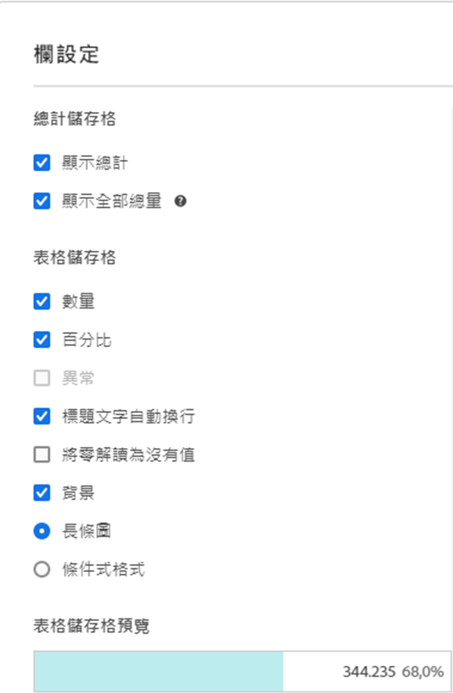

# [!UICONTROL 欄設定]

[!UICONTROL 欄設定]可供設定欄的格式，部分可設為條件式。

## 編輯[!UICONTROL 「欄設定」]  {#edit-column-settings}

您可以編輯單一資料欄或同時編輯多個資料欄的資料欄設定。

1. 在 Analysis Workspace 中，將一個自由格式表拖放到您的項目中。

1. (視情況而定) 要同時編輯多個資料欄，請在按住 Shift 鍵的同時選擇要編輯的每一欄。

1. 將滑鼠暫留在要編輯的資料欄上，然後選擇齒輪圖標示。

   如果您選擇了多個資料欄，請按一下任何所選資料欄的齒輪圖示。 您所做的任何變更都會套用在所選資料欄。

   

1. 繼續進行[資料欄設定](#column-settings)。

## 欄設定

您可以更新 Analysis Workspace 中個別表格的以下資料欄設定，如[編輯資料欄設定](#edit-uicontrol-column-settings)中所述。

您還可為在 Analysis Workspace 所建立的全部最新項目管理其中一些相同的設定，如[使用者偏好設定](/help/analyze/analysis-workspace/user-preferences.md)中所述

| 元素 | 說明 |
| --- | --- |
| **總計儲存格** |  |
| 顯示總計 | 此總計通常等於[!UICONTROL 全部總量]或其一個小計。它反映的是在自由表格中套用的任何表格篩選條件，包括[!UICONTROL 「不包含任何項目」]選項。 |
| 顯示全部總量 | 此總計表示所選取的全部集合，有時候是指「報告套裝總計」。在面板層級或自由表格內套用區段時，這項總計會經過調整，藉此反映所有符合區段條件的點擊。具[靜態列](/help/analyze/analysis-workspace/visualizations/freeform-table/workspace-totals.md)的表格或劃分不支援全部總量。 |
| **表格儲存格** |   |
| 數字 | 決定儲存格是否要顯示/隱藏量度數值。例如，如果量度為「頁面檢視」，則該數值為列項目的頁面檢視數量。 |
| 百分比 | 決定儲存格是否要顯示/隱藏量度百分比值。例如，如果量度為「頁面檢視」，則該百分比數值為欄頁面檢視總數除以列項目的頁面檢視次數。附註：為了比例更精確，我們可以顯示超過 100% 的數值。我們也將上限提高為 1000%，以確保欄位的寬度夠大。 |
| 異常 | 決定是否要在該欄的數值中執行異常偵測。 如需詳細資訊，請參閱[在 Analysis Workspace 中檢視異常](/help/analyze/analysis-workspace/c-anomaly-detection/view-anomalies.md)。 |
| 繞排標頭文字 | 讓您自由表格中的標頭文字環繞，讓標頭變得更容易閱讀，表格也更便於分享。這項設定對 PDF 的轉譯還有較長名稱的量度來說，非常實用。預設啟用。 |
| 將零解讀為沒有值 | 針對含有 0 值的儲存格，決定顯示 0 或空白儲存格。如果您要查看某月的每日資料，而當月有部分天數尚未發生，這個方法就相當實用。若不想在未來的日期中顯示 0 值，則可選擇顯示空白儲存格。圖表也會採用此設定 (意即選取此設定後，若圖表含有 0 值，則不會顯示折線圖或長條圖)。 |
| 背景 | 決定儲存格是否要顯示/隱藏所有儲存格格式，包括長條圖和條件式格式。 |
| 長條圖 | 顯示長條圖，當中呈現相對於欄總數的儲存格數值。 |
| 條件式格式 | 請參閱以下小節。 |
| 表格儲存格預覽 | 顯示目前已套用選定格式選項之各儲存格的呈現方式預覽。 |

## 條件式格式 {#conditional-formatting}

條件式格式會將格式套用至您可定義的上限、中點和下限。除非選取「自訂」限制，否則也能自動在自由表格中套用例如顏色等的條件格式。

| 元素 | 說明 |
| --- | --- |
| 條件式格式 | 將您選擇的預配置顏色集應用到單元格。 根據您選取的 4 種可用色彩配置中的哪一種，高值、中點值和低值會分配不同的顏色。  取代表格中的維度會重設條件式格式限制。取代量度會重新計算該欄的限制 (其中量度位在 X 軸，維度位在 Y 軸)。 |
| 使用百分比限制 | 變更限制範圍，從絕對值改為以百分比為基礎.此設定適用於僅有百分比的量度 (例如反彈率)，以及含有計數和百分比的量度 (例如頁面檢視)。 |
| 自動產生 | 根據資料自動計算上/中/下限。上限是此欄中的最大值。下限是最小值，而中點是上限和下限的平均。 |
| 自訂 | 手動對齊上/中/下限。這可提供由您決定欄的值是好、中等或壞的彈性。 |
| 條件式格式設定調色盤 | 從 4 個可用色彩配置中，選擇要將哪一個用於條件式格式。 |

## 使用非預設歸因模式 {#attribution}

Analysis Workspace 支援絕大多數量度的[歸因](/help/analyze/analysis-workspace/attribution/overview.md)。

1. 按一下自由表格欄中的「設定」(齒輪) 圖示。

   

1. 在&#x200B;**[!UICONTROL 資料設定]**&#x200B;底下，勾選&#x200B;**[!UICONTROL 使用非預設歸因模式]**。如需不同歸因模式的詳細資訊，請參閱[歸因模式](/help/analyze/analysis-workspace/attribution/models.md)。

   

>[!MORELIKETHIS]
>
>* [管理資料來源](/help/analyze/analysis-workspace/visualizations/t-sync-visualization.md)

## 動態欄

>[!BEGINSHADEBOX]

如需示範影片，請參閱 [動態資料行](https://video.tv.adobe.com/v/23138?quality=12&learn=on){target="_blank"}。

>[!ENDSHADEBOX]

