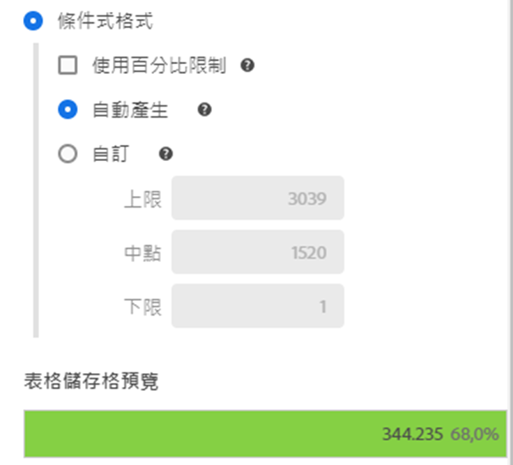
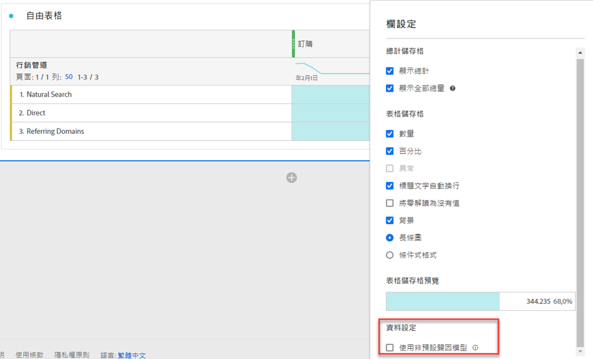
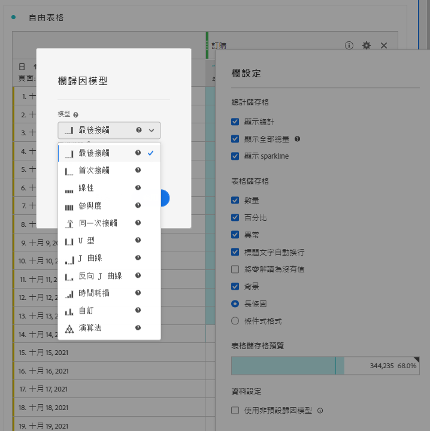

# 欄設定

[!UICONTROL 欄設定]可設定欄的格式，部分可設為條件式。

>[!BEGINSHADEBOX]

請參閱  [自由格式表格中的列和欄設定](https://video.tv.adobe.com/v/40382/?quality=12&learn=on){target="_blank"}示範影片。

>[!ENDSHADEBOX]

若要存取[!UICONTROL 列設定]，請在列標題中選取「」。

您可以同時編輯多欄的設定。選取多個欄，然後在任一選取欄中選取「」。您所做的任何變更均會套用至所有欄，以及您在其中選取的儲存格。

| 選項 | 說明 |
| --- | --- |
| **[!UICONTROL 顯示總計]** | 顯示客戶端欄的總和。此總和&#x200B;**不會**&#x200B;刪除如工作階段或人數等重複量度。 |
| **[!UICONTROL 顯示全部總計]** | 顯示伺服器端欄的總和。總計會刪除如工作階段或人數等重複量度。 |
| **[!UICONTROL 顯示走勢圖]** | 在欄標題處顯示折線圖。 |
| **[!UICONTROL 數字]** | 決定儲存格是否要顯示/隱藏量度數值。例如，如果量度為「頁面檢視」，則數值為列專案的頁面檢視次數。 |
| **[!UICONTROL 百分比]** | 決定儲存格是否要顯示/隱藏量度百分比值。例如，如果量度為「頁面檢視次數」，則該百分比數值為列項目的頁面檢視次數除以欄的頁面檢視次數。請注意：百分比可以大於 100% 以確保準確性。上限可移動至 1,000%，以防止欄寬變得太寬。 |
| **[!UICONTROL 顯示異常狀況]** | 決定是否要在此欄的數值中執行異常偵測。 |
| **[!UICONTROL 顯示預測]** | 決定預測值是否顯示在此欄中。 |
| **[!UICONTROL 繞排標題文字]** | 在自由格式表格中的繞排標題文字，讓標題更易於閱讀，且表格更便於分享。繞排對 PDF 的轉譯以及較長名稱的量度而言非常實用。預設啟用。 |
| **[!UICONTROL 將零解讀為沒有值]** | 針對含有 0 值的儲存格，決定顯示 0 或空白儲存格。當您要查看某月的每日資料，而當月部分天數尚未開始，此解釋相當實用。若不想在未來的日期中顯示 0 值，則可選擇顯示空白儲存格。圖表也遵循此設定 (即，圖表不顯示具有 0 值的折線圖或長條圖)。 |
| **[!UICONTROL 背景]** | 決定儲存格是否要顯示/隱藏所有儲存格格式，包括長條圖和條件式格式。 |
| **[!UICONTROL 長條圖]** | 顯示橫條圖，當中呈現相對於欄總數的儲存格數值。 |
| **[!UICONTROL 條件式格式]** | 使用條件式格式。請參閱以下[區段](#conditional-formatting)。 |
| **[!UICONTROL 表格儲存格預覽]** | 目前已套用選取格式選項之各儲存格的顯示方式預覽。 |
| **[!UICONTROL 使用非預設歸因模型]** | 使用非預設歸因模型。請參閱以下[區段](#use-non-default-attribution-model)。 |

## 條件式格式 {#conditional-formatting}

條件式格式會將格式套用至您可定義的上限、中點和下限。除非已選取[!UICONTROL 自訂]限制，否則系統也會在資料劃分時自動在自由格式表格中套用條件式格式。

| 條件式格式選項 | 說明 |
| --- | --- |
| **[!UICONTROL 使用百分比限制]** | 變更限制範圍，從絕對值改為以百分比為基礎。百分比限制範圍適用於僅有百分比的量度 (例如退回率)，以及含有計數和百分比的量度 (例如頁面檢視次數)。 |
| **[!UICONTROL 自動產生]** | 根據資料自動計算上/中/下限。上限是此欄中的最大值。 下限是最低的，中點則是上限與下限的平均值。 |
| **[!UICONTROL 自訂]** | 手動指派&#x200B;**[!UICONTROL 上限]**、**[!UICONTROL 中點]**&#x200B;和&#x200B;**[!UICONTROL 下限]**。限制提供決定欄的值是好、中等或壞的彈性。 |
| **[!UICONTROL 條件式格式設定調色盤]** | 將預先設定的顏色集套用至儲存格。取決於您選取的四種可用色彩配置中的哪一種，高值、中點值和低值會指派不同的顏色。 取代表格中的維度會重設條件式格式限制。取代量度會重新計算該欄的限制 (其中量度位在 X 軸，維度位在 Y 軸)。 |

## 使用非預設歸因模型 {#use-non-default-attribution-model}

<!-- markdownlint-disable MD034 -->

>[!CONTEXTUALHELP]
>id="workspace_freeformtable_column_usenondefaultattributionmodel"
>title="使用非預設歸因模型"
>abstract="為選取的欄啟用非預設歸因模型。"

<!-- markdownlint-enable MD034 -->

<!-- markdownlint-disable MD034 -->

>[!CONTEXTUALHELP]
>id="workspace_freeformtable_column_usenondefaultattributionmodel_disabled"
>title="使用非預設歸因模型"
>abstract="此量度無法使用非預設歸因模型。"

<!-- markdownlint-enable MD034 -->

>[!NOTE]
>
>元件歸因更新至非預設歸因模型時，請考慮以下事項：
>
>* **當使用報告中&#x200B;*單一維度的元件*：**&#x200B;使用非預設歸因模型時，此元件歸因會忽略配置模式。
>
>* **當使用報告中&#x200B;*多個維度的元件*：**&#x200B;使用非預設歸因模型時，此元件歸因會保留配置模式。
>
>

若要在 Analysis Workspace 中使用量度的非預設歸因模型：

1. 請選取「**[!UICONTROL 使用非預設歸因模型]**」。當已選取時，使用「**[!UICONTROL 編輯]**」來編輯此歸因模型。或取消選取以傳回預設歸因模型。

   

2. 在&#x200B;**[!UICONTROL 欄歸因模型]**&#x200B;中，選取「**[!UICONTROL 模型]**」和「**[!UICONTROL 回顧期間]**」。回顧期間決定套用至每個轉換的資料歸因期間。

   

### 歸因模型

{{attribution-models-details}}

### 容器

{{attribution-container}}

### 回顧期間

{{attribution-lookback-window}}

### 範例

{{attribution-example}}

>[!MORELIKETHIS]
>
>* [管理資料來源](/help/analyze/analysis-workspace/visualizations/t-sync-visualization.md)

>[!BEGINSHADEBOX]

請參閱  [動態欄](https://video.tv.adobe.com/v/23138?quality=12&learn=on){target="_blank"}的示範影片。

>[!ENDSHADEBOX]

