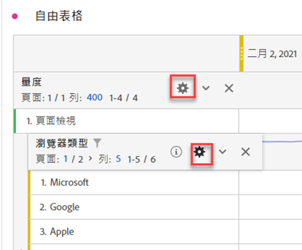

# 列設定

>[!BEGINSHADEBOX]

請參閱  [自由格式表格中的列和欄設定](https://video.tv.adobe.com/v/40382/?quality=12&learn=on){target="_blank"}示範影片。

>[!ENDSHADEBOX]

列設定依您拖放至表格中的元件而異。若要存取表格列設定，請選取維度、篩選器、量度、時段旁的「 **[!UICONTROL 設定]**」，或以下各專案之中的劃分:

| 設定 | 說明 |
| --- | --- |
| **[!UICONTROL 依位置劃分]** | 此設定預設為停用，且劃分會固定至靜態列項目。例如，想像您根據行銷管道劃分前 3 個頁面維度項目 (「首頁」、「搜尋結果」、「結帳」)。接著，您離開專案，兩週後再回來。再次開啟專案時，前 3 個頁面已變更，現在「首頁」、「搜尋結果」和「結帳」是前 4 到 6 個頁面。即使它們目前位於第 4 至 6 列，您的行銷管道劃分根據預設仍會顯示在「首頁」、「搜尋結果」和「結帳」中。 相反地，**根據位置劃分**&#x200B;會不斷劃分前 3 個項目，無論前 3 個項目是什麼。請參考範例，當您重啟專案時，行銷管道劃分將與表格中的前 3 頁面相連結。而不是目前位於第 4 至 6 列的首頁、搜尋結果和結帳。 |
| **[!UICONTROL 百分比]** | **依欄計算百分比** (預設)：儲存格中的百分比是根據欄位總計計算。 **依列計算百分比**：會跨列計算儲存格百分比，而非以全部總計作為分母整欄計算。此計算在趨勢分析百分比相當實用。 |
| **[!UICONTROL 欄總計]** | 這些設定僅適用於[靜態列](/help/analyze/analysis-workspace/visualizations/freeform-table/column-row-settings/manual-vs-dynamic-rows.md)。  **顯示為目前各列的總和**&#x200B;會顯示表格中的用戶端列數加總，因此總計&#x200B;*不會*&#x200B;刪除造訪次數或人數等重複量度。  **顯示總計**&#x200B;會顯示伺服器端的加總，表示刪除重複量度的總計。 |

## 變更列計數

變更顯示的列數量:

1. 按一下&#x200B;**[!UICONTROL 列]**&#x200B;旁邊的數字 (位於表格第一欄的頂端)。

   

1. 從下拉式清單中選取您希望表格顯示的列數量。

## 內容選單

選取維度標題時，可用以下內容選單選項。

| 選項 | 說明 |
| --- | --- |
| **[!UICONTROL 複製選取項目至剪貼簿]** | 從視覺效果將選取項目複製至剪貼簿。 |
| **[!UICONTROL 將項目下載為 CSV (*維度名稱*)]** | 立即將視覺效果的維度項目 (最多 50,000 個) 下載至您的本機裝置。選取維度的最大維度項目數為 50,000。 |
| **[!UICONTROL 將選取項目下載為 CSV]** | 立即將視覺效果的維度項目下載至您的本機裝置。 |
| **[!UICONTROL 建立所有維度項目的超連結]** | 建立所有維度項目的超連結。請參閱[自由格式表格維度的超連結](../freeform-table-hyperlinks.md) |
| **[!UICONTROL 編輯所有維度項目的超連結]** | 編輯所有維度項目的超連結。請參閱[自由格式表格維度的超連結](../freeform-table-hyperlinks.md) |
| **[!UICONTROL 移除所有維度項目的超連結]** | 移除所有維度項目的超連結。請參閱[自由格式表格維度的超連結](../freeform-table-hyperlinks.md) |
| **[!UICONTROL 刪除]** | 從表格中刪除維度。 |
| **[!UICONTROL 視覺化]** | 使用任何可用的視覺效果將維度視覺化。 |
| **[!UICONTROL 僅顯示選取的列]** | 僅顯示視覺效果中的選取項目。 |
| **[!UICONTROL 從選取項目建立註解]** | 開啟「**[!UICONTROL 註解詳細資料]**」以新增註解。 |

在自由格式表格中選取一個或多個維度項目 (第一列)，或者一個或多個個別儲存格時，可以使用下列其他內容選單選項。

| 選項 | 說明 |
| --- | --- |
| **[!UICONTROL 建立超連結]** | 建立此項目的超連結。請參閱[自由格式表格維度的超連結](../freeform-table-hyperlinks.md) |
| **[!UICONTROL 編輯超連結]** | 編輯此項目的超連結。請參閱[自由格式表格維度的超連結](../freeform-table-hyperlinks.md) |
| **[!UICONTROL 移除超連結]** | 刪除此項目的超連結。請參閱[自由格式表格維度的超連結](../freeform-table-hyperlinks.md) |
| **[!UICONTROL 劃分]** | 劃分維度項目。從&#x200B;**[!UICONTROL 維度]**、**[!UICONTROL 量度]**、**[!UICONTROL 篩選器]**&#x200B;或者&#x200B;**[!UICONTROL 日期範圍]**&#x200B;清單中選取。使用&#x200B;*搜尋*&#x200B;進行元件的替代搜尋。 |
| **[!UICONTROL 刪除選取]** | 刪除選取的列 (項目)。 |
| **[!UICONTROL 趨勢選取項目]** | 建立選取項目的趨勢折線圖視覺化效果。 |
| **[!UICONTROL 僅顯示選取的列]** | 僅顯示視覺效果中的選取的列。 |
| **[!UICONTROL 顯示所有列]** | 顯示視覺效果中的所有列。 |
| **[!UICONTROL 從選取項目建立篩選器]** | 開啟&#x200B;**[!UICONTROL 篩選產生器]**，從選取項目中建置篩選器。 |
| **[!UICONTROL 從選取項目中建立客群]** | 開啟「**[!UICONTROL 建立客群]**」對話框，從選取項目中建立客群。 |

選取量度欄標題時，可使用以下其他內容選單選項。

| 選項 | 說明 |
|---|---|
| **[!UICONTROL 從選取範圍建立量度]** | 從選取的量度建立新量度。量度可為平均值、中位數、欄最大值、欄最小值、欄總和。您也可以在計算量度產生器中選取「開啟」來建立計算量度。 |
| **[!UICONTROL 新增時段欄]** | 新增時段欄。您將獲得面板行事曆範圍決定&#x200B;*日期範圍*&#x200B;的多個選項： <li>**[!UICONTROL 之前的&#x200B;*日期範圍*至此日期範圍]**</li><li>**[!UICONTROL 這些&#x200B;*日期範圍*至此日期範圍]**</li><li>**[!UICONTROL 將日期範圍自訂為此日期範圍]**。開啟&#x200B;**[!UICONTROL 日期範圍產生器]**，以指定日期範圍。</li>請參閱[日期比較](/help/analyze/analysis-workspace/components/calendar-date-ranges/time-comparison.md)，以了解更多資訊。 |
| **[!UICONTROL 比較時段]** | 新增比較時段欄。僅於維度並非根據時間使用。您將獲得數個選項確定此&#x200B;*日期範圍*： <li>**[!UICONTROL 之前的&#x200B;*日期範圍*至此日期範圍]**</li><li>**[!UICONTROL 將日期範圍自訂為此日期範圍]**。開啟&#x200B;**[!UICONTROL 日期範圍產生器]**，以指定日期範圍。</li>請參閱[日期比較](/help/analyze/analysis-workspace/components/calendar-date-ranges/time-comparison.md)，以了解更多資訊。 |
| **[!UICONTROL 修改歸因模型]** | 修改此欄的歸因模型。 |
| **[!UICONTROL 比較歸因模型]** | 指定一個新的歸因模型並與選取欄的歸因模型進行比較。已新增包含新歸因模型量度的新欄位。此外，還新增百分比變更欄以進行比較。 |
| **[!UICONTROL 重設欄寬]** | 重設欄寬為預設寬度。 |
| **[!UICONTROL 從選取項目建立註解]** | 開啟「**[!UICONTROL 註解詳細資料]**」以新增註解。 |
| **[!UICONTROL 從選取項目建立篩選器]** | 開啟&#x200B;**[!UICONTROL 篩選產生器]**，從選取項目中建置篩選器。 |
| **[!UICONTROL 從選取項目中建立客群]** | 開啟「**[!UICONTROL 建立客群]**」對話框，從選取項目中建立客群。 |

## 變更列高

您可以將專案的[檢視密度](/help/analyze/analysis-workspace/build-workspace-project/view-density.md)設定為&#x200B;**[!UICONTROL 緊密]**、**[!UICONTROL 舒適]**&#x200B;和&#x200B;**[!UICONTROL 展開]**。
