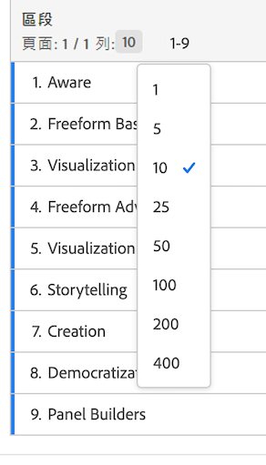

# 列設定

列設定依您拖放至表格中的元件而異。若要存取表格列設定，按一下維度、區段、量度、時段旁的設定圖示，或按以下各項之中的劃分：

| 設定 | 說明 |
|--- |--- |
| 統一日期 | 此表格層級設定讓每一欄的日期與同一列中所有開始日期一致。在表格的列中使用時間維度，並在欄中套用不同日期範圍時，預設會啟用日期統一功能。例如，在套用 10 月和 9 月的每日表格中，左欄以 10 月 1 日開始，右欄以 9 月 1 日開始。 |
| 依位置劃分 | 此設定預設為停用，且劃分會固定至靜態列項目。例如，假設您依「行銷管道」劃分前 3 個頁面維度項目 (「首頁」、「搜尋結果」、「結帳」)。接著，您離開專案，兩週後再回來。再次開啟專案時，前 3 個頁面已變更，現在「首頁」、「搜尋結果」和「結帳」是前 4 到 6 個頁面。您的「行銷管道」劃分預設仍會顯示在「首頁」、「搜尋結果」和「結帳」中，即使它們現在位於第 4 到 6 列。  相較之下，**依位置劃分**&#x200B;總是會劃分前 3 個項目，無論前 3 個項目是什麼。 請參考我們的範例，重新開啟專案時，「行銷管道」劃分會關聯表格的前 3 個頁面，而非現在位於第 4 到 6 列的「首頁」、「搜尋結果」和「結帳」。 |
| 百分比 | 預設設定為&#x200B;**「依欄計算百分比」**；欄中的百分比是根據欄位總計計算。 **「依列計算百分比」**&#x200B;會強制自由格式表格跨列計算儲存格百分比，而非將「總量」當作分母的整欄計算。此設定在計算趨勢百分比時特別實用。使用「視覺化」圖示時，此設定預設為啟用。 |
| 欄總計 | 這些設定僅適用於[靜態列](manual-vs-dynamic-rows.md)。  **「顯示為目前各列的總和」**&#x200B;會顯示表格中的用戶端列數加總，因此總計&#x200B;*不會*&#x200B;刪除「造訪次數」或「訪客人數」等重複量度。  **「顯示總量」**&#x200B;會顯示伺服器端的加總，因此總計會刪除重複量度。 |

## 變更列計數

變更顯示的列數量:

1. 按一下表格頂端「[!UICONTROL 列]」旁的數字。

   

1. 從下拉清單中選取您希望表格顯示的列數量。

## 影片

以下是有關「依資料列的百分比」的短片：

>[!VIDEO](https://video.tv.adobe.com/v/23134/?quality=12)
