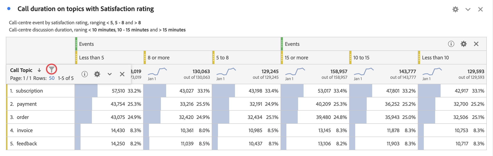
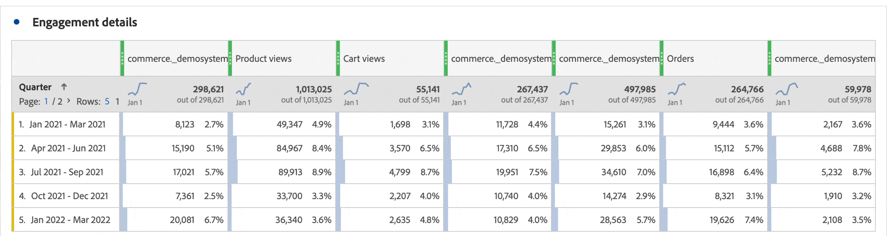

# 篩選和排序

Analysis Workspace 中的自由表格是互動式資料分析的基礎。因此，它們可包含數千列資訊。若要有效地展示最重要的資訊，對資料進行篩選和排序相當重要。

## 篩選表格

Analysis Workspace 中的篩選器可協助您找出最重要的資訊。

>[!NOTE]
>
> 只有動態維度項目才能依照本節所述進行篩選。無法篩選靜態維度項目。有關詳細資訊，請參閱「[自由格式表中的動態與靜態維度項目](/help/analyze/analysis-workspace/visualizations/freeform-table/column-row-settings/manual-vs-dynamic-rows.md)。

您可以使用多種方法來篩選自由格式表中的資料列。

- 排除表格中的特定資料列
- 套用篩選器至表格
- 使用客群篩選器

請務必閱讀每種方法如何影響[自由格式表格總計](/help/analyze/analysis-workspace/visualizations/freeform-table/workspace-totals.md)。

### 排除表格中的特定資料列

您可以快速排除表格中的特定資料列，而無需使用   **[!UICONTROL 篩選器]**。

>[!NOTE]
>
>當您按照本節所述排除資料列時， 「[!UICONTROL 永遠排除項目]」規則會自動加入[!UICONTROL 進階]篩選器對話框。您可以透過選取  篩選器圖示，然後選取「[**[!UICONTROL 顯示進階]**](#apply-a-simple-or-advanced-filter-to-a-table)」來檢視套用的規則。

若要排除自由格式表格的特定資料列：

1. 將滑鼠停留在要排除的資料列上，然後選取「」。

   按住 ***Shift*** 鍵以選取資料列範圍，或按住 ***cmd*** 鍵 (在 Mac 系統上)，或按 ***ctrl*** 鍵 (在 Windows 系統上) 以選取多個資料列。

<!--### Right-click > Delete selected rows

Note: this option does not seem to work. AN-338422

1. Select 1 or more rows. 
1. Right-click and select **[!UICONTROL Delete Selected Rows]**. 

   This action will remove the rows from the table and apply a table filter.-->

### 套用簡單或進階篩選器至表格

若要篩選自由表格中的資料：

1. 將滑鼠停留在含有您要篩選的資料欄位上。<!--only some types of columns show the filter... Which? Just Dimensions?-->

1. 選取出現的  **篩選器**。

   

   在「**[!UICONTROL 搜尋]**」對話框中有以下選項：

   {width="500"}

   | 選項 | 函數 |
   |---------|----------|
   | [!UICONTROL **包括「無值」**] | 選取此選項，在表格中顯示&#x200B;**[!UICONTROL 無值]**&#x200B;資料列，這些資料為沒有所選維度的值。取消選取此選項，可隱藏&#x200B;**[!UICONTROL 無值]**&#x200B;資料列。 |
   | [!UICONTROL **搜尋單字或片語**] | 指定您想要篩選的單字或片語。只顯示包含指定字詞或確切片語的行。 |

1. (選用) 若要依不同條件或依多個條件篩選，請選取&#x200B;[!UICONTROL **顯示進階**]。

   可使用以下進階篩選器選項：

   {width=500}

   | 選項 | 函數 |
   |---------|----------|
   | [!UICONTROL **包括「無值」**] | 選取此選項，在表格中顯示&#x200B;**[!UICONTROL 無值]**&#x200B;資料列，這些資料為沒有所選維度的值。取消選取此選項，可隱藏&#x200B;**[!UICONTROL 無值]**&#x200B;資料列。 |
   | [!UICONTROL **符合**] | 選擇&#x200B;[!UICONTROL **如果滿足所有條件**]&#x200B;即可僅顯示符合您指定之所有條件的資料。 此選項通常會產生更精細的資料。  選擇&#x200B;[!UICONTROL **如果符合任何條件即可顯示符合**]&#x200B;您指定之任何篩選條件的資料。 此選項通常會產生較少精細的資料。 |
   | [!UICONTROL **標準**] | 從下列篩選選項中選取： <ul><li>[!UICONTROL **包含片語**] (預設)：篩選結果中只會包含您指定之確切片語的資料。 字詞必須按照&#x200B;[!UICONTROL **搜尋字詞或片語欄位**]&#x200B;中指定的順序排列。</li><li>[!UICONTROL **包含任何詞語**]：篩選結果中只會包含來自您所指定片語的一或多個字詞。 </li><li>[!UICONTROL **包含所有詞語**]：篩選結果中只會包含來自您所指定片語的所有字詞的資料。字詞不必按照&#x200B;[!UICONTROL **搜尋字詞或片語欄位**]&#x200B;中指定的順序排列。</li><li>[!UICONTROL **不包含任何詞語**]：篩選結果中只會顯示不含您所指定片語的一或多個字詞。 </li><li>[!UICONTROL **不包含片語**]：篩選結果中只會顯示不含您指定之確切片語的資料。 字詞必須按照&#x200B;[!UICONTROL **搜尋字詞或片語欄位**]&#x200B;中指定的順序排列。</li><li>[!UICONTROL **等於**]：篩選結果中只會包含與您所指定之片語完全相符的資料。 </li><li>[!UICONTROL **不等於**]：篩選結果中只會包含與您所指定之片語不完全相符的資料。 </li><li>[!UICONTROL **開頭為**]：篩選結果中只會包含以您指定的字詞或確切片語開頭的資料。 </li><li>[!UICONTROL **結尾為**]：篩選結果中只會包含以您指定的字詞或確切片語結尾的資料。 </li></ul>選取  [!UICONTROL **「新增資料列」**]&#x200B;以新增多個篩選條件。 您為「[!UICONTROL **符合**]」選取的選項會確定「**[!UICONTROL 如果滿足所有條件]**」或「**[!UICONTROL 如果滿足任何條件]**」。 |
   | [!UICONTROL **永遠排除項目**] | 指定要從篩選資料中排除的任何項目的名稱。 |

1. 選取「**[!UICONTROL 套用]**」以篩選資料。選取「**[!UICONTROL 清除]**」以清除所有輸入的資料。選取「**[!UICONTROL 取消]**」以取消並關閉對話框。 彩色  **篩選器**&#x200B;圖示是指示並顯示將篩選器套用至表格時的詳細資訊。

## 排序表格

您可以依照 Analysis Workspace 中屬於維度或量度的任何欄位，來排序自由格式的資料。箭頭表示資料的排序方式 (**↓** 降序，或 **↑** 為升序)。

