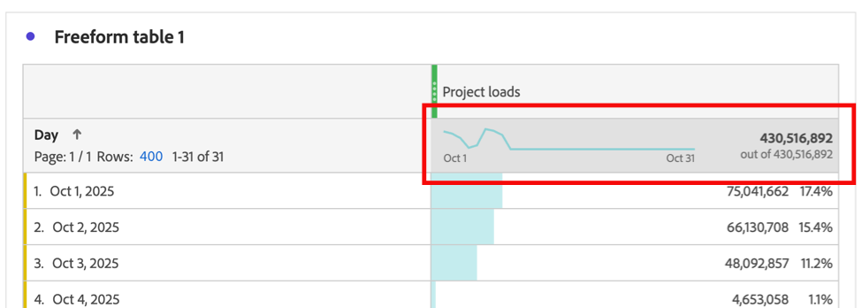

# 檢視自由表格的趨勢資料

您可以檢視自由表格中所包含資料的趨勢。 此趨勢資料顯示在Analysis Workspace的下列區域中：

* [走勢圖](#use-sparklines-to-view-trended-data)

* [線條視覺效果](#use-line-visualizations-to-view-trended-data)

## 使用走勢圖檢視趨勢資料

走勢圖會顯示在自由表格的量度欄標題中。

自由格式表格中的

走勢圖一律包括：

* 欄中所有資料的趨勢資料

* 套用至表格維度的任何搜尋篩選條件

  如需詳細資訊，請參閱[篩選與排序](/help/analyze/analysis-workspace/visualizations/freeform-table/filter-and-sort.md)。

## 使用線條視覺效果來檢視趨勢資料

[行](/help/analyze/analysis-workspace/visualizations/line.md)視覺效果會顯示其所連線之自由表格的資料。

### 將線條視覺效果連線到自由表格

根據將線條視覺效果新增至專案的方式和時間，它可能已連線至所需的自由表格。 使用以下步驟檢查或手動連線：

1. 在Analysis Workspace專案中新增線條視覺效果。

1. 選取視覺效果名稱旁的點，選取&#x200B;**[!UICONTROL 資料來源]**&#x200B;標籤，然後選取您要連線至線條視覺效果的自由表格名稱。

   

### 選擇線條圖視覺效果中包含的資料

根據在自由格式表格中選擇的儲存格，所連線圖視覺效果中包含的資料會有所不同。

若要檢視自由表格中所有資料的趨勢，請選取自由表格中的走勢圖儲存格。

選取走勢圖儲存格時，儲存格會顯示為深灰色。

已選取

選取所連線表格的走勢圖儲存格時，線圖視覺效果包括：

* 欄中所有資料的趨勢資料

* 套用至表格維度的任何搜尋篩選條件

  如需詳細資訊，請參閱[篩選與排序](/help/analyze/analysis-workspace/visualizations/freeform-table/filter-and-sort.md)。

未選取所連線表格的走勢圖時，線圖視覺效果包括：

* 在連線的表格中選取之列的資料。 如果未選取任何列，則只會顯示已連線表格之第一個維度的資料。

* 套用至表格維度的任何搜尋篩選條件都會被忽略

  如需詳細資訊，請參閱[篩選與排序](/help/analyze/analysis-workspace/visualizations/freeform-table/filter-and-sort.md)。

## 在連線的線條視覺效果中包含篩選條件

如需有關何時將篩選條件包含在已連線的線條視覺效果中的資訊，請參閱[在走勢圖和線條視覺效果中的趨勢資料中包含篩選條件](/help/analyze/analysis-workspace/visualizations/freeform-table/filter-and-sort.md#include-filter-criteria-in-trended-data-in-sparklines-and-line-visualizations)

